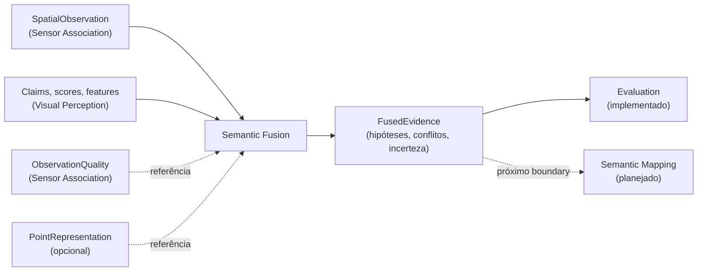

# Semantic Fusion

## Responsabilidade

Acumular a evidência de várias vistas sobre um **suporte espacial** compartilhado, **sem decidir que objeto ele é**. A saída, `FusedEvidence`, é crença em formação: mantém todas as hipóteses, a evidência exata por trás de cada uma, os conflitos entre observações físicas e o que é simplesmente desconhecido.

Fusão não é identidade. Um `FusionSupport` afirma apenas que observações espaciais veem geometria compatível sob uma política; não afirma mesmo objeto, mesma classe nem identidade persistente entre versões do mapa.

## O que este módulo explicitamente não possui

- identidade persistente de objeto e `Entity`: Semantic Mapping e Entity Resolution;
- geometria e suas coordenadas: Geometric Mapping (aqui só há `GeometryReference`);
- claims, scores de scorer, features: Visual Perception (aqui só há referências);
- qualidade de observação: Sensor Association (aqui só há `ObservationQualityRef`);
- representações 3D: Point Representation (aqui só há `PointRepresentationRef`);
- reexecução da VLM para corrigir um label: fusão nunca chama inferência.

## Estado implementado

Existem os **contratos** (`FusionSupport`, `EvidenceContribution`, `PhysicalObservationGroup`, `FusedHypothesis`, `FusedEvidence` e seus tipos de apoio), o **agrupamento por observação física** sobre uma seleção explícita de runs, a **construção de `FusionSupport`** por sobreposição de geometria e a **política baseline de acumulação** de evidência multi-vista, que preserva ambiguidade, contradição, empate, abstenção e evidência insuficiente sem resolvê-los, a **seleção de canais de evidência** tipados e a **política opcional ciente de qualidade**, que pondera sem descartar evidência, e o **`SemanticFusionRunArtifact`** persistido. A validação vive em `evaluation` e está documentada em [`evaluation/docs/semantic_fusion.md`](../../evaluation/docs/semantic_fusion.md).

## Contratos públicos

- `FusionSupport`, `FusionSupportId`, `FusionSupportProvenance` — onde a evidência é acumulada: geometria, observações espaciais, limites, centroide, intervalo temporal e política.
- `EvidenceContribution`, `EvidenceContributionId` — uma vista: uma região de um frame físico, interpretada por uma execução de inferência.
- `PhysicalObservationGroup` — tudo o que foi inferido de um frame físico, separado do próprio frame.
- `group_by_physical_observation()`, `PhysicalObservationGrouping`, `PHYSICAL_OBSERVATION_GROUPING_POLICY_ID` — agrupa observações espaciais por frame físico sob uma seleção explícita de runs e reporta as contagens de frames, inferências, runs e variantes.
- `accumulate_baseline_evidence()`, `BaselineAccumulationPolicy`, `BASELINE_ACCUMULATION_POLICY_ID`, `label_key()`, `evidence_contribution_id_for()`, `fused_evidence_id_for()` — a política baseline: uma contribuição por observação, hipóteses por chave de label, stances e sinais tipados, abstenção configurável, registros de incerteza, sem ranking e sem ponderar por qualidade.
- `build_fusion_supports()`, `FusionSupportBuild`, `ExcludedObservation`, `GeometryOverlapSupportPolicy`, `GEOMETRY_OVERLAP_SUPPORT_POLICY_ID` — constrói suportes por sobreposição de geometria (Jaccard), com os limiares declarados e as observações excluídas explícitas.
- `ScoreReference`, `ObservationQualityRef` — referências ao score de um scorer e à qualidade mensurável da vista; nunca valores.
- `FusedEvidence`, `FusedEvidenceId`, `FusedEvidenceProvenance` — a evidência acumulada sobre um suporte.
- `accumulate_quality_aware_evidence()`, `QualityAwareAccumulationPolicy`, `QualityRamp`, `QualityInput`, `QUALITY_AWARE_ACCUMULATION_POLICY_ID` — a política opcional que pondera as contribuições por qualidade mensurável, com rampas declaradas e fator neutro registrado.
- `QualityWeighting`, `ContributionWeight`, `ComponentFactor`, `ComponentTreatment`, `HypothesisSupport`, `ObservationFactor` — o peso derivado, inspecionável: por componente, por contribuição e o suporte de cada hipótese antes e depois.
- `SemanticFusionRunWriter`, `SemanticFusionRunReader`, `SemanticFusionRunManifest`, `FusionRunLineage`, `FusionOutcome`, `SemanticFusionDebugLevel`, `SemanticFusionRunId`, `FusionRunArtifactError`, `IncompleteFusionRunArtifactError` — o artifact persistido: escrita atômica em fluxo, leitura por identidade, linhagem explícita, métricas separadas e debug nunca contratual.
- `EvidenceChannel`, `ChannelProvenance` — os canais tipados (claims, scores, features, qualidade, geometria, estrutura 3D) e a proveniência do que alimentou cada canal ativo.
- `FusedHypothesis`, `FusedHypothesisId`, `HypothesisEvidence`, `EvidenceStance` — um candidato semântico e cada claim que o sustenta, contradiz ou deixa ambíguo.
- `SupportSignal`, `SupportSignalKind` — score tipado de uma claim, com o modelo que o produziu; `None` significa não pontuado.
- `UncertaintyRecord`, `UncertaintyKind`, `EvidenceReference` — conflito, ambiguidade, empate ou evidência insuficiente, com a evidência exata que o produziu.
- `PointRepresentationRef` — estrutura 3D estática do suporte, listada uma única vez.

Ver [`contracts.md`](contracts.md) para a referência de campos, as regras de correlação e as invariantes.

## Módulos consumidos

- `contextmap.sensor_association`: `SpatialObservation`, `SpatialObservationId`, `SemanticClaimRef`, `VisualFeatureRef`.
- `contextmap.visual_perception`: `BackendProvenance`, `ClaimId`, `FeatureScope`, `HypothesisRole`, `PerceptionResultId`, `PerceptionRun`, `PerceptionRunId`, `RegionId`.
- `contextmap.point_representation`: `PointRepresentationId`, `PointRepresentationRunId`.
- `contextmap.geometric_mapping`: `GeometrySource`, `GeometryReference`, `GeometryId`, `Bounds3D`, `MapId`.
- `contextmap.ingestion`: `SourceObservationId`.
- `contextmap.state_estimation`: `TimeBounds`, reutilizado para o intervalo fechado de aquisição em vez de duplicar a regra.
- `contextmap.shared`: `SourceTimestamp`, `Vector3`, `AtomicRunDirectory`, `FileEntry`, `check_file_inventory`.

A dependência de `geometric_mapping`, `ingestion` e `state_estimation` existe apenas para identidades e para o tipo de intervalo temporal, sempre pela API pública; Semantic Fusion não usa a lógica dessas capabilities. Ela está declarada em `tests/architecture/test_boundaries.py`.

## Módulos que consomem este

Hoje, `evaluation`, sempre através de `contextmap.semantic_fusion`.
`semantic_mapping` será o consumidor downstream quando esse módulo planejado
for materializado.

## Onde estão os documentos detalhados

- [`contracts.md`](contracts.md) — contratos, regras de correlação e invariantes.
- [`grouping.md`](grouping.md) — agrupamento por observação física, seleção explícita de runs e contagens.
- [`support.md`](support.md) — política baseline de suporte, medida de sobreposição, mesclagem e casos limite.
- [`accumulation.md`](accumulation.md) — política baseline de acumulação, regra de label, stances e fronteira de qualidade.
- [`artifact.md`](artifact.md) — layout, linhagem, métricas, leitura, integridade e debug do `SemanticFusionRunArtifact`.
- [`quality-aware.md`](quality-aware.md) — política opcional ciente de qualidade: regras versionadas, fator neutro, correlação preservada e diagnósticos.
- [avaliação de Semantic Fusion](../../evaluation/docs/semantic_fusion.md) — consistência, incerteza, canais, estratificação e comparação controlada.
- [`docs/PIPELINE.md`](../../../../docs/PIPELINE.md) — o estágio de Semantic Fusion no fluxo.
- [`docs/CONTRACTS.md`](../../../../docs/CONTRACTS.md) — `FusionSupport` e `FusedEvidence` no contexto global de contratos.
