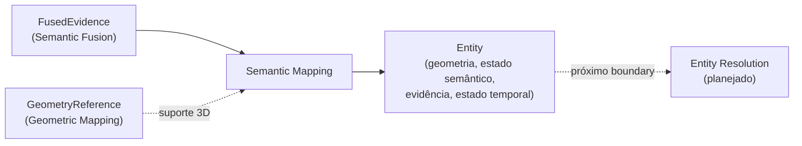

# Semantic Mapping

## Responsabilidade

Materializar a evidência fundida como **entidades semânticas persistentes** dentro de um semantic-map artifact. Uma `Entity` guarda o suporte 3D exato que justifica sua existência, todas as hipóteses semânticas, a cadeia de evidência que a criou e quando foi observada.

Uma entidade **não é** um `Region2D` cru, uma `SpatialObservation`, um `FusionSupport`, um único label vencedor, uma relação espacial nem uma garantia de identidade entre mapas. Semantic Mapping também **não decide** se duas entidades são o mesmo objeto físico: isso é Entity Resolution.

## O que este módulo explicitamente não possui

- decisão de mesmo objeto (match, merge, split, re-identificação): Entity Resolution;
- relações entre entidades: Spatial Relations;
- geometria e suas coordenadas: Geometric Mapping (aqui só há `GeometryReference`);
- evidência fundida: Semantic Fusion (aqui só há referências e o estado semântico derivado dela);
- propriedades de senso comum nunca observadas nem derivadas por um estágio de raciocínio documentado.

## Estado implementado

Existem os **contratos** do envelope: `Entity`, `EntityReference`, `EntitySet` e `EntityProvenance`, as regras de **escopo de identidade** e a serialização JSON com revalidação (`serialization.py`). Os quatro componentes de uma entidade:

- `EntityGeometry`: o suporte 3D como `GeometryReference` (a autoridade) e os resumos derivados, no frame do mapa: centroide, limites, extensão, estatísticas, orientação opcional e diagnósticos, com a proveniência de como foram calculados. `summarize_geometry`, `resolve_geometry` e `verify_geometry_summary` constroem, resolvem e reverificam esses resumos ([`geometry.md`](geometry.md));
- `EntitySemanticState`: todas as hipóteses (`EntityHypothesis`) com a evidência exata e os sinais tipados de cada claim, atributos com evidência e derivação, os registros de incerteza, o estado de ambiguidade e, só quando justificada, uma hipótese primária. `semantic_state_from_fused_evidence` mapeia `FusedEvidence` para esse estado sem descartar nada ([`semantic-state.md`](semantic-state.md));
- `EntityEvidenceLinks`: a evidência fundida de origem (com identidade, versão e digest do artifact), as observações espaciais e físicas que contribuíram, as features visuais e as representações 3D, só por referência. `validate_entity_evidence` checa a integridade das referências e `trace_entity_evidence` / `trace_geometry_sources` percorrem a proveniência ([`evidence.md`](evidence.md));
- `EntityTemporalState`: `first_seen`, `last_seen`, as contagens de frames físicos e de resultados de inferência (sempre distintas), o histórico de observações e um ciclo de vida conservador. `summarize_temporal_state` deriva o estado da evidência fundida sem fabricar nenhum instante ([`temporal-state.md`](temporal-state.md)).

A **materialização** converte a evidência fundida selecionada em entidades sob uma política baseline versionada, um suporte, uma entidade (`one-support-one-entity-v1`), com identidade determinística local ao artifact e rejeição explícita de candidatos inválidos, **sem nenhuma resolução entre suportes** ([`materialization.md`](materialization.md)).

O **`SemanticMappingRunArtifact`** persiste as entidades, os índices, a linhagem, as métricas e os candidatos rejeitados de forma imutável e atômica, e reabre sem runtimes de percepção, fusão ou modelo ([`artifact.md`](artifact.md)). A validação das invariantes, da preservação de evidência e da reprodutibilidade é feita por `evaluate_semantic_mapping` em `contextmap.evaluation` ([validação](../../evaluation/docs/semantic_mapping.md)).

## Escopo de identidade

Um `EntityId` é único **dentro de um** semantic map. A mesma string em dois mapas construídos de forma independente nomeia dois registros diferentes; só um estágio explícito de alinhamento poderia dizer que são o mesmo objeto físico. Por isso a referência estável é `EntityReference(semantic_map_id, entity_id)`, nunca um id nu. `EntitySet.resolve` recusa uma referência de outro mapa mesmo quando o `entity_id` existe.

## Contratos públicos

- `Entity`, `EntityId`, `SemanticMapId`, `EntityProvenance` — o registro persistente e sua identidade local ao mapa.
- `EntityReference` — o handle estável `(semantic_map_id, entity_id)`.
- `encode_entity`, `decode_entity`, `encode_entity_reference`, `decode_entity_reference` — o codec JSON canônico, que revalida todas as invariantes na decodificação.
- `EntitySet`, `UnknownEntityError`, `ForeignEntityReferenceError` — as entidades de um mapa, com resolução de referência que distingue "outro mapa" de "entidade inexistente".
- `EntityGeometry`, `SupportStatistics`, `SpatialSummaryProvenance`, `EntityOrientation`, `GeometryDiagnostic`, `GeometryDiagnosticKind` — o suporte 3D e seus resumos derivados.
- `GeometrySummaryPolicy`, `OrientationPolicy`, `summarize_geometry`, `resolve_geometry`, `verify_geometry_summary`, `geometry_set_digest`, `GEOMETRY_SUMMARY_ALGORITHM_ID`, `EmptyGeometrySupportError`, `GeometryResolutionError` — construção, resolução e verificação da geometria.
- `EntitySemanticState`, `EntityHypothesis`, `EntityHypothesisRef`, `EntityAttribute`, `EntityUncertainty`, `AmbiguityState`, `AttributeOrigin`, `SemanticStateProvenance` — o estado semântico.
- `semantic_state_from_fused_evidence`, `derive_ambiguity_state`, `SEMANTIC_STATE_MAPPING_RULE_ID`, `PRIMARY_HYPOTHESIS_POLICY_ID`, `CLASS_ATTRIBUTE_DERIVATION_ID` — o mapeamento de `FusedEvidence` e suas regras versionadas.
- `EntityEvidenceLinks`, `FusedEvidenceRef`, `EntityFeatureRef`, `evidence_links_from_fused_evidence`, `feature_refs_of`, `fusion_artifact_digest` — os vínculos de evidência.
- `validate_entity_evidence`, `EvidenceIntegrityIssue`, `EvidenceIntegrityKind`, `FusedEvidenceSource`, `trace_entity_evidence`, `EntityEvidenceTrace`, `ContributionTrace`, `EvidenceTraceError`, `trace_geometry_sources`, `GeometrySourceTrace` — integridade de referências e travessia da proveniência.
- `materialize_entities`, `EntityMaterializationPolicy`, `EntityMaterialization`, `CandidateRejection`, `RejectionReason`, `MaterializationInputError`, `entity_id_for`, `ENTITY_MATERIALIZATION_POLICY_ID`, `ENTITY_ID_POLICY_ID` — a materialização a partir da evidência fundida, sem resolução entre suportes.
- `SemanticMappingRunWriter`, `SemanticMappingRunReader`, `SemanticMappingRunManifest`, `MappingRunLineage`, `MappingDebugLevel`, `SemanticMappingRunId`, `MappingRunArtifactError`, `IncompleteMappingRunArtifactError`, `allocate_mapping_run_index`, `rebuild_mapping_run_registry`, `lineage_from_fusion_manifest` — o artifact persistido.
- `validate_evidence_of_entities` — a validação de referências de muitas entidades, verificando cada run de fusão uma única vez.
- `EntityTemporalState`, `ObservationRef`, `TemporalProvenance`, `EntityLifecycle`, `summarize_temporal_state`, `TemporalEvidenceError`, `TEMPORAL_SUMMARY_RULE_ID` — o estado temporal e seu histórico.

Ver [`contracts.md`](contracts.md) para a referência de campos e as invariantes.

## Módulos consumidos

- `contextmap.semantic_fusion`: `SemanticFusionRunManifest`, `FusionOutcome`, `FusedEvidence`, `FusedEvidenceId`, `FusedHypothesisId`, `FusionSupportId`, `SemanticFusionRunId`, `EvidenceContributionId`, `EvidenceReference`, `HypothesisEvidence`, `EvidenceStance`, `SupportSignal`, `SupportSignalKind`, `UncertaintyKind`, `UncertaintyRecord`.
- `contextmap.geometric_mapping`: `GeometryReference`, `GeometrySource`, `GeometryPoint`, `Bounds3D`, `MapId`, `geometry_id_for`, `geometry_index_of`.
- `contextmap.ingestion`: `FrameId`, `SourceObservationId`.
- `contextmap.sensor_association`: `SpatialObservationId`.
- `contextmap.point_representation`: `PointRepresentationId`, `PointRepresentationRunId`.
- `contextmap.state_estimation`: `TimeBounds`, o intervalo fechado de aquisição.
- `contextmap.visual_perception`: `BackendProvenance`, `ClaimId`, `HypothesisRole`, `FeatureId`, `FeatureScope`, `PerceptionResultId`, `PerceptionRunId`, `RegionId`, presentes nos sinais, nas claims e nas features preservadas.
- `contextmap.shared`: `SourceTimestamp`, `Vector3`, `AtomicRunDirectory`, `FileEntry`, `check_file_inventory`, `next_run_index`, `write_run_registry`.

As dependências de `ingestion`, `visual_perception`, `sensor_association`, `point_representation` e `state_estimation` existem apenas para identidades e tipos que a evidência fundida já traz, sempre pela API pública, e estão declaradas em `tests/architecture/test_boundaries.py`.

## Onde estão os documentos detalhados

- [`contracts.md`](contracts.md) — contratos, escopo de identidade e invariantes.
- [`geometry.md`](geometry.md) — suporte 3D, resumos derivados, proveniência, diagnósticos e verificação.
- [`evidence.md`](evidence.md) — vínculos de evidência, integridade de referências e travessia da proveniência.
- [`semantic-state.md`](semantic-state.md) — estado semântico, distinções preservadas e regras de mapeamento da evidência fundida.
- [`temporal-state.md`](temporal-state.md) — estado temporal, histórico de observações e ciclo de vida.
- [`materialization.md`](materialization.md) — política baseline, identidade determinística, seleção explícita e rejeição de candidatos.
- [`artifact.md`](artifact.md) — layout, linhagem, métricas, leitura, integridade e debug do `SemanticMappingRunArtifact`.
- [validação de Semantic Mapping](../../evaluation/docs/semantic_mapping.md) — as seis camadas de validação, a linhagem do relatório e as defesas contra upstream corrompido.
- [`docs/PIPELINE.md`](../../../../docs/PIPELINE.md) — o estágio de Semantic Mapping no fluxo.
- [`docs/CONTRACTS.md`](../../../../docs/CONTRACTS.md) — os contratos no contexto global.
