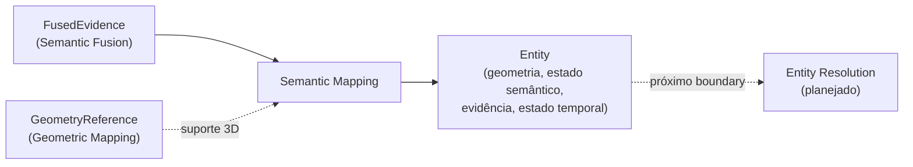

# Semantic Mapping

## Responsabilidade

Materializar a evidência fundida como **entidades semânticas persistentes** dentro de um semantic-map artifact. Uma `Entity` guarda o suporte 3D exato que justifica sua existência, todas as hipóteses semânticas, a cadeia de evidência que a criou e quando foi observada.

Uma entidade **não é** um `Region2D` cru, uma `SpatialObservation`, um `FusionSupport`, um único label vencedor, uma relação espacial nem uma garantia de identidade entre mapas. Semantic Mapping também **não decide** se duas entidades são o mesmo objeto físico: isso é Entity Resolution.

## O que este módulo explicitamente não possui

- decisão de mesmo objeto (match, merge, split, re-identificação): Entity Resolution;
- relações entre entidades: Spatial Relations;
- geometria e suas coordenadas: Geometric Mapping (aqui só há `GeometryReference`);
- evidência fundida: Semantic Fusion (aqui só há referências e o estado semântico derivado dela);
- propriedades de senso comum nunca observadas nem derivadas por um estágio de raciocínio documentado.

## Estado implementado

Existem os **contratos** do envelope: `Entity`, `EntityReference`, `EntitySet` e `EntityProvenance`, as regras de **escopo de identidade** e a serialização JSON com revalidação (`serialization.py`). Os quatro componentes de uma entidade existem em sua forma mínima, referência a referência:

- `EntityGeometry`: as `GeometryReference` do suporte e o frame do mapa;
- `EntitySemanticState`: todas as hipóteses (`EntityHypothesis`), com a evidência exata e os sinais tipados de cada claim;
- `EntityEvidenceLinks`: as referências à evidência fundida (`FusedEvidenceRef`);
- `EntityTemporalState`: `first_seen`, `last_seen` e as contagens de frames físicos e de resultados de inferência, sempre distintas.

Resumos espaciais, estado semântico completo, vínculos de evidência, histórico temporal, materialização e persistência pertencem às issues seguintes da milestone e ainda **não** existem.

## Escopo de identidade

Um `EntityId` é único **dentro de um** semantic map. A mesma string em dois mapas construídos de forma independente nomeia dois registros diferentes; só um estágio explícito de alinhamento poderia dizer que são o mesmo objeto físico. Por isso a referência estável é `EntityReference(semantic_map_id, entity_id)`, nunca um id nu. `EntitySet.resolve` recusa uma referência de outro mapa mesmo quando o `entity_id` existe.

## Contratos públicos

- `Entity`, `EntityId`, `SemanticMapId`, `EntityProvenance` — o registro persistente e sua identidade local ao mapa.
- `EntityReference` — o handle estável `(semantic_map_id, entity_id)`.
- `EntitySet`, `UnknownEntityError`, `ForeignEntityReferenceError` — as entidades de um mapa, com resolução de referência que distingue "outro mapa" de "entidade inexistente".
- `EntityGeometry`, `EntitySemanticState`, `EntityHypothesis`, `EntityEvidenceLinks`, `FusedEvidenceRef`, `EntityTemporalState` — os componentes.

Ver [`contracts.md`](contracts.md) para a referência de campos e as invariantes.

## Módulos consumidos

- `contextmap.semantic_fusion`: `FusedEvidenceId`, `FusedHypothesisId`, `FusionSupportId`, `SemanticFusionRunId`, `EvidenceContributionId`, `HypothesisEvidence`, `EvidenceStance`, `SupportSignal`, `SupportSignalKind`.
- `contextmap.geometric_mapping`: `GeometryReference`, `MapId`, `geometry_id_for`, `geometry_index_of`.
- `contextmap.ingestion`: `FrameId`.
- `contextmap.visual_perception`: `BackendProvenance`, `ClaimId`, `HypothesisRole`, presentes nos sinais e nas claims preservadas.
- `contextmap.shared`: `SourceTimestamp`.

As dependências de `ingestion` e `visual_perception` existem apenas para identidades e tipos que a evidência fundida já traz, sempre pela API pública, e estão declaradas em `tests/architecture/test_boundaries.py`.

## Onde estão os documentos detalhados

- [`contracts.md`](contracts.md) — contratos, escopo de identidade e invariantes.
- [`docs/PIPELINE.md`](../../../../docs/PIPELINE.md) — o estágio de Semantic Mapping no fluxo.
- [`docs/CONTRACTS.md`](../../../../docs/CONTRACTS.md) — os contratos no contexto global.
