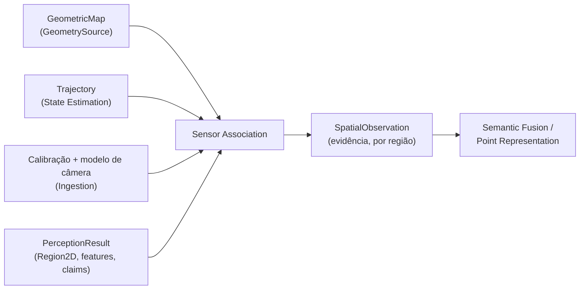

# Sensor Association

## Responsabilidade

Ligar a **evidência visual 2D** à **geometria 3D persistente**. Para cada região de uma imagem, responder: *quais elementos do mapa esta região enxerga?* A resposta é uma `SpatialObservation`: referências à geometria visível dentro da região, mais os diagnósticos que explicam os candidatos que **não** entraram (atrás da câmera, fora da imagem, ocluídos, …).

Uma `SpatialObservation` é **evidência**: registra o que foi observado nesta execução. Não é crença nem conhecimento — não fixa label, identidade ou entidade, não escolhe um vencedor entre regiões sobrepostas e não copia XYZ, embeddings ou claims. Tudo o que ela aponta é alcançado por referência.

## O que este módulo explicitamente não possui

- geometria e sua linhagem: Geometric Mapping (`GeometryReference`, `GeometrySource`);
- pose e trajetória: State Estimation;
- calibração e modelos de câmera: Ingestion;
- regiões, features e claims: Visual Perception;
- agregação de evidência em suporte por entidade (`FusionSupport`, `FusedEvidence`): Semantic Fusion;
- identidade de objeto e labels persistentes: Semantic Mapping e Entity Resolution.

## Estado implementado

Existem os **contratos** e sua serialização, a **projeção de câmera calibrada** (pinhole, fisheye equidistante e MEI, escolhida só pela calibração canônica) e a **cadeia mapa → câmera → imagem preparada** com proveniência por ponto e a **visibilidade e oclusão** por suporte de profundidade local conservador (política explícita, sem valores padrão). Estão **planejados**, e serão documentados aqui quando forem implementados: pertencimento à máscara, amostragem de features densas, qualidade da observação, diagnósticos de calibração e reprojeção, o artifact de run e a validação.

## Contratos públicos

- `SpatialObservation`, `SpatialObservationId`, `spatial_observation_id_for()` — a geometria que uma região enxerga, por referência.
- `VisibilityState`, `VisibilityDiagnostics`, `DepthMetric` — por que um candidato entrou ou não como evidência, e como a profundidade foi medida.
- `PointCorrespondence`, `PixelCoordinate` — registro de baixo nível do resultado 2D de um elemento do mapa.
- `ProjectionSummary` — fatos da projeção no nível do frame.
- `VisualFeatureRef`, `SemanticClaimRef` — referências à evidência visual do mesmo resultado, nunca cópias.
- `CalibrationRef`, `PoseRef`, `AssociationProvenance` — qual calibração, qual pose e qual execução produziram a observação.
- `CameraProjection`, `PixelProjection`, `CameraIdentity`, `camera_projection_for()` — projeção 3D → pixel e raio inverso, com domínio de visão explícito e a identidade da calibração em todo resultado.

Ver [`contracts.md`](contracts.md) para a referência de campos, as convenções e as invariantes.

A cadeia de projeção e a resolução de visibilidade (`GeometryCloud`, `RawToPreparedTransform`, `FrameProjector`, `FrameProjection`, `OcclusionPolicy`, `VisibilityResolution`) são internas à capability: os consumidores externos usarão o serviço de associação, não os passos intermediários.

## Módulos consumidos

- `contextmap.geometric_mapping`: `GeometrySource`, `GeometricMap`, `GeometryReference`, `MapId`, `geometry_id_for`.
- `contextmap.ingestion`: `CalibrationEntry`, os modelos de câmera canônicos (`PinholeCameraModel`, `FisheyeCameraModel`, `MeiCameraModel`), `FrameId`, `CalibrationReferenceId`, `SequenceArtifactId`, `SourceObservationId`.
- `contextmap.state_estimation`: `TrajectoryLookup`, `LookupPolicy`, `StaticFrameGraph`, `calibration_identity`, `TrajectoryId`, `StateEstimationRunId`, `PoseEstimateId`, `LookupOutcome`.
- `contextmap.visual_perception`: `PreparedImage` e seus registros de transformação, `RegionId`, `FeatureId`, `FeatureScope`, `ClaimId`, `PerceptionResultId`, `PerceptionRunId`.

## Módulos que consomem este

`semantic_fusion`, `point_representation` e `artifact`, sempre através de `contextmap.sensor_association`.

## Onde estão os documentos detalhados

- [`contracts.md`](contracts.md) — contratos, convenções, identidade e serialização.
- [`camera_models.md`](camera_models.md) — modelos de câmera, convenções de pixel, domínio de visão e verificação.
- [`projection_chain.md`](projection_chain.md) — cadeia mapa → câmera → imagem preparada, suporte, proveniência e validação.
- [`visibility.md`](visibility.md) — oclusão por suporte de profundidade local, política, métrica de profundidade e diagnósticos.
- [`docs/architecture.md`](../../../../docs/architecture.md) — ownership e direção de dependências.
- [`docs/CONTRACTS.md`](../../../../docs/CONTRACTS.md) — `SpatialObservation` no contexto global de contratos.
