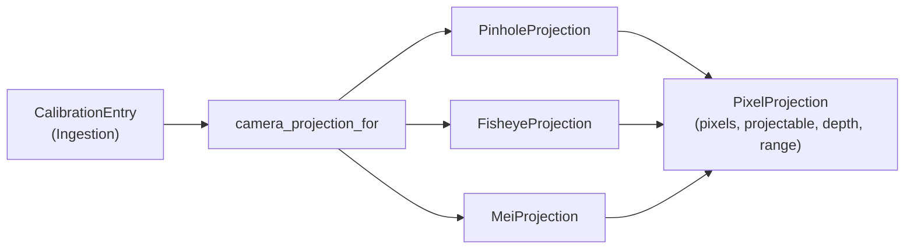

# Modelos de câmera e projeção 3D → pixel

Este documento descreve `src/contextmap/sensor_association/camera_models.py`.

Sensor Association precisa de projeção fisicamente correta de um ponto no frame óptico da câmera para um pixel, e de volta para um raio. O modelo vem **apenas da calibração canônica** (`CalibrationEntry` de Ingestion): `camera_projection_for(entry)` escolhe a matemática de pinhole, fisheye equidistante ou MEI pelo tipo declarado, e nunca substitui um modelo por outro. Não há conhecimento de dataset e não há leitura de arquivo ou YAML aqui.

## Contrato

`CameraProjection` (Protocol) é a fronteira que o restante da capability consome:

| Operação | Resultado |
| --- | --- |
| `identity` | `CameraIdentity`: `calibration_id`, `content_hash`, `camera_frame`, `camera_model_kind` e `image_size` |
| `project(points_camera_m)` | `PixelProjection` para `(N, 3)` pontos finitos, em metros |
| `unproject(pixels)` | `(N, 3)` raios unitários para `(N, 2)` pixels finitos |
| `in_image(pixels)` | máscara de pixels dentro da extensão da imagem crua |

`PixelProjection` guarda `pixels` `(N, 2)`, `projectable` `(N,)`, `depth_m` (`z` com sinal no frame óptico), `range_m` (distância do centro óptico) e a `CameraIdentity` que a produziu, então todo resultado carrega a proveniência da calibração. Os arrays são revalidados: `projectable` é verdadeiro exatamente onde o pixel é finito.

O NumPy é importado sob demanda: importar `contextmap.sensor_association` continua sem NumPy.

## Convenções

- **Frame óptico**: `x` para a direita, `y` para baixo, `z` para a frente, metros. É o frame declarado por `CalibrationEntry.frame_id`; nada é inferido.
- **Pixel**: `(u, v)` contínuos, com o **centro** do pixel no inteiro. A imagem cobre `[-0.5, largura - 0.5) × [-0.5, altura - 0.5)`; `in_image` usa essa extensão e trata `NaN` como fora.
- **Alcance e profundidade**: `range_m` é `‖P‖` e `depth_m` é `z`; ambos são preservados. A oclusão usa a métrica que o modelo de câmera pede (`z` no pinhole, alcance nos modelos de campo amplo, onde `z` pode ser não positivo), registrada em cada resultado; ver [`visibility.md`](visibility.md).

## Modelos

### Pinhole

`u = fx·xd + cx`, `v = fy·yd + cy`, com `(xd, yd)` a distorção OpenCV de `(x/z, y/z)`. `DistortionModel.NONE` não distorce; `PLUMB_BOB` usa `(k1, k2, p1, p2, k3)` e `RATIONAL_POLYNOMIAL` usa `(k1, k2, p1, p2, k3, k4, k5, k6)`, com `k4..k6` no denominador do termo radial. O raio inverso é obtido por iteração de ponto fixo.

### Fisheye equidistante (Kannala-Brandt)

`θ = atan2(ρ, z)`, `θ_d = θ (1 + k1 θ² + k2 θ⁴ + k3 θ⁶ + k4 θ⁸)` e `u = fx·θ_d·x/ρ + cx`. Vale para qualquer direção, inclusive além de 90°. O raio inverso resolve `θ` de `θ_d` por bisseção em `[0, θ_max]`, que é robusta perto do limite onde o Newton divergiria.

### MEI (unificado omnidirecional)

Parametrização do CamOdoCal: `z' = z + xi·‖P‖`, plano normalizado `(x/z', y/z')`, distorção radial `(k1, k2)` e tangencial `(p1, p2)`, e `u = fx·xd + cx` com `fx = gamma1`, `cx = u0`. O raio inverso usa a elevação à esfera unitária: `λ = (xi + √(1 + (1 − xi²)ρ²)) / (1 + ρ²)` e `P = (λx, λy, λ − xi)`.

## Domínio de visão explícito

Todo modelo projeta apenas parte da esfera de direções. Um ponto que o modelo não projeta sai como **não projetável**, com pixels `NaN`; nunca é recortado para dentro da imagem. O limite é onde a projeção deixa de ser injetiva:

| Modelo | Projetável quando |
| --- | --- |
| Pinhole | `z > 1e-9·‖P‖` (o plano `z = 0` e a origem ficam de fora); com distorção, também `√(x² + y²) < r_max·z`, com `r_max` o primeiro zero de `d(r·radial)/dr` (ou sem limite se nunca se anula) |
| Fisheye | `θ < θ_max`, o primeiro zero de `dθ_d/dθ = 1 + 3k1θ² + 5k2θ⁴ + 7k3θ⁶ + 9k4θ⁸` (ou `π` se nunca se anula) |
| MEI | `cos θ > −min(xi, 1/xi)`: o horizonte da esfera para `xi > 1` (a projeção dobra de volta além dele) e o zero de `z + xi·‖P‖` para `xi < 1` |

A margem de `1e-9` em cosseno (constante `_COSINE_MARGIN`) mantém as coordenadas finitas junto da fronteira, onde os denominadores dos modelos se anulam.

O ponto sobre o eixo negativo, por exemplo, **não** vira o ponto principal em MEI com `xi > 1`, onde uma implementação ingênua o dobraria de volta para dentro da imagem.

No pinhole distorcido, o termo radial leva o raio sem distorção `r` a `r·radial(r)`. Além do primeiro zero de `d(r·radial)/dr` dois raios compartilham o mesmo raio distorcido e o polinômio dobra de volta: com `k1 = −0,28` sozinho, um ponto a 62,1° do eixo cairia exatamente no ponto principal, dentro da imagem. `r_max` é derivado no construtor pela mesma técnica do `θ_max` do fisheye (varredura do ângulo com o eixo, `r = tan θ`, refinada por bisseção), e os pontos além dele são não projetáveis. O pinhole sem distorção não tem esse limite.

Os termos tangenciais e a distorção do MEI são confiados dentro do domínio. Uma calibração cujo polinômio do MEI dobra antes é um problema de calibração, que os diagnósticos de reprojeção expõem; a projeção não tenta adivinhá-lo.

## Raio inverso e pixels sem raio

`unproject` **falha** quando algum pixel não tem raio sob o modelo (além do horizonte da esfera, além de `θ_d(θ_max)` num fisheye, com raio além de `r_max` num pinhole distorcido, ou quando a distorção não tem inverso confiável), com uma mensagem que conta os pixels e mostra o primeiro. Não devolve um raio chutado.

## Seleção e validação

`camera_projection_for` recusa uma entrada sem `camera_model` (`ValueError`) e valida a calibração pelo `validate_calibration_set` de Ingestion (`CalibrationError`): resolução positiva, parâmetros focais e de ponto principal finitos, contagem de coeficientes compatível com o modelo, `xi` finito e não negativo. Não há fallback para outro modelo: o tipo declarado é o tipo usado.

## Como é verificado

Os testes comparam as três projeções contra as fórmulas publicadas, escritas de forma escalar e independente da implementação (OpenCV plumb_bob/racional e equidistante; CamOdoCal `spaceToPlane`), contra casos exatos que se conferem à mão (pinhole por triângulos semelhantes, fisheye ideal linear em θ, MEI com `xi = 0` igual ao pinhole e `xi = 1` estereográfico), contra os limites analíticos do domínio (inclusive a dobra do polinômio radial do pinhole) e por ida e volta `unproject → project` em uma grade de pixels da imagem, com tolerância de `1e-6` pixel.
