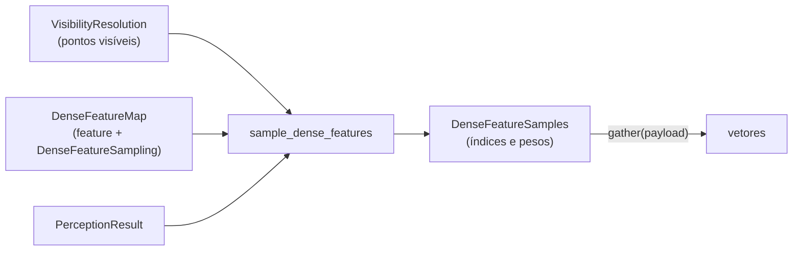

# Amostragem de features densas sobre a geometria

Este documento descreve `src/contextmap/sensor_association/dense_sampling.py`.

Evidência visual densa é ancorada à geometria persistente pelo contrato público `DenseFeatureMap` de Visual Perception, nunca por um backbone específico. Para cada ponto de geometria **visível**, o caminho é

```text
GeometryReference → coordenada da imagem preparada → célula(s) da grade de features → amostra local
```



Um mapa **nativo** e um mapa **melhorado** por `FeatureResolutionEnhancement` passam exatamente pelo mesmo caminho: só a geometria de amostragem declarada em `DenseFeatureSampling` importa, e não há ramificação por backend (`if loftup`, `if dinov3`). Um patch nunca é assumido igual a um pixel.

## Geometria

`DenseFeatureSampling` descreve a grade em **bordas** de pixel da imagem preparada: a célula `(linha, coluna)` cobre `[origem + índice·passo, origem + índice·passo + suporte)`. Para um ponto de borda `e = c + 0.5` (o pixel de centro `c`), a coordenada contínua da grade, em unidades de célula e com os centros em inteiros, é

```text
g = (e − origem − suporte / 2) / passo
```

por eixo. Passo e suporte separados representam tanto grades sem sobreposição quanto campos receptivos que se sobrepõem.

## Políticas de interpolação (`dense-feature-sampling-v1`)

| Política | Regra | Válida quando |
| --- | --- | --- |
| `NEAREST` | a célula de centro mais próximo (`floor(g + 0.5)`, com o empate para cima) | o suporte dessa célula contém o ponto: uma lacuna (`suporte < passo`) ou o resto da imagem fora da grade não é servida |
| `BILINEAR` | as quatro células ao redor, com pesos pela proximidade dos centros | o ponto está entre os centros externos da grade (`0 ≤ g ≤ tamanho − 1`), onde os quatro vizinhos existem |

A política escolhida fica registrada. Um campo linear é reproduzido exatamente pela bilinear, e um teste verifica isso contra a fórmula fechada.

Um ponto que a grade não serve é **fora do suporte**, explícito (`sampled = False`, índices `−1`, pesos `0`), e nunca é recortado para a célula da borda. A bilinear serve um subconjunto do que a mais próxima serve: a meia célula junto à borda só tem a mais próxima.

## Índices, não vetores

O resultado (`DenseFeatureSamples`) guarda **índices e pesos** por ponto elegível (`cell_rows`, `cell_cols`, `weights`), com `T = 1` (mais próxima) ou `T = 4` (bilinear). Nenhum vetor de feature é duplicado por ponto. `gather(array)` lê os vetores do payload só quando são necessários, valida forma e dtype contra a feature declarada e, para uma feature normalizada em `l2`, renormaliza depois de interpolar, como o payload declara. Pontos fora do suporte não são devolvidos (`sampled_point_indices`).

**Elegíveis** são os pontos **visíveis** (não ocluídos, dentro do suporte válido); a amostragem densa independe de região.

## Preflight

Metadados espaciais incompatíveis ou incompletos falham antes de qualquer amostragem, com `AssociationInputError`, sem adivinhar:

- o resultado de percepção deve ser da mesma observação que o frame;
- a feature deve **fazer parte** do resultado e estar no mesmo **espaço de embedding** que ele declara;
- o tamanho da imagem sobre o qual a grade é definida deve ser o da **imagem preparada** do frame;
- um mapa melhorado deve declarar uma grade de saída igual à de `DenseFeatureSampling`, o tamanho de imagem da imagem preparada e o mesmo espaço de embedding na saída.

## Proveniência

`DenseSamplingProvenance` (com `to_record()` em JSON) liga cada associação a tudo de que ela dependeu:

| Origem | Campos |
| --- | --- |
| geometria | `map_id` |
| observação e imagem preparada | `source_observation_id`, `image_transform_id` |
| artefato denso exato | `feature_id`, `source_artifact_id`, `payload_reference`, `dtype`, `normalization` |
| extrator | `extractor` (`BackendProvenance`) |
| melhoria de resolução, se houver | `enhancement` (`FeatureResolutionEnhancementProvenance`), com a feature nativa de origem |
| espaço de features | `embedding_space_id` |
| geometria de amostragem | `coordinate_transform_id`, `sampling_fingerprint` (hash da grade completa) |
| projeção | `calibration_ref`, `pose_ref` |
| política | `policy_id`, `interpolation`, `visibility_policy_id` e `visibility_policy_fingerprint` |

## Fora do escopo

Codificação 3D aprendida (Point Representation), fusão de evidência entre frames e features de região ou globais. Estas continuam **referenciadas** pelo `SpatialObservation`; esta etapa cobre apenas a amostragem densa local.

## Como é verificado

Grades sintéticas de valor conhecido (o valor de uma célula é `(linha, coluna)`): mais próxima contra as células esperadas, sobreposição de suportes contra uma busca exaustiva, lacunas, pixels além da grade, bilinear contra uma fórmula fechada, domínio da bilinear, normalização `l2`, elegibilidade só dos visíveis, mapa nativo e melhorado pelo mesmo caminho, cada falha de preflight, validação do payload, reprodutibilidade e proveniência completa. Mutações que arredondam para baixo, ignoram o suporte, retiram o domínio da bilinear, pulam o preflight de tamanho ou de espaço, tornam elegíveis os pontos ocluídos, retiram a renormalização ou tratam centros como bordas fazem testes falharem.
