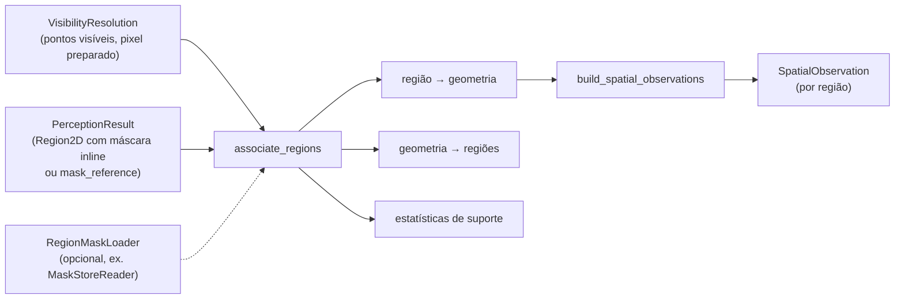

# Pertencimento à máscara de região

Este documento descreve `src/contextmap/sensor_association/membership.py`.

Com a geometria projetada na imagem preparada e filtrada por visibilidade, `associate_regions(resolution, perception_result, *, mask_loader=None)` responde, para cada ponto visível: **quais máscaras de `Region2D` congeladas contêm o seu pixel preparado?** A resposta é zero, uma ou várias regiões, e é mantida assim.

## Máscara por referência (#378)

Um `PerceptionRunArtifact` reaberto do disco nunca materializa pixels de máscara em `Region2D.mask` (`PerceptionRunReader.list_results()`); a região carrega só `mask_reference`. `associate_regions()` resolve isso com um `mask_loader: RegionMaskLoader | None` opcional — um Protocol local (`load(source_observation_id, region_id) -> InlineMask`) que não assume nenhum backend de armazenamento específico. `MaskStoreReader.load` (`contextmap.visual_perception.mask_store`) já satisfaz essa forma; `SensorAssociationExecutor` (runtime) passa `PerceptionRunReader(...).mask_store()`. Sem `mask_loader` (o default), uma região sem máscara inline permanece `NO_INLINE_MASK`, exatamente como antes de #378 — nada muda para quem já não precisava reabrir um run persistido.

## Regra (`mask-membership-v1`)

Um ponto visível pertence a **toda** região aceita cuja máscara inline é foreground no pixel cujo centro é o mais próximo do pixel preparado do ponto (índice `floor(c + 0.5)`). Truncar o pixel em vez de arredondá-lo erraria meio pixel; há um teste de regressão para isso.

## Sobreposição sem vencedor

Regiões sobrepostas são válidas. Quando várias máscaras contêm a mesma geometria, todas ficam: nada aqui escolhe um vencedor semântico, atribui uma classe final ao ponto, funde observações ou reexecuta a descoberta de regiões. As claims e features continuam **referências** à evidência de percepção, nunca rótulos escritos por Sensor Association.

`FrameMembership.regions_of(i)` devolve todas as regiões de um ponto, na ordem do resultado de percepção; uma tupla vazia é um ponto visível fora de toda máscara (`visible_unassigned`).

## Índices compactos

- **região → geometria**: `RegionMembership.associated_indices`, as posições ordenadas da geometria associada (`points_of(region_id)`);
- **geometria → regiões**: pares `(ponto, região)` ordenados (`point_indices`, `point_region_slots`), consultados por busca binária.

Uma região sem geometria visível ainda é avaliada: seu suporte é vazio e os contadores explicam o porquê. Nada é copiado para os pontos: o suporte é uma lista de `GeometryReference`.

## Regiões não avaliadas

Vão para `FrameMembership.skipped`, com o motivo, em vez de sumirem:

| Motivo | Quando |
| --- | --- |
| `REJECTED` | o candidato foi rejeitado pela normalização, então não está no conjunto canônico congelado |
| `NO_INLINE_MASK` | a região não tem nenhuma máscara resolvível: só caixa, ou a máscara está por referência sem um `mask_loader` capaz de resolvê-la |
| `EMPTY_MASK` | a região aceita tem máscara sem nenhum pixel de foreground: sem footprint, as estatísticas por pixel (cobertura, densidade de suporte) não têm definição, e `observation-quality-v2` exige `mask_area_px >= 1` |

## Espaço de coordenadas

A máscara de uma região deve estar **na imagem preparada** em que a geometria foi projetada. Uma máscara com outras dimensões (por exemplo, no espaço cru enquanto a imagem preparada foi recortada e redimensionada) é **recusada** com `AssociationInputError`, não reamostrada. O resultado de percepção também deve ser da mesma observação que o frame. As máscaras só são lidas, nunca alteradas, e os `region_id` são preservados.

## Estatísticas (`region-support-metrics-v1`)

As definições são versionadas; mudar uma delas muda a versão.

Por região (`RegionMembership`):

| Valor | Definição |
| --- | --- |
| *pegada* (`footprint`) | pontos cujo pixel preparado cai na máscara, qualquer que seja o estado (atrás da câmera e fora da imagem não têm pixel e nunca estão nela) |
| `associated_count` | pontos da pegada que estão visíveis |
| `occluded_count`, `outside_valid_support_count` | pontos da pegada ocluídos ou fora do suporte válido |
| `mask_area_px` | número de pixels foreground da máscara |
| `covered_pixel_count` | pixels distintos da máscara com pelo menos um ponto associado |
| `support_pixel_coverage` | `covered_pixel_count / mask_area_px`: a fração dos pixels da região com geometria 3D suportada (baixa num mapa esparso) |
| `visible_share` | `associated_count / tamanho da pegada`: a parcela da pegada que estava visível; `None` para pegada vazia |

Por frame (`MembershipStatistics`): `point_count`; os cinco estados que o particionam (`behind_camera`, `outside_image`, `outside_valid_support`, `occluded` e `visible`); `visible_count = associated_count + visible_unassigned_count`; `overlap_point_count` (visíveis em duas ou mais máscaras); `membership_pair_count`; e `points_by_region_count`, quantos pontos visíveis pertencem a exatamente `k` regiões (`k = 0` são os não atribuídos).

## `SpatialObservation` por região

`build_spatial_observations(membership, configuration_fingerprint=, code_version=)` monta um `SpatialObservation` por região avaliada:

- `geometry_support`: as `GeometryReference` da geometria associada, ordenadas;
- `visibility`: `ASSOCIATED`, `OCCLUDED` e `OUTSIDE_VALID_SUPPORT` da pegada da região;
- `projection_summary`: modelo de câmera, métrica de profundidade, identidade da cadeia de imagem, tamanho preparado, pontos considerados e visíveis do frame;
- `visual_feature_refs`: as features de escopo `REGION` da própria região e os mapas densos do mesmo resultado (que podem ser amostrados sobre a região). Features globais e claims de cena descrevem a imagem inteira, não a região, e ficam de fora;
- `semantic_claim_refs`: as claims cuja `region_id` é a região;
- `calibration_ref`, `pose_ref` e a proveniência: mapa, run de percepção, sequência do resultado, políticas de visibilidade e de pertencimento, fingerprint e versão do código.

## Como é verificado

Cenas sintéticas com pixel e profundidade conhecidos: associação reproduzível, ordem dos pontos irrelevante, região sem geometria, sobreposição de três máscaras com a mesma geometria, pegada com pontos ocluídos e fora do suporte, definições de cobertura, partição das estatísticas, recorte e redimensionamento sem deslocar a pertença, máscara em espaço errado, resultado de outra observação, regiões rejeitadas e só com caixa, referências de evidência por região, proveniência e ida e volta em JSON. Mutações que truncam o pixel, ignoram a visibilidade, pulam a checagem de espaço, escolhem a primeira região, avaliam regiões rejeitadas ou incluem features globais fazem testes falharem.
