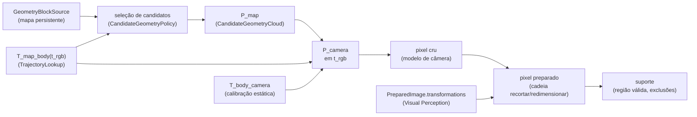

# Cadeia de projeção mapa → câmera → imagem preparada

Este documento descreve `candidate_geometry.py`, `image_transform.py` e `frame_projection.py`.

Para cada observação RGB, o `FrameProjector` executa o caminho determinístico completo:



Esta etapa **só posiciona** os pontos. Ela não decide oclusão, não escolhe região e não atribui label: um ponto que cai no suporte da imagem preparada é apenas um **candidato** para as etapas de visibilidade e pertencimento.

## Cadeia 3D

1. `T_map_body(t_rgb)` vem do `TrajectoryLookup` da trajetória selecionada, sob a `LookupPolicy` explícita (exata, mais próxima ou interpolada). Uma pose rejeitada devolve um `RejectedProjection`, não um erro (ver abaixo).
2. `T_body_camera` vem da calibração canônica: `StaticFrameGraph.resolve(body, camera)`, com o frame do corpo tomado da própria pose e o frame da câmera, da `CalibrationEntry`.
3. Compõe-se `T_map_camera = T_map_body · T_body_camera` e leva-se cada coordenada autoritativa do mapa ao frame óptico: `P_camera = R_map_cameraᵀ (P_map − t_map_camera)`, vetorizado sobre todos os pontos.
4. O `CameraProjection` declarado pela calibração projeta (ver [`camera_models.md`](camera_models.md)).

## Seleção de candidatos

Projetar o mapa inteiro em cada frame é correto, mas não escala: no mapa real de corridor-02 (26,63 M pontos) custava ~1,17 GB de arrays retidos e ~12 s por frame, e **nenhuma** geometria que virou evidência estava a mais de 5,5 m da câmera — indoor, a oclusão descarta tudo além da primeira superfície muito antes do alcance.

Por isso, antes de qualquer projeção exata, `select_candidate_geometry()` escolhe o que o frame avalia:

1. a translação de `T_map_camera` é o **centro óptico** no frame do mapa;
2. a `CandidateGeometryPolicy` declara `max_range_m`, e a caixa alinhada aos eixos que envolve a esfera de raio `max_range_m` vai à porta `GeometryBlockSource.iter_blocks(bounds=)` de Geometric Mapping (ver [`spatial-access.md`](../../geometric_mapping/docs/spatial-access.md));
3. cada bloco é reduzido pelo teste **exato** `‖P − C‖ ≤ max_range_m`.

A região de candidatos é a **esfera**, nunca a caixa com que a consulta é expressa: uma caixa alinhada aos eixos deixaria um ponto logo fora de uma face mais perto que um dentro de um canto, e é por isso que a caixa só decide o que é **lido**.

O que a esfera garante **depende da `DepthMetric` da câmera**, porque é essa a grandeza que a regra de oclusão compara:

| Métrica | Câmeras | Garantia |
|---|---|---|
| `RAY_RANGE` | fisheye, MEI | **Exata.** `depth == range`, então todo excluído está estritamente mais longe que todo retido na grandeza comparada, e a janela de um ponto sempre contém ele mesmo. Um excluído nunca pode ter sido o suporte mais próximo de um retido, e projeção, pixel, suporte, oclusão, pertencimento e suporte geométrico de todo retido são exatamente os do mapa inteiro. |
| `OPTICAL_AXIS` | pinhole | **Não exata.** A regra compara `z`, e `z ≤ range`, então um excluído pelo alcance pode ter `z` **menor** que um retido — basta estar num ângulo de campo maior. Se os dois caem na mesma janela de células, o culling remove um suporte que o mapa inteiro usaria. |

O sentido do erro no caso pinhole é fixo: remover pontos só pode **elevar** o mínimo de uma janela, então o mecanismo só pode tornar um retido **menos** ocluído. Entre os candidatos **retidos** ele **nunca descarta** geometria que o mapa inteiro associou — que é o que o #562 tinha de garantir. Geometria que a política excluiu, naturalmente, deixa de estar associada: essa é a mudança **declarada** na população avaliada. O que o caso pinhole acrescenta é que a política de alcance redefine também a população de **suporte**, não só a avaliada.

O regime só é alcançável com grade grossa. Uma sonda numérica pôs o menor alcance de janela capaz de disparar em ~**24 px**, contra os **12 px** de `cell_size_px=4, neighborhood_radius_cells=2` do run do corridor-02. **É uma sonda, não uma cota provada**: diz que a configuração real não está perto do regime, não que nenhuma configuração abaixo de 24 px possa divergir. `tests/sensor_association/test_candidate_equivalence.py` fixa os dois comportamentos, incluindo o par adversarial que de fato diverge.

`max_range_m = None` seleciona o mapa inteiro e é exatamente o comportamento anterior; é o braço de baseline com que a equivalência é comparada, e é o padrão do runtime (`policies.association_max_range_m`), de modo que habilitar o corte é sempre uma decisão deliberada e registrada.

### Identidade é global, nunca a linha

Um `CandidateGeometryCloud` carrega `coordinates_m[N,3]` **e** `global_indices[N]`: a linha `i` é o elemento `global_indices[i]`, nunca o elemento `i`. `FrameProjection.map_reference(row)` resolve a identidade persistente pelo índice global, e `rows_for(global_indices)` faz o caminho inverso, reportando explicitamente a geometria que a política não avaliou em vez de mapeá-la para uma linha vizinha. Os três lugares que persistiam a posição local como se fosse identidade global — `outputs/geometry-support.u32`, os `eligible_indices` das amostras densas e a coluna `geometry_index` do CSV de debug — gravam o índice global.

## Cadeia 2D

A câmera projeta em pixels da imagem **crua**, mas regiões e máscaras vivem na imagem **preparada**. `raw_to_prepared_transform(raw_size=, prepared_image=)` reproduz o efeito, sobre as coordenadas, dos passos que Visual Perception registrou em `PreparedImage.transformations`, e nunca assume que os dois espaços sejam iguais nem infere um espaço só pelas dimensões:

- a cadeia deve **começar** na imagem crua que a calibração descreve, ser **contígua** e **terminar** na imagem preparada;
- `crop`: subtrai a origem da caixa; o tamanho de saída registrado deve ser o da caixa;
- `resize`: multiplica pela razão de tamanhos, por eixo;
- `normalize`: não move pixels e não pode mudar o tamanho;
- `rectify`: **recusada**. O registro guarda só o `calibration_id`, não o remap nem o modelo de câmera retificado, então o pixel cru não pode ser levado à imagem retificada sem recriar parâmetros de pré-processamento que não foram registrados. Suportá-la exige que Visual Perception registre o modelo retificado;
- qualquer outra operação é recusada em vez de adivinhada.

### Convenção de pixel

Os passos são aplicados sobre as **bordas** dos pixels: um pixel com centro no inteiro `c` cobre `[c − 0.5, c + 0.5)`, então sua coordenada de borda é `c + 0.5`. O recorte subtrai a origem e o redimensionamento multiplica pela razão nesse espaço, que é como uma imagem de metade do tamanho é de fato amostrada; o resultado volta a ser centro de pixel. Por isso, na metade da resolução, o pixel cru de centro `0` cai em `−0.25` e não em `0`. O mesmo vale para `RawToPreparedTransform.in_prepared_image`, que usa `[−0.5, tamanho − 0.5)`.

O índice de máscara de um pixel preparado de centro `c` é `floor(c + 0.5)`, o pixel cujo centro é o mais próximo; truncar `c` erraria meio pixel. Testes de regressão cobrem esse erro, o de ignorar o recorte e o de amostrar pelo centro em vez da borda.

`RawToPreparedTransform.transform_id` (`sha256:…`) identifica a cadeia: tamanho cru, passos com seus parâmetros e tamanho preparado. Cadeias iguais compartilham a identidade, e é ela que `ProjectionSummary.image_transform_id` registra.

### Suporte

O `FrameProjection` guarda, por ponto, a profundidade óptica `z` e o alcance, os pixels crus e preparados e os estágios. Ele classifica cada ponto em quatro estágios exclusivos (`stage_counts()` os particiona):

| Estágio | Significado |
| --- | --- |
| `BEHIND_CAMERA` | o modelo de câmera não projeta o ponto |
| `OUTSIDE_IMAGE` | projeta, mas fora da imagem preparada (inclusive o que foi cortado, mesmo estando na imagem crua) |
| `OUTSIDE_VALID_SUPPORT` | dentro da imagem preparada, mas fora da `valid_region` ou dentro de uma `exclusion_region` |
| `IN_SUPPORT` | sobre pixels suportados; visível ou ocluído será decidido depois (`support_indices`) |

## Proveniência

Cada projeção é auditável: `FrameProjection.audit(i)` reconstrói

```text
GeometryReference → PoseRef → ExtrinsicRef → CameraIdentity/CalibrationRef → pixel cru → RawToPreparedTransform → pixel preparado
```

- `PoseRef`: trajetória, run, estimativas de origem (uma, ou as duas de uma interpolação), desfecho, `time_delta_ns` e fração;
- `ExtrinsicRef`: identidade da calibração e os frames do corpo e da câmera;
- `CalibrationRef` e `CameraIdentity`: qual calibração e qual câmera, com o hash da entrada.

## Validação

O construtor do `FrameProjector` recusa combinações cuja linhagem não fecha (`AssociationInputError`):

- a trajetória deve estar no **frame do mapa**;
- o mapa e a trajetória devem vir da **mesma trajetória** e da **mesma sequência**;
- a calibração deve ter a **mesma identidade** que o mapa e a trajetória usaram. O runtime deve passar a calibração do próprio artifact de sequência para todas as etapas.

Por observação, `project()` recusa: observação sem calibração ou com calibração sem modelo de câmera; frame ou tamanho da observação diferentes dos da calibração; `PreparedImage` de outra observação (`source_observation_id`); ausência de extrínseco estático entre o corpo e a câmera; cadeia de imagem não reproduzível.

## Erro versus rejeição

Uma pose que a política de lookup não aceita (fora do alcance da trajetória, sem correspondência exata, tolerância excedida, lacuna de interpolação) é uma condição **de dados**: `project()` devolve `RejectedProjection` com o motivo, para que frames pulados sejam contados e auditados. Um relógio diferente do da trajetória (`ClockDomainMismatchError`) e tudo o que não se encaixa (frames, linhagem, calibração, cadeia de imagem) são **erros**, porque nenhuma nova tentativa os resolve.
