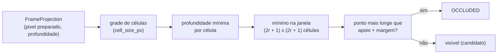

# Visibilidade e oclusão

Este documento descreve `src/contextmap/sensor_association/visibility.py`.

Uma projeção válida não prova que o ponto foi visto: pontos atrás de uma superfície mais próxima caem no mesmo pixel ou em pixels vizinhos e não podem herdar evidência do primeiro plano. Além disso, mapas persistentes são **esparsos**, e um z-buffer por pixel exato deixa pontos de fundo vazarem pelas lacunas de uma superfície da frente. `resolve_visibility(frame, policy)` classifica cada ponto projetado com um **suporte de profundidade local conservador**.

## Regra

1. A imagem preparada é dividida em células quadradas de `cell_size_px` pixels.
2. Cada célula guarda a **menor profundidade** entre os pontos que projetaram nela.
3. O apoio de um ponto é a menor profundidade na janela de `(2·neighborhood_radius_cells + 1)²` células ao redor da sua célula (truncada na borda da imagem).
4. O ponto é **ocluído** quando está mais longe que o apoio por mais que a margem `max(depth_margin_m, depth_margin_ratio · apoio)`.

Como o apoio vem da janela e não só do pixel, a superfície da frente cobre as suas próprias lacunas: um ponto de fundo projetado numa lacuna de 12 px de uma parede esparsa continua ocluído. O custo é conservador: perto da borda de um objeto, pontos realmente visíveis do fundo dentro da janela também são tratados como ocluídos.

## Política explícita, sem valores padrão

`OcclusionPolicy(cell_size_px, neighborhood_radius_cells, depth_margin_m, depth_margin_ratio)` não tem valores padrão: a vizinhança e a margem que servem a uma densidade de mapa e a uma câmera não servem a outra, então são escolhidas e registradas por execução. A política é validada (lado positivo, raio não negativo, margens finitas e não negativas), tem identidade versionada (`policy_id = "conservative-depth-support-v1"`) e um `fingerprint()` determinístico sobre a identidade e os parâmetros, que vai para `AssociationProvenance`.

- **Espaço**: os parâmetros são em **pixels da imagem preparada**, o espaço em que as regiões vivem. Com a imagem à metade da resolução, 16 px crus entre dois pontos são 8 px preparados.
- **Sem vizinhança universal**: `neighborhood_radius_cells = 0` compara o ponto só com a sua célula, e `cell_size_px = 1` com o pixel exato, o comportamento que vaza; o valor validado é uma escolha da política, não uma constante enterrada.

## Semântica de profundidade

O apoio compara **profundidades**, não distâncias euclidianas por padrão. `depth_metric_for(camera_model_kind)` escolhe a métrica pelo modelo de câmera, e ela é registrada em `ProjectionSummary.depth_metric`:

| Modelo | Métrica | Motivo |
| --- | --- | --- |
| Pinhole | `OPTICAL_AXIS` (`z`) | uma superfície fronto-paralela tem profundidade constante; o alcance a faria variar com o ângulo |
| Fisheye, MEI | `RAY_RANGE` (distância ao longo do raio) | o campo de visão pode passar de um hemisfério, onde `z` é indefinido ou não positivo |

Um teste garante que uma parede fronto-paralela vista em ângulos diferentes é uma só superfície para uma câmera perspectiva, e que um ponto a 100° do eixo em MEI, com `z < 0`, recebe uma profundidade positiva.

## Suporte válido

Só os pontos que ficaram no **suporte** (região válida, fora das exclusões) podem ser evidência. Mas **todos** os que caíram na imagem preparada atuam como oclusores, inclusive os fora do suporte: a oclusão é física, e a região válida só limita o que pode virar evidência. Pontos sem pixel (atrás da câmera, ou que o modelo não projeta) não participam.

## Resultado e diagnósticos

`VisibilityResolution` particiona os pontos em cinco máscaras exclusivas: `behind_camera`, `outside_image`, `outside_valid_support`, `occluded` e `visible`. Um ponto visível ainda é só um **candidato**: quem o atribui a uma região é o pertencimento à máscara, que decide se ele vira `ASSOCIATED` ou `VISIBLE_UNASSIGNED`.

Por ponto ficam o pixel projetado, a profundidade (`depth_m`), a profundidade de apoio (`support_depth_m`) e o motivo. `correspondence(i, visible_state=)` reconstrói o `PointCorrespondence` do ponto; um ocluído carrega o apoio estritamente mais próximo que o explica. No frame:

- `state_counts()` e `visible_count` particionam todos os pontos;
- `neighborhood_only_occlusions` conta os pontos que a vizinhança ocluiu e que um z-buffer só da própria célula deixaria passar: o vazamento que a política impede.

## Como é verificado

Os testes usam cenas sintéticas em que cada pixel e cada profundidade se conferem à mão: superfície da frente e do fundo; margem absoluta e relativa; uma parede esparsa a 2 m com fundo a 6 m nas lacunas (com a política conservadora o fundo fica ocluído, e com célula de 1 px e raio 0 ele vaza, o que documenta o modo de falha); raio de vizinhança e tamanho de célula configuráveis, inclusive um lado que não divide a imagem; espaço preparado; métrica de profundidade por modelo; suporte válido; partição dos estados; independência da ordem dos pontos. Mutações que removem a vizinhança, forçam o alcance, ignoram os pontos fora do suporte, descartam a margem relativa ou medem as células em pixels crus fazem testes falharem.
