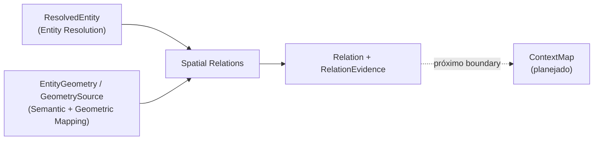

# Spatial Relations

## Responsabilidade

Descrever **como entidades resolvidas se relacionam no espaço**, sem esconder a incerteza. Uma `Relation` liga duas entidades resolvidas por um predicado canônico versionado, com um estado explícito (`SUPPORTED`, `REJECTED` ou `UNRESOLVED`) e o rastro da evidência em que se apoia. A relação é conhecimento derivado: nunca substitui as medições que a justificam e nunca corrige uma entidade.

## O que este módulo explicitamente não possui

- criação, fusão ou correção de entidades: Semantic Mapping e Entity Resolution (relações nunca reparam uma entidade errada);
- geometria e suas coordenadas: Geometric Mapping (aqui só há medições e referências);
- busca em linguagem natural, planejamento e navegação: consumidores externos;
- ontologia estendida ou completamento de senso comum: o vocabulário é pequeno, fechado e versionado;
- inferência de modelos: nenhuma relação é aceita só porque um modelo de linguagem a afirmou.

## Estado implementado

Existem os **contratos** (`Relation`, `RelationEvidence` e seus tipos de apoio), a **taxonomia de predicados** versionada, as **convenções de frame** declaradas pela execução a **geração de candidatos** determinística, os **avaliadores geométricos** de proximidade, direção e topologia a **evidência de contato e apoio** por pontos a **política de decisão** baseline, a **evidência de observação** (afirmações upstream como canal corroborante) e o **`SpatialRelationsRunArtifact`** persistido. A avaliação chega na última issue da milestone "Spatial Relations" (#148).

## Contratos públicos

- `Relation`, `RelationId`, `RelationState`, `RelationUncertainty`, `RelationUncertaintyKind`, `RelationProvenance`, `relation_id_for()` — a relação decidida entre duas entidades resolvidas.
- `RelationEvidence`, `RelationEvidenceId`, `RelationEvidenceChannel`, `RelationEvidenceStatus`, `RelationEvidenceProvenance`, `evidence_id_for()` — o que um canal mediu sobre um candidato dirigido.
- `Quantity`, `EvidenceCaveat`, `EvidenceCaveatKind`, `MeasuredGeometry` — número com unidade, ressalva declarada e a geometria sobre a qual se mediu.
- `RelationPredicate`, `PredicateFamily`, `FrameRequirement`, `PredicateSpec`, `PREDICATE_SPECS`, `predicate_spec()`, `TAXONOMY_VERSION` — o vocabulário e a semântica de cada predicado.
- `FrameConventions`, `AxisDirection`, `FRAME_CONVENTIONS_POLICY_ID`, `FrameConventionError`, `IncompatibleFrameError`, `UndeclaredAxisError` — os eixos que a execução declara para o frame do mapa e a recusa explícita quando faltam ou não servem.
- `generate_relation_candidates()`, `CandidatePolicy`, `RelationCandidate`, `RelationCandidateSet`, `CandidateExclusion`, `CandidateReason`, `CandidateExclusionReason`, `SkippedPredicate`, `CandidateProvenance`, `CANDIDATE_POLICY_ID` — a redução determinística dos pares a avaliar, com as razões de exclusão inspecionáveis.
- `evaluate_geometric_predicate()`, `evaluate_geometric_candidates()`, `GeometricPredicatePolicy`, `GEOMETRIC_PREDICATES`, `GEOMETRIC_POLICY_ID` — os avaliadores de `NEXT_TO`, `ABOVE`, `IN_FRONT_OF`, `INSIDE` e `INTERSECTS` sobre os limites das entidades.
- `evaluate_contact_predicate()`, `evaluate_contact_candidates()`, `ContactPredicatePolicy`, `CONTACT_PREDICATES`, `CONTACT_POLICY_ID` — a evidência por pontos de `TOUCHING`, `ON_TOP_OF` e `LEANING_AGAINST`.
- `decide_relations()`, `RelationDecisionResult`, `RelationDecision`, `DecisionRule`, `EvidenceUse`, `CONSERVATIVE_DECISION_POLICY_ID`, `decision_policy_fingerprint()` — a política conservadora que decide os estados, verifica a consistência estrutural e gera inversos e gêmeas simétricas.
- `observation_evidence_from_statements()`, `ObservationEvidenceResult`, `ObservationRelationStatement`, `UpstreamStatementRef`, `EndpointLink`, `StatementPolarity`, `canonical_predicate()`, `OBSERVATION_RULE_ID`, `UnlinkedEndpointError`, `IncompatibleLineageError` — o canal de observação: vínculo explícito, sem vocabulário escondido e nunca decisivo.
- `SpatialRelationsRunWriter`, `SpatialRelationsRunReader`, `SpatialRelationsRunManifest`, `SpatialRelationsRunId`, `RelationsRunLineage`, `RelationsRunPolicies`, `RelationsRunDebugLevel`, `RelationsRunArtifactError`, `IncompleteRelationsRunArtifactError` — o artifact persistido: escrita atômica em diretório escolhido por quem chama, linhagem explícita, leitura por identidade e índice por entidade.
- `encode_candidate_set()`, `decode_candidate_set()`, `encode_relation_decision()`, `decode_relation_decision()`, `encode_relation()`, `decode_relation()`, `encode_relation_evidence()`, `decode_relation_evidence()` — o codec JSON, que revalida todas as invariantes.

Ver [`contracts.md`](contracts.md) para a referência de campos e [`taxonomy.md`](taxonomy.md) para a semântica dos predicados.

## Módulos consumidos

- `contextmap.entity_resolution`: `ResolvedEntityReference` e o codec da referência.
- `contextmap.semantic_mapping`: `EntityGeometry`, o resumo espacial que os avaliadores leem.
- `contextmap.geometric_mapping`: `GeometrySource`, `GeometryPoint`, `GeometryReference`, `GeometryId` e `MapId`; a fonte só serve para resolver os pontos do canal de contato.
- `contextmap.shared`: `Vector3`, `AtomicRunDirectory`, `FileEntry`, `check_file_inventory`.

Todas as dependências são pela API pública e estão declaradas em `tests/architecture/test_boundaries.py`.

## Onde estão os documentos detalhados

- [`contracts.md`](contracts.md) — contratos, estados, invariantes e serialização.
- [`taxonomy.md`](taxonomy.md) — vocabulário, direção, simetria, inverso e convenções de frame.
- [`candidates.md`](candidates.md) — geração de candidatos, pré-condições, razões de exclusão e escala.
- [`geometric-predicates.md`](geometric-predicates.md) — definições, limiares, faixa de tolerância, ressalvas e consistência dos predicados geométricos.
- [`contact-predicates.md`](contact-predicates.md) — evidência por pontos de contato e apoio, área de contato, inclinação e incerteza.
- [`decision.md`](decision.md) — política de decisão, consistência estrutural, inverso e simetria, e rastro da evidência.
- [`artifact.md`](artifact.md) — layout, linhagem, políticas, validação na escrita, leitura, integridade e debug do `SpatialRelationsRunArtifact`.
- [`observation-evidence.md`](observation-evidence.md) — afirmações upstream como evidência corroborante: vínculo, vocabulário, direção e reconciliação.
