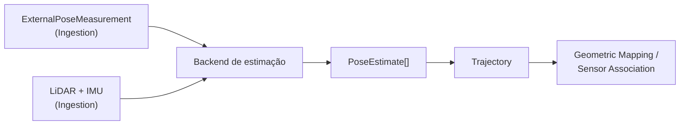

# State Estimation

## Responsabilidade

Produzir a **pose dinâmica** do rig ao longo do tempo: onde o frame do corpo (`body`) está no frame do mapa (`map`) em cada instante. O resultado é publicado como contratos canônicos (`PoseEstimate`, `Trajectory`) que Geometric Mapping e Sensor Association consomem sem conhecer ROS, o estimador que produziu a pose ou o formato de pose de um dataset.

Uma medição de pose vinda da fonte é apenas entrada. Ela só se torna `PoseEstimate` depois que um backend a valida e publica com frames, unidades e provenance explícitos.

## O que este módulo explicitamente não possui

- calibração estática (extrínsecos, intrínsecos, identidade de frames): pertence a Ingestion; State Estimation apenas consome o subconjunto de que o frame graph precisa;
- projeção 3D→2D e associação com imagens: Sensor Association;
- geometria persistente e mapa global: Geometric Mapping;
- qualquer conceito semântico.

## Estado implementado

Existem os contratos canônicos (`PoseEstimate`, `Trajectory`), o lookup temporal com interpolação, o port `StateEstimator` e o backend `ExternalPose`. Estão **planejados**, e serão documentados aqui quando forem implementados: backend FAST-LIO, preflight do frame graph, `StateEstimationRunArtifact` e o harness de validação.

## Contratos públicos

- `PoseEstimate`, `PoseEstimateId`, `PoseValidity`, `PoseProvenance` — pose `T_parent_child` em um instante, com frames, unidades, validade e provenance explícitos.
- `Trajectory`, `TrajectoryId`, `TrajectoryGap`, `TrajectoryProvenance`, `EstimatorProvenance` — sequência ordenada de poses de um corpo em um frame de referência.
- `TimeBounds`, `TrajectoryQualitySummary` — resumos derivados de uma trajetória.
- `pose_estimate_id_for()` — identidade determinística de uma pose dentro da trajetória.
- `TrajectoryLookup`, `LookupPolicy`, `ResolvedPose`, `RejectedLookup`, `LookupOutcome`, `LookupRejection`, `ClockDomainMismatchError` — resolução auditável de `T_map_body(t)` no timestamp de uma observação (exata, mais próxima ou interpolada), com rejeições explícitas.
- `TemporalAlignmentSummary`, `summarize_lookups()` — métricas de alinhamento temporal de um conjunto de lookups.
- `StateEstimator` — port de backends de estimação; `StateEstimationRequest`, `StateEstimationResult`, `EstimationDiagnostic`, `DiagnosticSeverity`, `StateEstimationError`, `MissingEstimatorInputError`.

O backend `contextmap.state_estimation.backends.external_pose` (`ExternalPoseEstimator`, `ExternalPoseConfig`) não é reexportado por `contextmap.state_estimation`; é importado pelo caminho completo somente pelo composition root em `runtime`, como qualquer backend.

Ver [`contracts.md`](contracts.md) para a referência de campos, a convenção de transform e as invariantes, [`lookup.md`](lookup.md) para a semântica de lookup e interpolação e [`backends.md`](backends.md) para o port e o backend `ExternalPose`.

## Módulos consumidos

- `contextmap.ingestion`: `FrameId`, `SourceObservationId`, `SequenceArtifactId`, `Covariance6x6`.
- `contextmap.shared`: `SourceTimestamp`, `Vector3`, `Quaternion`, `is_unit_quaternion`.

## Módulos que consomem este

`geometric_mapping` e `sensor_association`, sempre através de `contextmap.state_estimation`.

## Onde estão os documentos detalhados

- [`contracts.md`](contracts.md) — contratos, convenção de transform, invariantes e serialização.
- [`lookup.md`](lookup.md) — alinhamento temporal, políticas de lookup, interpolação e métricas.
- [`backends.md`](backends.md) — port `StateEstimator` e backend `ExternalPose`.
- [`docs/architecture.md`](../../../../docs/architecture.md) — ownership e direção de dependências.
- [`docs/CONTRACTS.md`](../../../../docs/CONTRACTS.md) — `PoseEstimate` e `Trajectory` no contexto global de contratos.
- [`docs/shared-primitives.md`](../../../../docs/shared-primitives.md) — primitivas geométricas compartilhadas.
