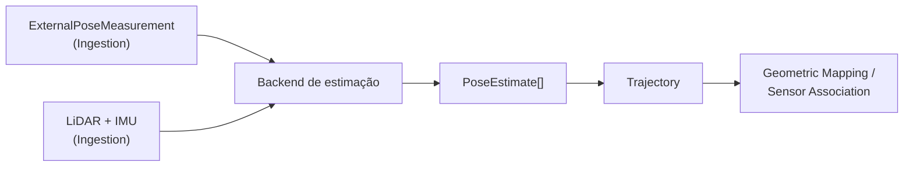

# State Estimation

## Responsabilidade

Produzir a **pose dinâmica** do rig ao longo do tempo: onde o frame do corpo (`body`) está no frame do mapa (`map`) em cada instante. O resultado é publicado como contratos canônicos (`PoseEstimate`, `Trajectory`) que Geometric Mapping e Sensor Association consomem sem conhecer ROS, o estimador que produziu a pose ou o formato de pose de um dataset.

Uma medição de pose vinda da fonte é apenas entrada. Ela só se torna `PoseEstimate` depois que um backend a valida e publica com frames, unidades e provenance explícitos.

## O que este módulo explicitamente não possui

- calibração estática (extrínsecos, intrínsecos, identidade de frames): pertence a Ingestion; State Estimation apenas consome o subconjunto de que o frame graph precisa;
- projeção 3D→2D e associação com imagens: Sensor Association;
- geometria persistente e mapa global: Geometric Mapping;
- qualquer conceito semântico.

## Estado implementado

Existem os contratos canônicos (`PoseEstimate`, `Trajectory`), o lookup temporal com interpolação, o port `StateEstimator`, os backends `ExternalPose` e FAST-LIO (este com o wrapper de implantação em container e uma execução real de referência sobre o `corridor-02`, ver [`backends.md`](backends.md)), o frame graph estático, o preflight de geometria, as métricas de movimento e o `StateEstimationRunArtifact`. A validação de qualidade (estrutura, movimento, transform trace, ATE/RPE contra referência e comparação entre backends) pertence a `evaluation`; ver [avaliação de State Estimation](../../evaluation/docs/state_estimation.md).

## Contratos públicos

- `PoseEstimate`, `PoseEstimateId`, `PoseValidity`, `PoseProvenance` — pose `T_parent_child` em um instante, com frames, unidades, validade e provenance explícitos.
- `Trajectory`, `TrajectoryId`, `TrajectoryGap`, `TrajectoryProvenance`, `EstimatorProvenance` — sequência ordenada de poses de um corpo em um frame de referência.
- `TimeBounds`, `TrajectoryQualitySummary` — resumos derivados de uma trajetória.
- `pose_estimate_id_for()` — identidade determinística de uma pose dentro da trajetória.
- `TrajectoryLookup`, `LookupPolicy`, `ResolvedPose`, `RejectedLookup`, `LookupOutcome`, `LookupRejection`, `ClockDomainMismatchError` — resolução auditável de `T_map_body(t)` no timestamp de uma observação (exata, mais próxima ou interpolada), com rejeições explícitas.
- `TemporalAlignmentSummary`, `summarize_lookups()` — métricas de alinhamento temporal de um conjunto de lookups.
- `StateEstimator` — port de backends de estimação; `StateEstimationRequest`, `StateEstimationResult`, `EstimationDiagnostic`, `DiagnosticSeverity`, `StateEstimationError`, `MissingEstimatorInputError`.
- `StaticFrameGraph`, `ResolvedTransform`, `LoopInconsistency`, `FrameGraphError` — resolução de `T_parent_child` e verificação de caminhos redundantes sobre os extrínsecos estáticos canônicos.
- `run_geometry_preflight()`, `GeometryRequirements`, `StaticRelationRequirement`, `GeometryPreflightReport`, `PreflightStatus`, `PreflightTolerances`, `calibration_identity()` — preflight READY/BLOCKED por capability.
- `execute_state_estimation()`, `StateEstimationOutcome`, `GeometryPreflightError` — executa um backend somente depois do preflight.
- `summarize_motion()`, `motion_deltas()`, `MotionSummary`, `MotionDelta`, `DistributionSummary` — distribuições de deslocamento, rotação e velocidades por intervalo.
- `StateEstimationRunWriter`, `StateEstimationRunReader`, `StateEstimationRunManifest`, `StateEstimationRunId`, `StateEstimationDebugLevel`, `allocate_run_index()`, `rebuild_run_registry()`, `RunArtifactError`, `IncompleteRunArtifactError` — persistência imutável e leitura de um run.

Os backends `contextmap.state_estimation.backends.external_pose` (`ExternalPoseEstimator`, `ExternalPoseConfig`) e `contextmap.state_estimation.backends.fast_lio` (`FastLioEstimator`, `FastLioConfig`, `FastLioRunner`) não são reexportados por `contextmap.state_estimation`; são importados pelo caminho completo somente pelo composition root em `runtime`, como qualquer backend. O `SubprocessFastLioRunner` (`backends/fast_lio_process.py`) e o wrapper de implantação (`backends/fast_lio_wrapper.py`, um arquivo autônomo que roda dentro do container do FAST-LIO e não é importado por nenhum outro módulo) seguem a mesma regra.

Ver [`contracts.md`](contracts.md) para a referência de campos, a convenção de
transform e as invariantes, [`lookup.md`](lookup.md) para a semântica de lookup e
interpolação, [`backends.md`](backends.md) para o port e os backends
`ExternalPose`/FAST-LIO, [`preflight.md`](preflight.md) para o frame graph, as
checagens e o serviço, e [`artifact.md`](artifact.md) para o formato persistido.

## Módulos consumidos

- `contextmap.ingestion`: `FrameId`, `SourceObservationId`, `SequenceArtifactId`, `Covariance6x6`, `CalibrationSet`, `RigidTransform`, `SourceObservation`.
- `contextmap.shared`: `SourceTimestamp`, `Vector3`, `Quaternion`, a álgebra de quaternions/transforms rígidos de `shared.geometry` e a mecânica de run directory de `shared.run_directory`.

## Módulos que consomem este

`geometric_mapping`, `sensor_association`, `semantic_fusion` e `evaluation`,
sempre através de `contextmap.state_estimation`.

## Onde estão os documentos detalhados

- [`contracts.md`](contracts.md) — contratos, convenção de transform, invariantes e serialização.
- [`lookup.md`](lookup.md) — alinhamento temporal, políticas de lookup, interpolação e métricas.
- [`backends.md`](backends.md) — port `StateEstimator`, backend `ExternalPose` e backend FAST-LIO.
- [`preflight.md`](preflight.md) — frame graph estático, preflight de geometria e serviço de execução.
- [`artifact.md`](artifact.md) — layout, manifest, níveis de debug e integridade do `StateEstimationRunArtifact`.
- [avaliação de State Estimation](../../evaluation/docs/state_estimation.md) — harness de validação e relatório comum entre backends.
- [`docs/architecture.md`](../../../../docs/architecture.md) — ownership e direção de dependências.
- [`docs/CONTRACTS.md`](../../../../docs/CONTRACTS.md) — `PoseEstimate` e `Trajectory` no contexto global de contratos.
- [`docs/shared-primitives.md`](../../../../docs/shared-primitives.md) — primitivas geométricas compartilhadas.
