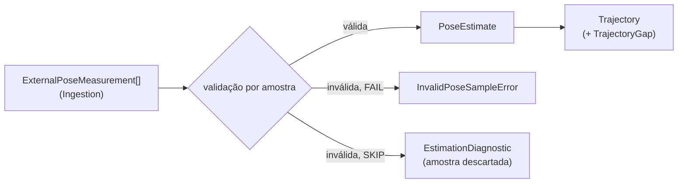
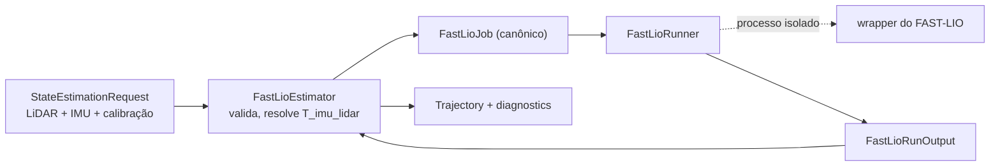

# Port e backends de State Estimation

## O port `StateEstimator`

`StateEstimator` (`ports.py`) é o ponto de substituição de backends de estimação.
Existem duas implementações concretas: `ExternalPoseEstimator` e
`FastLioEstimator`. Os testes exercitam ExternalPose diretamente e isolam a
integração de processo do FAST-LIO por um `FastLioRunner` injetável; nenhum dos
dois backends é tratado como fake do outro.

```python
class StateEstimator(Protocol):
    def estimator_provenance(self) -> EstimatorProvenance: ...
    def geometry_requirements(self) -> GeometryRequirements: ...
    def estimate(self, request: StateEstimationRequest) -> StateEstimationResult: ...
```

`geometry_requirements()` declara o que o backend exige da sequência e da calibração (modalidades, extrínsecos estáticos e frames dinâmicos); o [preflight](preflight.md) o verifica antes de `estimate()`.

- `StateEstimationRequest`: `trajectory_id`, `sequence_artifact_id`, `selection_id`, `observations` (observações canônicas selecionadas, em ordem de sequência) e `calibration` (`CalibrationSet | None`). O backend usa as modalidades de que precisa e ignora as demais; nunca mantém uma cópia própria da calibração.
- `StateEstimationResult`: `trajectory`, `diagnostics`, `consumed_observation_count` e `rejected_observation_count`.
- `EstimationDiagnostic`: `severity` (`INFO`/`WARNING`), `code` estável no formato `<backend_id>.<condição>`, `message` e `observation_id` opcional.
- Erros: `StateEstimationError` (base) e `MissingEstimatorInputError` (o request não traz uma entrada de que o backend depende).

Não existe fallback implícito para outro backend quando o selecionado falha. A
construção dos backends concretos pertencerá à composition root planejada;
`contextmap.runtime` ainda não existe.

## Backend `ExternalPose`

`contextmap.state_estimation.backends.external_pose` publica medições de pose externas como uma trajetória canônica, sem depender de ROS nem de FAST-LIO. Serve como o primeiro baseline de geometria.



Uma pose externa é medição de entrada, não ground truth: nada aqui a rotula como referência. O backend não conhece nomes de dataset, arquivo ou frame; o parsing de arquivos e a normalização de convenções pertencem a Ingestion, que já entrega frames, metros e quaternions `(x, y, z, w)`.

### Configuração (`ExternalPoseConfig`)

| Campo | Significado |
| --- | --- |
| `reference_frame` / `body_frame` | Frames que toda medição deve declarar e que a trajetória publicada declara. Outros frames tornam a amostra inválida: frames nunca são inferidos nem renomeados aqui. |
| `invalid_sample_policy` | `FAIL` (padrão) interrompe a execução; `SKIP` descarta a amostra e registra. |
| `max_gap_ns` | Intervalo entre poses consecutivas acima do qual um `TrajectoryGap` é registrado; `None` não registra. Gaps são reportados, nunca preenchidos. |
| `orientation_norm_tolerance` | Maior `|norm − 1|` de um quaternion de origem que é renormalizado (e registrado) em vez de rejeitado. Padrão `1e-3`. |

`fingerprint()` produz um hash determinístico da configuração efetiva, que vai para `EstimatorProvenance.configuration_fingerprint`.

### Validação por amostra

A primeira regra violada define o `code` da amostra inválida:

| Código | Condição |
| --- | --- |
| `external_pose.frame_mismatch` | `parent_frame`/`frame_id` diferentes dos frames configurados |
| `external_pose.non_finite_translation` | translação com NaN/Inf |
| `external_pose.invalid_orientation` | quaternion não finito, de norma zero, ou com `|norm − 1|` acima da tolerância |
| `external_pose.invalid_covariance` | covariância com valor não finito |
| `external_pose.clock_domain_mismatch` | `clock_id` diferente do da trajetória |
| `external_pose.non_increasing_timestamp` | timestamp duplicado ou fora de ordem |

Com `FAIL`, a primeira amostra inválida levanta `InvalidPoseSampleError` (com `code`, `observation_id` e `detail`). Com `SKIP`, ela é descartada, conta em `rejected_observation_count` e gera um diagnóstico `WARNING`; a execução falha com `StateEstimationError` somente se nenhuma amostra válida restar. As amostras seguem a ordem recebida: o backend não reordena, porque isso repararia em silêncio um problema de ordenação da fonte.

Um gap acima de `max_gap_ns` gera `TrajectoryGap` e o diagnóstico `external_pose.timestamp_gap`.

### Publicação

- orientação com `|norm − 1| ≤ 1e-6` é mantida como veio; acima disso e dentro da tolerância configurada é renormalizada, com a nota `renormalized orientation (norm=...)` em `conversions_applied`;
- covariância é propagada somente quando a fonte a fornece (`None` caso contrário), nunca fabricada;
- cada pose registra a medição de origem em `provenance.source_observation_ids`;
- `estimate_id` segue a posição na trajetória publicada (sem buracos quando amostras são descartadas);
- `calibration_identity` é `None`: o backend não consome calibração;
- `validity` é `VALID`: a fonte não sinaliza degradação.

A trajetória resultante é indistinguível, no nível do contrato público, da produzida por outro estimador; `TrajectoryLookup` e os demais consumidores a tratam da mesma forma.

## Backend `FastLio`

`contextmap.state_estimation.backends.fast_lio` integra o FAST-LIO (estimador LiDAR-inercial) atrás do port, para que a geometria downstream consuma `PoseEstimate`/`Trajectory` e nunca tipos de ROS ou do FAST-LIO. Trocar `ExternalPose` por FAST-LIO é uma mudança de configuração: os contratos downstream não mudam.



### O que a trajetória significa

O FAST-LIO estima a pose da IMU (o `body_frame`) no frame ancorado na primeira pose. É um frame **local**, não um frame global nem de referência: compará-la com uma trajetória de referência exige um alinhamento explícito e reportado (ver a avaliação de State Estimation). `reference_frame` é apenas o nome que a configuração dá a esse frame.

As poses não afirmam nada sobre correção de movimento das varreduras: as varreduras de entrada permanecem cruas e cada resultado carrega o diagnóstico `fast_lio.raw_scans_not_deskewed`, para nenhum consumidor supor deskew só porque o FAST-LIO foi usado.

### Requisitos e validação antes do estimador

`geometry_requirements()` declara LiDAR, IMU e o extrínseco LiDAR↔IMU; câmera não é exigida. O [preflight](preflight.md) bloqueia a execução antes de o estimador iniciar quando faltam dados, calibração ou o extrínseco. O extrínseco vem exclusivamente da calibração canônica (`T_imu_lidar`, `p_imu = R · p_lidar + t`); o backend não guarda uma segunda cópia.

O estimador ainda recusa, com erro acionável e sem chamar o runner: LiDAR em vários frames, IMU fora do `body_frame`, domínios de clock diferentes entre LiDAR e IMU, timestamps não crescentes, IMU que não cobre da primeira varredura ao fim da última, e ausência de caminho estático entre os frames.

### Configuração (`FastLioConfig`)

`reference_frame`, `body_frame`, `fast_lio_ref` (versão ou ref do FAST-LIO, obrigatória para reprodutibilidade), `scan_period_ns`, `max_gap_ns`, `orientation_norm_tolerance` e `parameters` (tipo de LiDAR, ruído, alcance etc., repassados sem interpretação ao runner e incluídos no fingerprint). O `configuration_fingerprint` cobre também o que o runner descreve (`describe()`), como o comando.

### Runner e contrato de troca

`FastLioRunner` é o único ponto em que ROS e o processo do FAST-LIO existem. `SubprocessFastLioRunner` (`backends/fast_lio_process.py`) executa o comando da implantação **sem shell**, com timeout, num diretório temporário removido ao final, e troca com ela arquivos em um contrato pequeno e independente das chaves de configuração do FAST-LIO:

| Placeholder | Conteúdo |
| --- | --- |
| `{input_bag}` | bag ROS 1 com `/lidar` (`PointCloud2`) e `/imu` (`Imu`), com os timestamps canônicos; orientação ausente na IMU é marcada pela convenção do ROS (`orientation_covariance[0] = -1`) |
| `{job}` | `job.json`: tópicos, frames, extrínseco `T_imu_lidar`, clock, período de varredura, limites de tempo, contagens e `parameters` |
| `{output_dir}` | onde o wrapper grava `trajectory.tum` (`timestamp tx ty tz qx qy qz qw`, com o timestamp em segundos decimais com precisão de nanossegundo e, opcionalmente, 36 valores de covariância em linha) e, opcionalmente, `status.json` (`status`: `ok`, `initialization_failed` ou `diverged`; `message`; `fast_lio_ref`; `warnings`) |

O bag escrito é relido pelo adapter ROS 1 de Ingestion como as mesmas observações canônicas (testado). O wrapper é o componente que mapeia `job.json` para as chaves do FAST-LIO e roda o binário; ele fica na implantação, junto com o FAST-LIO.

### Proveniência e falhas

- cada pose é atribuída à varredura cujo intervalo (do timestamp da varredura até um `scan_period_ns` depois) contém seu timestamp e registra essa observação em `source_observation_ids`; uma pose que não cai em nenhum intervalo não é rastreável e falha a execução;
- valores inválidos (não finitos, quaternion fora da tolerância, timestamps não crescentes) falham em vez de serem reparados; quaternion dentro da tolerância é renormalizado e registrado;
- covariância é preservada somente quando o estimador a expõe;
- toda falha vira `FastLioFailure` com `kind` (`process_failed`, `timeout`, `missing_output`, `invalid_output`, `initialization_failed`, `diverged`, `version_mismatch`, `empty_output`) e, quando há, o final do log do processo;
- uma versão reportada diferente de `fast_lio_ref` falha (`version_mismatch`);
- **não há fallback** para `ExternalPose` nem para outro backend.

### Estado de validação

Estão testados: o estimador com um runner falso, o bag de entrada (incluindo o round trip pelo adapter de Ingestion), o `job.json`, o parsing da trajetória, e o runner de processo exercitado com um processo substituto que lê o bag e escreve a trajetória (sucesso, código de saída, timeout, ausência de saída, saída inválida, divergência, falha de inicialização, ausência de shell). **Uma execução de referência com o FAST-LIO instalado ainda não foi feita**: ela é necessária para validar o wrapper da implantação e a qualidade da trajetória sobre uma sequência de referência, e não pôde ser feita nesta máquina (sem ROS nem FAST-LIO).
