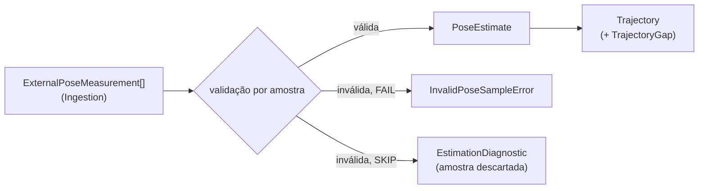

# Port e backends de State Estimation

## O port `StateEstimator`

`StateEstimator` (`ports.py`) é o ponto de substituição de backends de estimação. Existem duas implementações reais previstas (ExternalPose e FAST-LIO), e os testes usam a primeira como fake leve da segunda, o que justifica o port.

```python
class StateEstimator(Protocol):
    def estimator_provenance(self) -> EstimatorProvenance: ...
    def geometry_requirements(self) -> GeometryRequirements: ...
    def estimate(self, request: StateEstimationRequest) -> StateEstimationResult: ...
```

`geometry_requirements()` declara o que o backend exige da sequência e da calibração (modalidades, extrínsecos estáticos e frames dinâmicos); o [preflight](preflight.md) o verifica antes de `estimate()`.

- `StateEstimationRequest`: `trajectory_id`, `sequence_artifact_id`, `selection_id`, `observations` (observações canônicas selecionadas, em ordem de sequência) e `calibration` (`CalibrationSet | None`). O backend usa as modalidades de que precisa e ignora as demais; nunca mantém uma cópia própria da calibração.
- `StateEstimationResult`: `trajectory`, `diagnostics`, `consumed_observation_count` e `rejected_observation_count`.
- `EstimationDiagnostic`: `severity` (`INFO`/`WARNING`), `code` estável no formato `<backend_id>.<condição>`, `message` e `observation_id` opcional.
- Erros: `StateEstimationError` (base) e `MissingEstimatorInputError` (o request não traz uma entrada de que o backend depende).

Não existe fallback implícito para outro backend quando o selecionado falha. A construção dos backends concretos pertence ao `runtime`.

## Backend `ExternalPose`

`contextmap.state_estimation.backends.external_pose` publica medições de pose externas como uma trajetória canônica, sem depender de ROS nem de FAST-LIO. Serve como o primeiro baseline de geometria.



Uma pose externa é medição de entrada, não ground truth: nada aqui a rotula como referência. O backend não conhece nomes de dataset, arquivo ou frame; o parsing de arquivos e a normalização de convenções pertencem a Ingestion, que já entrega frames, metros e quaternions `(x, y, z, w)`.

### Configuração (`ExternalPoseConfig`)

| Campo | Significado |
| --- | --- |
| `reference_frame` / `body_frame` | Frames que toda medição deve declarar e que a trajetória publicada declara. Outros frames tornam a amostra inválida: frames nunca são inferidos nem renomeados aqui. |
| `invalid_sample_policy` | `FAIL` (padrão) interrompe a execução; `SKIP` descarta a amostra e registra. |
| `max_gap_ns` | Intervalo entre poses consecutivas acima do qual um `TrajectoryGap` é registrado; `None` não registra. Gaps são reportados, nunca preenchidos. |
| `orientation_norm_tolerance` | Maior `|norm − 1|` de um quaternion de origem que é renormalizado (e registrado) em vez de rejeitado. Padrão `1e-3`. |

`fingerprint()` produz um hash determinístico da configuração efetiva, que vai para `EstimatorProvenance.configuration_fingerprint`.

### Validação por amostra

A primeira regra violada define o `code` da amostra inválida:

| Código | Condição |
| --- | --- |
| `external_pose.frame_mismatch` | `parent_frame`/`frame_id` diferentes dos frames configurados |
| `external_pose.non_finite_translation` | translação com NaN/Inf |
| `external_pose.invalid_orientation` | quaternion não finito, de norma zero, ou com `|norm − 1|` acima da tolerância |
| `external_pose.invalid_covariance` | covariância com valor não finito |
| `external_pose.clock_domain_mismatch` | `clock_id` diferente do da trajetória |
| `external_pose.non_increasing_timestamp` | timestamp duplicado ou fora de ordem |

Com `FAIL`, a primeira amostra inválida levanta `InvalidPoseSampleError` (com `code`, `observation_id` e `detail`). Com `SKIP`, ela é descartada, conta em `rejected_observation_count` e gera um diagnóstico `WARNING`; a execução falha com `StateEstimationError` somente se nenhuma amostra válida restar. As amostras seguem a ordem recebida: o backend não reordena, porque isso repararia em silêncio um problema de ordenação da fonte.

Um gap acima de `max_gap_ns` gera `TrajectoryGap` e o diagnóstico `external_pose.timestamp_gap`.

### Publicação

- orientação com `|norm − 1| ≤ 1e-6` é mantida como veio; acima disso e dentro da tolerância configurada é renormalizada, com a nota `renormalized orientation (norm=...)` em `conversions_applied`;
- covariância é propagada somente quando a fonte a fornece (`None` caso contrário), nunca fabricada;
- cada pose registra a medição de origem em `provenance.source_observation_ids`;
- `estimate_id` segue a posição na trajetória publicada (sem buracos quando amostras são descartadas);
- `calibration_identity` é `None`: o backend não consome calibração;
- `validity` é `VALID`: a fonte não sinaliza degradação.

A trajetória resultante é indistinguível, no nível do contrato público, da produzida por outro estimador; `TrajectoryLookup` e os demais consumidores a tratam da mesma forma.
