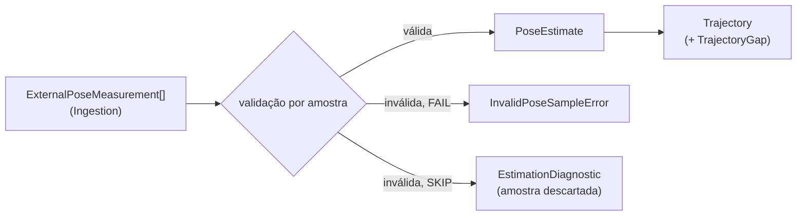
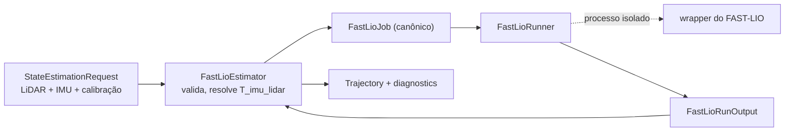
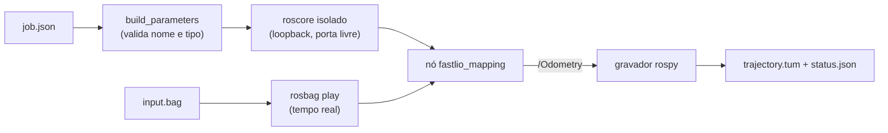

# Port e backends de State Estimation

## O port `StateEstimator`

`StateEstimator` (`ports.py`) é o ponto de substituição de backends de estimação.
Existem duas implementações concretas: `ExternalPoseEstimator` e
`FastLioEstimator`. Os testes exercitam ExternalPose diretamente e isolam a
integração de processo do FAST-LIO por um `FastLioRunner` injetável; nenhum dos
dois backends é tratado como fake do outro.

```python
class StateEstimator(Protocol):
    def estimator_provenance(self) -> EstimatorProvenance: ...
    def geometry_requirements(self) -> GeometryRequirements: ...
    def estimate(self, request: StateEstimationRequest) -> StateEstimationResult: ...
```

`geometry_requirements()` declara o que o backend exige da sequência e da calibração (modalidades, extrínsecos estáticos e frames dinâmicos); o [preflight](preflight.md) o verifica antes de `estimate()`.

- `StateEstimationRequest`: `trajectory_id`, `sequence_artifact_id`, `selection_id`, `observations` (observações canônicas selecionadas, em ordem de sequência) e `calibration` (`CalibrationSet | None`). O backend usa as modalidades de que precisa e ignora as demais; nunca mantém uma cópia própria da calibração.
- `StateEstimationResult`: `trajectory`, `diagnostics`, `consumed_observation_count` e `rejected_observation_count`.
- `EstimationDiagnostic`: `severity` (`INFO`/`WARNING`), `code` estável no formato `<backend_id>.<condição>`, `message` e `observation_id` opcional.
- Erros: `StateEstimationError` (base) e `MissingEstimatorInputError` (o request não traz uma entrada de que o backend depende).

Não existe fallback implícito para outro backend quando o selecionado falha. A
construção dos backends concretos pertencerá à composition root planejada;
`contextmap.runtime` ainda não existe.

## Backend `ExternalPose`

`contextmap.state_estimation.backends.external_pose` publica medições de pose externas como uma trajetória canônica, sem depender de ROS nem de FAST-LIO. Serve como o primeiro baseline de geometria.



Uma pose externa é medição de entrada, não ground truth: nada aqui a rotula como referência. O backend não conhece nomes de dataset, arquivo ou frame; o parsing de arquivos e a normalização de convenções pertencem a Ingestion, que já entrega frames, metros e quaternions `(x, y, z, w)`.

### Configuração (`ExternalPoseConfig`)

| Campo | Significado |
| --- | --- |
| `reference_frame` / `body_frame` | Frames que toda medição deve declarar e que a trajetória publicada declara. Outros frames tornam a amostra inválida: frames nunca são inferidos nem renomeados aqui. |
| `invalid_sample_policy` | `FAIL` (padrão) interrompe a execução; `SKIP` descarta a amostra e registra. |
| `max_gap_ns` | Intervalo entre poses consecutivas acima do qual um `TrajectoryGap` é registrado; `None` não registra. Gaps são reportados, nunca preenchidos. |
| `orientation_norm_tolerance` | Maior `|norm − 1|` de um quaternion de origem que é renormalizado (e registrado) em vez de rejeitado. Padrão `1e-3`. |

`fingerprint()` produz um hash determinístico da configuração efetiva, que vai para `EstimatorProvenance.configuration_fingerprint`.

### Validação por amostra

A primeira regra violada define o `code` da amostra inválida:

| Código | Condição |
| --- | --- |
| `external_pose.frame_mismatch` | `parent_frame`/`frame_id` diferentes dos frames configurados |
| `external_pose.non_finite_translation` | translação com NaN/Inf |
| `external_pose.invalid_orientation` | quaternion não finito, de norma zero, ou com `|norm − 1|` acima da tolerância |
| `external_pose.invalid_covariance` | covariância com valor não finito |
| `external_pose.clock_domain_mismatch` | `clock_id` diferente do da trajetória |
| `external_pose.non_increasing_timestamp` | timestamp duplicado ou fora de ordem |

Com `FAIL`, a primeira amostra inválida levanta `InvalidPoseSampleError` (com `code`, `observation_id` e `detail`). Com `SKIP`, ela é descartada, conta em `rejected_observation_count` e gera um diagnóstico `WARNING`; a execução falha com `StateEstimationError` somente se nenhuma amostra válida restar. As amostras seguem a ordem recebida: o backend não reordena, porque isso repararia em silêncio um problema de ordenação da fonte.

Um gap acima de `max_gap_ns` gera `TrajectoryGap` e o diagnóstico `external_pose.timestamp_gap`.

### Publicação

- orientação com `|norm − 1| ≤ 1e-6` é mantida como veio; acima disso e dentro da tolerância configurada é renormalizada, com a nota `renormalized orientation (norm=...)` em `conversions_applied`;
- covariância é propagada somente quando a fonte a fornece (`None` caso contrário), nunca fabricada;
- cada pose registra a medição de origem em `provenance.source_observation_ids`;
- `estimate_id` segue a posição na trajetória publicada (sem buracos quando amostras são descartadas);
- `calibration_identity` é `None`: o backend não consome calibração;
- `validity` é `VALID`: a fonte não sinaliza degradação.

A trajetória resultante é indistinguível, no nível do contrato público, da produzida por outro estimador; `TrajectoryLookup` e os demais consumidores a tratam da mesma forma.

## Backend `FastLio`

`contextmap.state_estimation.backends.fast_lio` integra o FAST-LIO (estimador LiDAR-inercial) atrás do port, para que a geometria downstream consuma `PoseEstimate`/`Trajectory` e nunca tipos de ROS ou do FAST-LIO. Trocar `ExternalPose` por FAST-LIO é uma mudança de configuração: os contratos downstream não mudam.



### O que a trajetória significa

O FAST-LIO estima a pose da IMU (o `body_frame`) no frame ancorado na primeira pose. É um frame **local**, não um frame global nem de referência: compará-la com uma trajetória de referência exige um alinhamento explícito e reportado (ver a avaliação de State Estimation). `reference_frame` é apenas o nome que a configuração dá a esse frame.

As poses não afirmam nada sobre correção de movimento das varreduras: as varreduras de entrada permanecem cruas e cada resultado carrega o diagnóstico `fast_lio.raw_scans_not_deskewed`, para nenhum consumidor supor deskew só porque o FAST-LIO foi usado.

### Requisitos e validação antes do estimador

`geometry_requirements()` declara LiDAR, IMU e o extrínseco LiDAR↔IMU; câmera não é exigida. O [preflight](preflight.md) bloqueia a execução antes de o estimador iniciar quando faltam dados, calibração ou o extrínseco. O extrínseco vem exclusivamente da calibração canônica (`T_imu_lidar`, `p_imu = R · p_lidar + t`); o backend não guarda uma segunda cópia.

O estimador ainda recusa, com erro acionável e sem chamar o runner: LiDAR em vários frames, IMU fora do `body_frame`, domínios de clock diferentes entre LiDAR e IMU, timestamps não crescentes, IMU que não cobre da primeira varredura ao fim da última, e ausência de caminho estático entre os frames.

### Configuração (`FastLioConfig`)

`reference_frame`, `body_frame`, `fast_lio_ref` (versão ou ref do FAST-LIO, obrigatória para reprodutibilidade), `scan_period_ns`, `max_gap_ns`, `orientation_norm_tolerance` e `parameters` (tipo de LiDAR, ruído, alcance etc., repassados sem interpretação ao runner e incluídos no fingerprint). O `configuration_fingerprint` cobre também o que o runner descreve (`describe()`), como o comando.

`scan_period_ns` precisa cobrir a duração medida de uma varredura, porque a pose do FAST-LIO leva o timestamp do **fim** da varredura (início mais o maior `time` dos pontos) e é atribuída à varredura cujo intervalo a contém. No `corridor-02` o `time` dos pontos vai de 0 a 0,1008 s e o intervalo entre varreduras é de 100,9 ms; a execução de referência usa 101 ms.

### Runner e contrato de troca

`FastLioRunner` é o único ponto em que ROS e o processo do FAST-LIO existem. `SubprocessFastLioRunner` (`backends/fast_lio_process.py`) executa o comando da implantação **sem shell**, com timeout, num diretório temporário removido ao final, e troca com ela arquivos em um contrato pequeno e independente das chaves de configuração do FAST-LIO:

| Placeholder | Conteúdo |
| --- | --- |
| `{input_bag}` | bag ROS 1 com `/lidar` (`PointCloud2`) e `/imu` (`Imu`), com os timestamps canônicos; orientação ausente na IMU é marcada pela convenção do ROS (`orientation_covariance[0] = -1`) |
| `{job}` | `job.json`: tópicos, frames, extrínseco `T_imu_lidar`, clock, período de varredura, limites de tempo, contagens e `parameters` |
| `{output_dir}` | onde o wrapper grava `trajectory.tum` (`timestamp tx ty tz qx qy qz qw`, com o timestamp em segundos decimais com precisão de nanossegundo e, opcionalmente, 36 valores de covariância em linha) e, opcionalmente, `status.json` (`status`: `ok`, `initialization_failed` ou `diverged`; `message`; `fast_lio_ref`; `warnings`) |

O bag escrito é relido pelo adapter ROS 1 de Ingestion como as mesmas observações canônicas (testado). O wrapper é o componente que mapeia `job.json` para as chaves do FAST-LIO e roda o binário; ele fica na implantação, junto com o FAST-LIO, e está descrito a seguir.

### Wrapper de implantação (`backends/fast_lio_wrapper.py`)

É o programa que o `SubprocessFastLioRunner` executa dentro do container do FAST-LIO. É um arquivo **autônomo**: usa só a biblioteca padrão (mais `rospy`/`nav_msgs`, importados sob demanda dentro do container), é escrito para o Python 3.8 do ROS Noetic e não importa `contextmap`, que não está instalado lá. Nenhum outro módulo do `contextmap` o importa; ele é montado no container como arquivo, e um teste garante que continua autônomo.



- **Parâmetros.** Os nomes em `FastLioConfig.parameters` são os parâmetros ROS do FAST-LIO (`preprocess/lidar_type`, `mapping/acc_cov`, `point_filter_num`, ...). O wrapper os aplica sem interpretar valores, mas **valida nome e tipo**: o roscpp ignora em silêncio um parâmetro de tipo incompatível e usa o padrão do código, e um nome errado não faz nada; ambos produziriam uma execução diferente da que o fingerprint declara. Um inteiro é aceito para um parâmetro de ponto flutuante e enviado como `float`. `preprocess/lidar_type` é obrigatório, porque o padrão do FAST-LIO é o tipo Livox e leria uma nuvem Velodyne com o tratador errado.
- **O que o wrapper define a partir do job**, e que a configuração não pode sobrescrever: os tópicos, `mapping/extrinsic_T` e `mapping/extrinsic_R` (a partir de `T_imu_lidar`, a direção que o FAST-LIO espera), `mapping/extrinsic_est_en = false` (a calibração canônica nunca é substituída por uma estimativa online) e a desativação de toda saída que a implantação não usa (publicação de nuvens e caminho, salvamento de PCD).
- **Falhas.** Sem nenhuma odometria publicada, o status é `initialization_failed`; qualquer pose não finita é `diverged` (e nenhuma trajetória é escrita); um processo que não inicia, morre ou passa do prazo interno (`--deadline-s`, menor que o timeout do host, para o container parar mesmo que o cliente do docker seja morto) termina com código de saída diferente de zero e o final do log no stderr, que o runner classifica como `process_failed`. Um job inválido termina com código 2 antes de qualquer processo iniciar.
- **Versão.** `status.json` traz o commit lido do `HEAD` do checkout do FAST-LIO dentro da imagem (sem executar `git`); o estimador o compara com `fast_lio_ref` (`version_mismatch`). Sem metadados git legíveis, o wrapper reporta `null` e um aviso `unverified`.
- **Covariância não é exportada.** Esta revisão do FAST-LIO preenche a covariância da mensagem de odometria **depois** de publicá-la (o assinante recebe a da varredura anterior, e zeros na primeira) e a ordena rotação-depois-posição, então não é a covariância de pose que o contrato canônico define. As poses saem sem covariância (`None`), em vez de com uma covariância errada.

### Execução por docker

A imagem vem da receita `docker/fast-lio-ros1/Dockerfile` (FAST-LIO no commit `7cc4175de6f8ba2edf34bab02a42195b141027e9` sobre ROS 1 Noetic, com os commits do Livox SDK e do driver fixados). Ela contém só o FAST-LIO compilado; o wrapper é montado em tempo de execução, então alterá-lo não exige reconstruir a imagem. O comando do runner usa os placeholders de arquivo:

```text
docker run --rm --network none --user <uid>:<gid> --read-only
    --tmpfs /tmp:rw,mode=1777 --tmpfs /opt/fast-lio/src/FAST_LIO/Log:rw,mode=1777
    --cap-drop ALL --security-opt no-new-privileges
    -e HOME=/tmp -e USER=fastlio -e LOGNAME=fastlio
    -v <wrapper>:/opt/contextmap/fast_lio_wrapper.py:ro
    -v {input_bag}:/data/input.bag:ro -v {job}:/data/job.json:ro -v {output_dir}:/data/output
    <id da imagem>
    python3 /opt/contextmap/fast_lio_wrapper.py --input-bag /data/input.bag
        --job /data/job.json --output-dir /data/output --deadline-s <timeout - 30>
```

O container roda sem rede, sem privilégios, com o sistema de arquivos somente leitura, como o usuário do host (as saídas ficam suas) e com o `Log/` do FAST-LIO em tmpfs (o nó tenta abrir arquivos de log ali). A imagem é referenciada pelo **ID**, não por uma tag móvel, porque o comando entra no fingerprint. O fingerprint inclui os caminhos do host do comando (o do wrapper e o uid); para comparar execuções entre máquinas, compare a identidade da implantação (ID da imagem, commit do FAST-LIO e hash do wrapper), que a validação registra à parte.

O FAST-LIO é um consumidor em tempo real: o bag é tocado a 1×, então a execução dura a duração da janela mais cerca de 10 s de inicialização (CPU apenas; não usa GPU).

### Proveniência e falhas

- cada pose é atribuída à varredura cujo intervalo (do timestamp da varredura até um `scan_period_ns` depois) contém seu timestamp e registra essa observação em `source_observation_ids`; uma pose que não cai em nenhum intervalo não é rastreável e falha a execução;
- valores inválidos (não finitos, quaternion fora da tolerância, timestamps não crescentes) falham em vez de serem reparados; quaternion dentro da tolerância é renormalizado e registrado;
- covariância é preservada somente quando o estimador a expõe; o wrapper do FAST-LIO não a exporta (ver acima), então as poses dele têm `covariance = None`;
- toda falha vira `FastLioFailure` com `kind` (`process_failed`, `timeout`, `missing_output`, `invalid_output`, `initialization_failed`, `diverged`, `version_mismatch`, `empty_output`) e, quando há, o final do log do processo;
- uma versão reportada diferente de `fast_lio_ref` falha (`version_mismatch`);
- **não há fallback** para `ExternalPose` nem para outro backend.

### Estado de validação

**Testes determinísticos (CI, sem ROS nem docker):** o estimador com um runner falso, o bag de entrada (incluindo o round trip pelo adapter de Ingestion), o `job.json`, o parsing da trajetória, o runner de processo com um processo substituto (sucesso, código de saída, timeout, ausência de saída, saída inválida, divergência, falha de inicialização, ausência de shell) e o wrapper com um runtime ROS substituto: mapeamento e validação de parâmetros, direção do extrínseco, formato da trajetória, versão, status de falha e concordância byte a byte com o que o `SubprocessFastLioRunner` lê. Esses testes **não** exercitam o FAST-LIO; o `RosRuntime` do wrapper só é coberto pela execução real abaixo.

**Execução real (2026-09-21, `corridor-02`, CPU, sem GPU):** o `FastLioEstimator` com o `SubprocessFastLioRunner` e a imagem `sha256:670973462caa9496acaf41dd2a94f07277f14439b4d026d3bd9965c81b1dd985` (FAST-LIO `7cc4175de6f8ba2edf34bab02a42195b141027e9`) sobre a janela de 90 s de `outputs/validation/2026-09-21/selection.json` (identidade `sha256:dc641b34…`), lida do índice da sequência ingerida sem carregar os 24 GB de payloads:

| Item | Resultado |
| --- | --- |
| Entrada | 891 varreduras LiDAR (as 892 da seleção menos a última, cujo fim a IMU não cobre) e 17 983 amostras de IMU; nada é lido fora da janela |
| Preflight | `READY` (LiDAR, IMU e extrínseco `T_epson_cmu_rc1_velodyne`; a prontidão de Geometric Mapping também foi verificada) |
| Saída | 888 poses (as 3 primeiras varreduras alimentam a inicialização do FAST-LIO), 0 gaps acima de 250 ms, todas com a varredura de origem em `source_observation_ids` |
| Tempo | ~100 s de execução para 90 s de dados (o bag é tocado em tempo real) e ~450 MB de RSS no processo host |
| Repetibilidade | 3 execuções da mesma entrada: `poses.jsonl` e `trajectory.json` idênticos byte a byte, mesmo fingerprint; só `created_at`, `run_id`, `run_index` e o inventário mudam. Não são observações independentes: medem só o determinismo da cadeia |
| Artifact | `StateEstimationRunArtifact` persistido, com `verify_integrity()` sem problemas |

Falhas reais provocadas pelo wrapper (todas viram `FastLioFailure` `process_failed`, sem fallback, com o motivo no fim do log): tipo de LiDAR errado (`preprocess/lidar_type = 1`, o nó recusa a conexão por diferença de tipo de mensagem e o wrapper para no prazo interno); prazo interno menor que a duração do bag; e um nome de parâmetro desconhecido, recusado com código 2 antes de qualquer processo ROS iniciar. Nenhum container ficou vivo depois.

A qualidade da trajetória (ATE/RPE contra a referência do `corridor-02`, com o alinhamento SE(3) explícito) está em [avaliação de State Estimation](../../evaluation/docs/state_estimation.md).

Limites conhecidos: uma única sequência e uma única janela de 90 s; a covariância não é exportada; o wrapper depende de o nó publicar em `/Odometry` e de `rosbag play --wait-for-subscribers`; e o fingerprint da configuração inclui os caminhos do host do comando (ver "Execução por docker").
