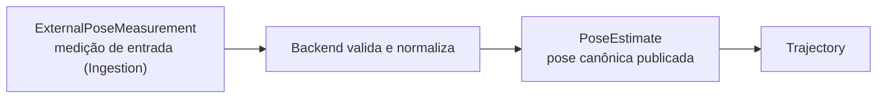

# Contratos de State Estimation

Este documento descreve `src/contextmap/state_estimation/models.py` e `serialization.py`.

## Convenção de transform

Todo transform público usa a notação `T_parent_child`: leva coordenadas expressas em `child_frame` para `parent_frame`.

```text
p_parent = R(orientation) · p_child + translation_m
```

- `orientation` é um quaternion unitário na ordem `(x, y, z, w)`; `(0, 0, 0, 1)` é a identidade;
- `translation_m` está em metros;
- a mesma convenção é usada por `RigidTransform` (calibração estática) e `ExternalPoseMeasurement` em Ingestion, então não há reordenação nem inversão na fronteira;
- uma pose nunca é uma matriz sem semântica de frames: todo `PoseEstimate` declara de qual frame para qual frame transforma. Frames nunca são inferidos do nome de um arquivo ou de convenção implícita.

`T_map_body(t)` é reconstruído diretamente de `parent_frame="map"`, `child_frame="body"`, `translation_m` e `orientation`, sem conhecimento do backend.

## Estimativa vs. medição



Uma pose fornecida pelo dataset não é verdade persistente só por existir na fonte. `PoseEstimate` é o que State Estimation publica depois de validar frames, timestamp, orientação e unidades.

## `PoseEstimate`

| Campo | Significado |
| --- | --- |
| `estimate_id` | Identidade dentro do artifact de state estimation. |
| `timestamp` | `SourceTimestamp` com `clock_id`; poses de domínios de clock diferentes nunca são comparadas cegamente. |
| `parent_frame` / `child_frame` | Frame de referência (ex.: `map`) e frame cuja pose é reportada (ex.: `body`). |
| `translation_m` | Origem de `child_frame` em `parent_frame`, em metros. |
| `orientation` | Quaternion unitário `(x, y, z, w)`. |
| `validity` | `VALID` ou `DEGRADED`. Uma pose degradada continua na trajetória para o consumidor decidir; o backend não a descarta silenciosamente. |
| `provenance` | `PoseProvenance`: observações de origem (nunca vazio), conversões aplicadas e `derived_from` (poses de origem de uma pose interpolada; vazio para uma pose estimada diretamente, ver [`lookup.md`](lookup.md)). |
| `covariance` | Covariância 6×6 opcional, linha a linha, sobre `(x, y, z, rot. em x, y, z)` expressa em `parent_frame` (m² e rad², convenção do `Odometry` do ROS). `None` significa que o backend não reportou incerteza; ela nunca é fabricada. |

Validação em construção: identidade e frames não vazios, frames distintos, translação finita, orientação quaternion unitário finito (tolerância absoluta `1e-6` em `|norm − 1|`) e covariância finita com 36 valores. Um backend que recebe orientação com norma fora dessa tolerância pode renormalizá-la dentro de um limite configurado, mas precisa registrar a conversão em `provenance.conversions_applied`.

## `Trajectory`

| Campo | Significado |
| --- | --- |
| `trajectory_id` | Identidade dentro do artifact. |
| `reference_frame` / `body_frame` | Frames que **todas** as poses declaram. |
| `poses` | `PoseEstimate` com timestamps estritamente crescentes em um único domínio de clock. |
| `gaps` | `TrajectoryGap`: intervalos entre poses consecutivas nos quais a interpolação não é confiável. |
| `provenance` | `TrajectoryProvenance`: backend e configuração (`EstimatorProvenance`), sequência e seleção consumidas, identidade da calibração usada, versão do código e, quando o #555 mesclou uma pose auxiliar de fato, `auxiliary_sequence_artifact_id`/`auxiliary_selection_id`. |

Derivados (não armazenados): `time_bounds` (`TimeBounds`) e `quality_summary()` (`TrajectoryQualitySummary`: contagem de poses, duração, intervalo mínimo/mediano/máximo, gaps, poses degradadas e poses com covariância).

Invariantes verificadas em construção: ao menos uma pose; frames de cada pose iguais aos da trajetória; um único `clock_id`; timestamps estritamente crescentes; `estimate_id` únicos; cada `TrajectoryGap` referencia poses existentes e consecutivas e sua duração coincide com os timestamps.

Frames desconhecidos ou incompatíveis não entram silenciosamente em uma trajetória válida: a construção falha com `ValueError`.

## Escopo de identidade

`PoseEstimateId` e `TrajectoryId` são válidos dentro do artifact de state estimation que os contém (ver [`docs/CONTRACTS.md`](../../../../docs/CONTRACTS.md#escopos-de-identidade)). `pose_estimate_id_for(trajectory_id=..., index=...)` gera identidades como função pura das entradas, então sobrevivem à serialização sem registry de identidade.

## Serialização

`serialization.py` converte poses e metadados de trajetória para registros com apenas primitivas JSON, legíveis sem ROS, sem estimador e sem NumPy. Poses e metadados são codificados separadamente porque o artifact persiste uma pose por linha e os metadados uma vez.

```json
{
  "estimate_id": "run-0001--trajectory--pose-000002",
  "timestamp": {"seconds": 0, "nanoseconds": 200000000, "clock_id": "ros1_bag:/clock"},
  "parent_frame": "map",
  "child_frame": "body",
  "translation_m": [2.0, 0.0, 0.0],
  "orientation_xyzw": [0.0, 0.0, 0.0, 1.0],
  "validity": "valid",
  "covariance": null,
  "provenance": {"source_observation_ids": ["pose-0002"], "conversions_applied": []}
}
```

`decode_pose_estimate()` e `decode_trajectory()` revalidam os contratos ao decodificar, então um registro corrompido falha explicitamente em vez de produzir uma pose inválida.
