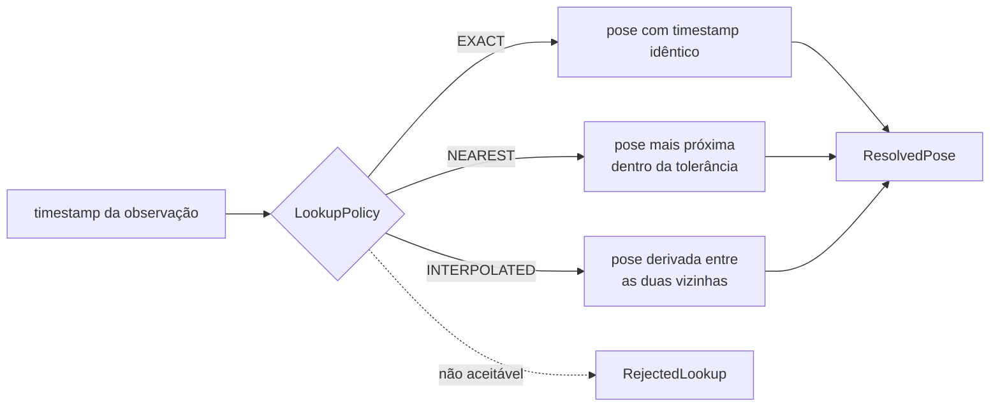

# Alinhamento temporal e lookup de pose

Este documento descreve `src/contextmap/state_estimation/lookup.py`.

## Por que o lookup é explícito

A geometria downstream precisa de `T_map_body(t)` para o timestamp de cada observação de LiDAR ou RGB. Uma calibração estática correta não basta quando pose e sensores estão desalinhados no tempo. Em vez de uma regra implícita de "pose mais próxima", o lookup declara a política, registra as poses de origem, o delta temporal e a tolerância, e rejeita explicitamente o que não puder aceitar. Assim é possível distinguir um erro de calibração espacial de um problema de alinhamento temporal.



## API

```python
lookup = TrajectoryLookup(trajectory)
result = lookup.pose_at(timestamp, policy=LookupPolicy.interpolated())
result = lookup.pose_for_observation(observation, policy=LookupPolicy.nearest(max_time_delta_ns=5_000_000))
```

`pose_for_observation` recebe a observação canônica (não apenas o id): usa seu `timestamp` e registra seu `observation_id` no resultado, sem I/O escondido.

## Políticas

| Modo | Aceita | Tolerância |
| --- | --- | --- |
| `EXACT` | somente pose com timestamp idêntico | nenhuma |
| `NEAREST` | pose mais próxima; empate resolve para a mais antiga | `max_time_delta_ns` (obrigatória) |
| `INTERPOLATED` | pose derivada entre as duas vizinhas | `max_interpolation_gap_ns` opcional (intervalo máximo entre as vizinhas) |

Em qualquer modo, um timestamp idêntico ao de uma pose devolve essa pose com resultado `EXACT`. Uma tolerância que não pertence ao modo (ou é negativa/zero) falha na construção da política.

## Resultado

O retorno é uma união: `ResolvedPose` ou `RejectedLookup`. Rejeições são dados, não exceções, para poderem ser contadas e auditadas (`summarize_lookups`).

`ResolvedPose` registra `pose`, `outcome` (`EXACT`/`NEAREST`/`INTERPOLATED`), `query_timestamp`, `policy`, `query_observation_id`, `source_estimate_ids`, `time_delta_ns` (distância da consulta à pose de origem mais próxima) e `interpolation_fraction`.

`RejectedLookup` registra o motivo (`LookupRejection`) e um `detail` legível:

| Motivo | Quando |
| --- | --- |
| `OUT_OF_RANGE` | o timestamp está fora da trajetória e nenhuma pose é aceitável (nunca há extrapolação) |
| `NO_EXACT_MATCH` | `EXACT` e nenhuma pose tem esse timestamp |
| `TOLERANCE_EXCEEDED` | `NEAREST` e a pose mais próxima excede a tolerância |
| `INTERPOLATION_GAP` | as vizinhas estão separadas por um `TrajectoryGap` registrado ou por mais que `max_interpolation_gap_ns` |

Consultas em outro domínio de clock levantam `ClockDomainMismatchError`: domínios de clock nunca são comparados implicitamente.

## Semântica da interpolação

- translação: interpolação linear;
- orientação: slerp pelo arco mais curto (`q` e `-q` representam a mesma rotação); para orientações quase idênticas usa-se interpolação linear normalizada, numericamente equivalente e estável;
- `covariance = None`: a incerteza de uma pose interpolada não é definida e não é inventada;
- `validity = DEGRADED` se qualquer pose de origem for `DEGRADED`;
- a pose derivada tem `estimate_id` determinístico (`<trajectory_id>--derived-<ns>`), `provenance.derived_from` com as duas poses de origem, as observações de origem de ambas e uma nota em `conversions_applied`. Uma pose com `derived_from` vazio foi estimada diretamente; é isso que mantém poses derivadas distinguíveis.

Resultados dependem apenas da trajetória, da consulta e da política, então entradas idênticas reproduzem resultados idênticos.

## Métricas de alinhamento temporal

`summarize_lookups()` produz um `TemporalAlignmentSummary`: contagens por resultado (`exact`, `nearest`, `interpolated`), rejeições por motivo e distribuição (mínimo, mediana inferior, máximo) do delta temporal das consultas aceitas. Junto com `Trajectory.quality_summary()` (distribuição do intervalo entre amostras e gaps) elas permitem correlacionar o alinhamento temporal com a qualidade de reprojeção câmera-LiDAR depois.

## Fora do escopo

Estimar automaticamente o offset de tempo câmera↔LiDAR e projetar pontos 3D em pixels não fazem parte deste módulo.
