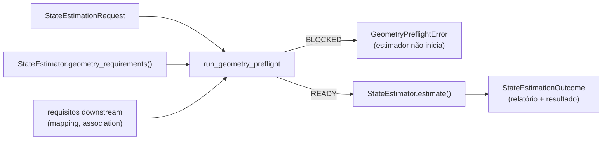

# Preflight de geometria e frame graph

Este documento descreve `src/contextmap/state_estimation/frame_graph.py`, `preflight.py` e `service.py`.

## Por que existe

Falhas de geometria costumam vir de frames, extrínsecos estáticos, unidades ou metadata de clock ausentes ou inconsistentes, não do estimador em si. O preflight falha a execução **antes** de o estimador iniciar quando o que aquela execução precisa não é confiável, e registra quais capabilities posteriores ainda não têm seus pré-requisitos, sem fingir que estão validadas.



O preflight não é dono da calibração (Ingestion é), não faz parsing de YAML/arquivos de dataset, não reescreve intrínsecos ou extrínsecos, não fixa nenhum rig e **não** afirma que uma calibração câmera↔LiDAR está fisicamente correta só porque suas matrizes são válidas: a validação por reprojeção pertence a Sensor Association.

## Convenções assumidas

O relatório declara, em `conventions`, o que as checagens assumem: transforms `T_parent_child` (`p_parent = R · p_child + t`), translação em metros e rotação como quaternion unitário `(x, y, z, w)`.

## Requisitos por capability

`GeometryRequirements` declara o que uma capability precisa, de modo que só bloqueia o que é relevante para a execução escolhida:

| Campo | Significado |
| --- | --- |
| `modalities` | modalidades de observação que devem existir (`lidar`, `imu`, `image`, `external_pose`) |
| `static_relations` | transforms estáticos exigidos entre frames; cada ponta é uma modalidade ou `BODY_ENDPOINT` |
| `camera_model_modalities` | modalidades cujas observações precisam referenciar uma entrada de calibração com modelo de câmera |
| `reference_frame` / `body_frame` | somente para a capability que executa: frames do transform dinâmico que ela publica |

Exemplos:

```text
FAST-LIO (executa)
  lidar + imu                 exigidos
  extrínseco lidar↔imu        exigido
  intrínsecos de câmera       não exigidos

geometric_mapping (downstream)
  lidar                       exigido
  extrínseco lidar↔body       exigido

sensor_association (downstream)
  image                       exigido
  extrínseco câmera↔body      exigido
  modelo de câmera            exigido
```

Uma modalidade que aparece em vários frames torna ambígua uma relação estática com ela (`ambiguous_endpoint`): o preflight nunca escolhe um frame por conta própria.

## `StaticFrameGraph`

Grafo de frames conectados pelos `RigidTransform` estáticos da calibração canônica (`CalibrationSet.static_transforms`). Cada aresta segue `T_parent_child`; percorrê-la de filho para pai usa a inversa. Um pose dinâmico (o corpo no mapa) não faz parte deste grafo.

- `resolve(parent, child)` compõe os transforms do caminho com direção explícita e devolve `T_parent_child`;
- `component_of(frame)` devolve os frames conectados;
- `loop_inconsistencies(...)` verifica caminhos redundantes: uma árvore geradora define cada frame relativo a uma raiz, e cada aresta restante fecha um laço. Se compor o caminho pela árvore não reproduz a aresta, dois caminhos entre os mesmos frames discordam e o grafo é ambíguo. Um transform reverso duplicado só é consistente quando é de fato a inversa.

Frames desconhecidos ou sem caminho estático levantam `FrameGraphError`.

## Checagens

Para cada transform estático:

| Checagem | Critério |
| --- | --- |
| `finite` | todos os valores finitos |
| `rotation_orthonormal` | `max(‖q‖ − 1, \|RᵀR − I\|, \|det R − 1\|) ≤ rotation_orthonormality` |
| `inverse_round_trip` | `T · T⁻¹` deixa no máximo `inverse_round_trip_translation_m` e `inverse_round_trip_rotation_rad` |

Mais: `relation_available` para cada relação exigida, `loop_consistency` para caminhos redundantes e os `ClockCheck`: cada modalidade exigida tem uma única identidade de clock não vazia (`missing_clock`, `clock_domain_mismatch`) e as modalidades exigidas compartilham o mesmo domínio.

Tolerâncias (`PreflightTolerances`, todas configuráveis): `rotation_orthonormality=1e-5` (tolera quaternions em precisão de texto e rejeita uma rotação que não é rotação), `inverse_round_trip_translation_m=1e-9`, `inverse_round_trip_rotation_rad=1e-9`, `loop_translation_m=1e-3` (1 mm) e `loop_rotation_rad=1e-3`.

Somente transforms nas componentes conexas usadas pelas relações exigidas bloqueiam. Problemas em componentes não usadas geram avisos (`unused_calibration_invalid`, `unused_calibration_inconsistent`).

## `GeometryPreflightReport`

| Campo | Conteúdo |
| --- | --- |
| `required_inputs` / `available_inputs` | modalidades exigidas e presentes |
| `frame_graph` | frames de referência e do corpo, frames e arestas estáticas, número de componentes |
| `calibration_identity` | hash determinístico dos transforms e dos hashes das entradas, independente da ordem (`None` sem calibração) |
| `transform_checks` / `clock_checks` | todas as checagens, com os números por trás de cada uma |
| `blockers` | `PreflightFinding(code, message)`: `missing_input`, `missing_calibration`, `missing_static_transform`, `invalid_transform`, `ambiguous_frame_graph`, `ambiguous_endpoint`, `missing_clock`, `clock_domain_mismatch` |
| `warnings` | avisos que não bloqueiam, incluindo `downstream_not_ready` |
| `downstream` | `DownstreamReadiness` por capability posterior, com o que falta |
| `status` | `READY` sem blockers, `BLOCKED` caso contrário |

Uma capability posterior sem pré-requisitos (por exemplo, câmera sem modelo de intrínsecos) **nunca** bloqueia uma execução LiDAR-inercial: aparece em `downstream` e como aviso.

## Serviço `execute_state_estimation`

```python
outcome = execute_state_estimation(estimator, request, downstream=[mapping, association])
```

Avalia o preflight com `estimator.geometry_requirements()`. Se estiver `BLOCKED`, levanta `GeometryPreflightError` (com o relatório completo) e o estimador nunca inicia. Caso contrário executa o backend e verifica que a trajetória devolvida responde ao request (mesmo `trajectory_id`, sequência, seleção, provenance do estimador e frames declarados); uma trajetória que não responde levanta `StateEstimationError`. O serviço não escolhe backend nem cai para outro.

`StateEstimationOutcome` reúne o relatório de preflight e o `StateEstimationResult`.
