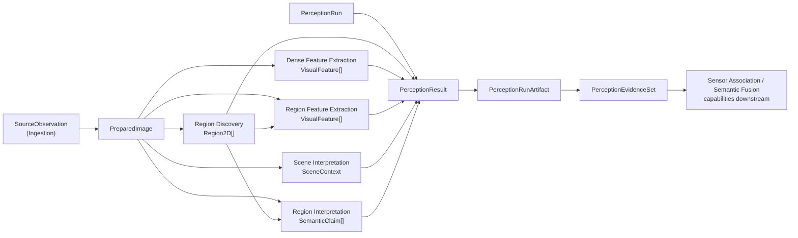

# Visual Perception

## Responsabilidade

Transformar uma `SourceObservation` física (Ingestion) em evidência visual canônica e agnóstica de backend — regiões, features, claims semânticas — para uma execução configurada (`PerceptionRun`), sem decidir identidade persistente de entidade 3D, significado semântico final, ou projeção 2D↔3D.

## Visão do fluxo de Visual Perception

O diagrama representa o fluxo do preset canônico atualmente implementado. Os ports continuam independentes da topologia: a ordem e as dependências são definidas pelo `PipelinePreset`, enquanto `service.py` apenas executa o grafo resolvido. Uma evidência produzida aqui permanece evidência de frame/run; ela não vira entidade 3D persistente nem crença fundida dentro deste módulo.

Region Discovery possui implementação concreta de preparação opcional, full-frame/tiling, SAM2, SAM3, Florence-2, normalização geométrica, provenance, diagnostics e avaliação. O contrato downstream continua sendo o mesmo `Region2D`; detalhes ficam em [`region-discovery.md`](region-discovery.md).

Feature Extraction possui identidade e compatibilidade de embeddings, persistência lazy de payload, geometria explícita de mapas densos, pooling mask-aware, diagnostics, avaliação, enhancement opcional e adapters concretos DINOv2, DINOv3, CLIP e AlphaCLIP. Os adapters usam runtimes lazy e testes determinísticos injetados; validação numérica com pesos reais permanece explícita. Detalhes e limites estão em [`feature-extraction.md`](feature-extraction.md).

## O que este módulo explicitamente não possui

- identidade persistente de entidade 3D (pertence a Entity Resolution/Semantic Mapping);
- projeção 2D↔3D (pertence a Sensor Association);
- fusão multi-view ou acumulação de confiança (pertence a Semantic Fusion);
- pose canônica do mapa (pertence a State Estimation).

## Contratos públicos

- `PerceptionRun`/`PerceptionResult` — execução configurada e seu resultado para uma `SourceObservation`.
- `Region2D`, `VisualFeature`, `SemanticClaim`, `SceneContext` — evidência visual canônica.
- `BackendProvenance` — rastreabilidade até o backend que produziu uma evidência.
- `RegionId`/`FeatureId`/`ClaimId` — identidades **locais a um `PerceptionResult`**, nunca identidade persistente de entidade nem comparável entre resultados diferentes sem associação explícita posterior.

- `RegionDiscovery`, `FeatureExtractor`, `SemanticInterpreter`, `SemanticScorer` — ports (`Protocol`) que qualquer backend concreto implementa; `PreparedImage`, `SemanticSupport`.

- `execute_stage_graph()`/`assemble_perception_result()` — executor de grafo de estágios e montagem de `PerceptionResult`; `StageDefinition`, `StageOutcome`, `StageStatus`, `StageGraphError`.

- `PipelinePreset`, `StageSpec`, `CANONICAL_PRESET_V1`, `KNOWN_CAPABILITIES` — presets de pipeline versionados e o grafo de estágios declarativo; `resolve_pipeline()`/`ResolvedPipeline`, `validate_pipeline_preset()`, `encode_pipeline_preset()`/`decode_pipeline_preset()`, `PipelineConfigError`, `StageBackendFactory`.

- `EmbeddingSpace` — o que `VisualFeature.embedding_space_id` identifica; `embedding_space_fingerprint()`, `ensure_compatible_embedding_spaces()`/`ensure_compatible_features()`, `EmbeddingSpaceMismatchError`, `encode_embedding_space()`/`decode_embedding_space()`.
- `DenseFeatureMap`/`DenseFeatureSampling` — geometria explícita entre o payload denso e a imagem preparada; `map_box_to_grid_cells()`/`pool_region_feature()` fazem associação e pooling mask-aware determinísticos com `RegionPoolingDiagnostics` e proveniência auditável.
- `FeatureResolutionEnhancement`/`enhance_feature_resolution()` — estágio opcional `DenseFeatureMap -> DenseFeatureMap`; a saída usa `FeatureResolutionEnhancementProvenance` para preservar artifact/payload hashes, transformações, backend, device/precision e custo sem alterar o preset canônico.
- `DinoV2DenseFeatureBackend` (interno a `backends/`) — adapter DINOv2 lazy que publica `DenseFeatureMap` e persiste o payload nativo sem expor SDK/tensor no contrato público.
- `DinoV3DenseFeatureBackend` (interno a `backends/`) — adapter DINOv3 lazy que remove CLS/registers explicitamente e publica patch tokens como `DenseFeatureMap` nativo.
- `ClipVisualFeatureBackend` (interno a `backends/`) — adapter visual CLIP global/região com crop/contexto e transformação por feature auditáveis, sem text encoding ou scoring.
- `AlphaClipRegionFeatureBackend` (interno a `backends/`) — adapter AlphaCLIP condicionado por máscara congelada, com transformação RGB/alpha e identidade de espaço próprias.

- `perception_result_id_for()`, `region_id_for()`, `feature_id_for()`, `claim_id_for()` — geradores de identidade determinística.

- `PerceptionRunWriter`/`PerceptionRunReader` — persistência local imutável de um run de percepção; `RunArtifactManifest`, `allocate_run_index()`, `rebuild_run_registry()`.
- `FeatureStoreWriter`/`FeatureStoreReader` — persistência, indexação e carregamento sob demanda do payload numérico de um `VisualFeature` (`PerceptionRunWriter.add_feature_payload()`/`PerceptionRunReader.feature_store()`); `FeaturePayloadEntry`, `FeatureStoreError`, `FeaturePayloadIntegrityError`.
- `FeatureExtractionDiagnostic`/`FeatureDebugLevel` — métricas comuns e debug auditável para features densas, globais e de região; integração por `PerceptionRunWriter.add_feature_diagnostic()`/`add_feature_preview()`.
- `encode_perception_result()`/`decode_perception_result()` (e equivalentes por tipo) — serialização JSON dos contratos públicos.

- `PerceptionEvidenceSet` — view de leitura sobre múltiplos runs selecionados explicitamente; `ObservationEvidence`, `EvidenceSetError`.

Ver [`contracts.md`](contracts.md) para a referência completa de campos e a regra central de ownership (observação física vs. resultado de inferência), [`ports.md`](ports.md) para os pontos de substituição de backend, [`service.md`](service.md) para a execução do grafo de estágios e a política de isolamento de falhas, [`pipeline.md`](pipeline.md) para os presets versionados e o grafo declarativo, [`embedding_space.md`](embedding_space.md) para a identidade de espaço de embedding e a regra de compatibilidade, [`dense_region_association.md`](dense_region_association.md) para a transformação espacial e o pooling mask-aware, [`feature_resolution_enhancement.md`](feature_resolution_enhancement.md) para o estágio opcional native→enhanced, [`dinov2.md`](dinov2.md) para o adapter DINOv2 e sua transformação de patch grid, [`dinov3.md`](dinov3.md) para o adapter DINOv3 e a exclusão explícita de register tokens, [`clip.md`](clip.md) para o adapter visual CLIP e as views global/região, [`alphaclip.md`](alphaclip.md) para o adapter AlphaCLIP e a transformação RGB/máscara, [`identity.md`](identity.md) para a cadeia completa de rastreabilidade, [`run_artifact.md`](run_artifact.md) para o formato do artefato de run persistido, [`feature_store.md`](feature_store.md) para a persistência/carregamento sob demanda do payload numérico de uma feature, [`feature_diagnostics.md`](feature_diagnostics.md) para métricas/debug auditáveis, e [`evidence_set.md`](evidence_set.md) para a view de evidência multi-run.

## Testes de contrato ponta a ponta

`tests/visual_perception/fakes.py` reúne implementações fake determinísticas de cada port (`FakeRegionDiscovery`, `FakeDenseFeatureExtractor`, `FakeRegionFeatureExtractor`, `FakeSemanticInterpreter`, `FakeFailingRegionDiscovery`) — sem GPU, download de modelo, ou dependência de rede — usadas por `tests/visual_perception/test_end_to_end.py` para validar o caminho completo: observação canônica → `PreparedImage` → grafo de estágios → `PerceptionResult` → `PerceptionRunArtifact` → `PerceptionRunReader` isolado → `PerceptionEvidenceSet` multi-run. `tests/visual_perception/test_pipeline.py` reutiliza os mesmos fakes para validar `pipeline.py` isoladamente: resolução única de backends, validação antes do carregamento de backend, rejeição de preset inválido/cíclico, inserção de estágio opcional sem tocar código de capability, e o `configuration_digest` determinístico.

## Módulos consumidos

`contextmap.shared` e `contextmap.ingestion` (`SourceObservationId`, e futuramente sequência/seleção para orquestração).

## Módulos que consomem este

`sensor_association`, `state_estimation` (indiretamente via pose), `semantic_fusion`, `evaluation` e demais capabilities a jusante, sempre através de `contextmap.visual_perception` (nunca de `contextmap.visual_perception.models` diretamente).

## Onde estão os documentos detalhados

- [`contracts.md`](contracts.md) — contratos de evidência, ownership, escopo de identidade e invariantes.
- [`region-discovery.md`](region-discovery.md) — fluxo completo de Region Discovery, passes/tiling, adapters SAM2/SAM3/Florence-2, normalização, diagnostics, avaliação e invariantes.
- [`feature-extraction.md`](feature-extraction.md) — visão integrada do core de Feature Extraction, contratos, payloads, sampling, pooling, diagnostics, enhancement opcional, avaliação e estado dos backends concretos.
- [`embedding_space.md`](embedding_space.md) — identidade e compatibilidade de espaços de embedding.
- [`feature_store.md`](feature_store.md) — persistência, indexação e carregamento lazy de payloads.
- [`dense_region_association.md`](dense_region_association.md) — geometria de sampling e pooling dense para região.
- [`feature_diagnostics.md`](feature_diagnostics.md) — métricas obrigatórias e debug auditável.
- [`feature_resolution_enhancement.md`](feature_resolution_enhancement.md) — estágio opcional native→enhanced e lineage.
- [`ports.md`](ports.md) — pontos de substituição de backend e contratos de capability.
- [`pipeline.md`](pipeline.md) — presets versionados, topologia canônica, validação e resolução de backends.
- [`service.md`](service.md) — execução do DAG, estados de estágio, isolamento de falhas e montagem do resultado.
- [`identity.md`](identity.md) — identidades determinísticas e cadeia de rastreabilidade.
- [`run_artifact.md`](run_artifact.md) — persistência imutável, manifest, outputs, métricas e leitura isolada.
- [`evidence_set.md`](evidence_set.md) — leitura explícita de múltiplos runs sem fusão implícita.
- [`docs/architecture.md`](../../../../docs/architecture.md) — ownership e regras de dependência no contexto global.
- [`docs/CONTRACTS.md`](../../../../docs/CONTRACTS.md) — `PerceptionResult` no contexto global de contratos.
- [`docs/ARTIFACTS.md`](../../../../docs/ARTIFACTS.md) — convenções globais de artifacts, lineage e imutabilidade.
