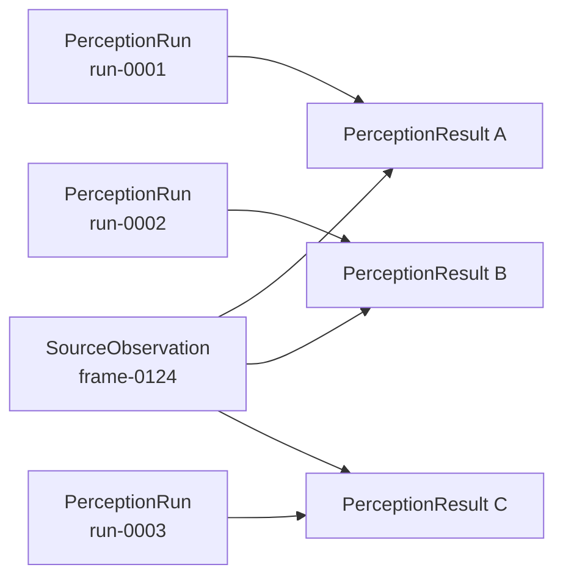
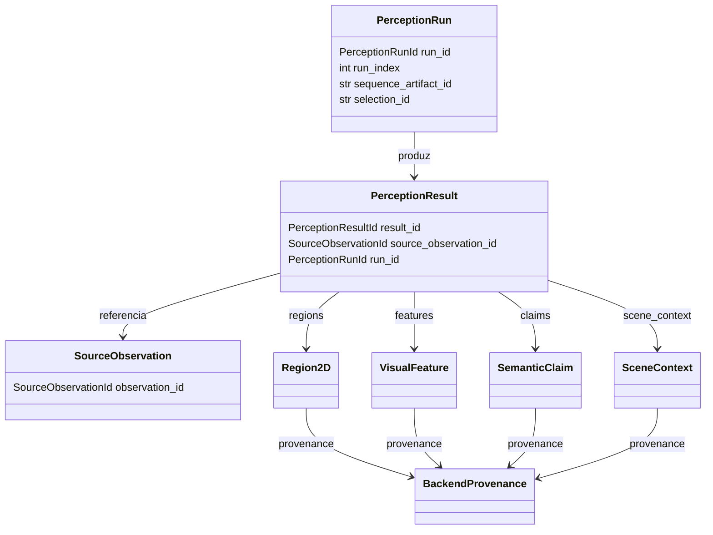

# Contratos de evidência visual

Este documento descreve os tipos definidos em `src/contextmap/visual_perception/models.py`.

## Princípio central: observação física vs. resultado de inferência

`SourceObservation` (Ingestion) é a observação física — Visual Perception nunca a possui, apenas a referencia via `source_observation_id`. `PerceptionResult` é o resultado de **uma** execução de inferência sobre essa observação. A mesma `SourceObservation` pode ser processada por múltiplos `PerceptionRun`s, cada um produzindo um `PerceptionResult` distinto:

Reprocessar não modifica `A`/`B`/`C` anteriores nem a `SourceObservation` original — sempre cria um novo `PerceptionResult`.

## Estrutura dos contratos

A estrutura preserva três separações: a observação física continua pertencendo a Ingestion; o run descreve uma execução configurada; e o resultado contém apenas a evidência produzida para uma observação naquele run. `SemanticSupport`, quando produzido por um `SemanticScorer`, é um julgamento separado referenciando uma claim e não é incorporado por mutação à `SemanticClaim`.

## Identidade local, não persistente

`RegionId`, `FeatureId`, `ClaimId` são identidades **locais ao `PerceptionResult` que as produziu**. `region-0007` no `run-0001` e `region-0007` no `run-0002` são identidades não relacionadas, a menos que uma capability posterior (Sensor Association, Semantic Fusion) associe-as explicitamente. Nenhum desses IDs é ou implica identidade de entidade persistente do mapa.

## `PerceptionRun`

Contexto de execução: qual sequência (`sequence_artifact_id`), qual seleção (`selection_id`, ver `contextmap.ingestion.selection_identity()`), quais capabilities habilitadas, e a `BackendProvenance` de cada uma. `run_index` é monotônico por escopo sequência+capability (`docs/ARTIFACTS.md`), nunca um ID global.

## `PerceptionResult`

Amarra um `PerceptionRun` a uma `SourceObservation`, carregando as evidências produzidas (`regions`, `features`, `claims`, `scene_context`). Valida na construção:

- nenhum `region_id` duplicado entre as `regions`;
- nenhum `feature_id` duplicado entre as `features`;
- nenhum `claim_id` duplicado entre as `claims`;
- toda `feature`/`claim` que referencia um `region_id` deve referenciar uma região presente em `regions`.

## `Region2D`

Contrato único de geometria 2D consumido por todo Visual Perception. `region_id` é local ao `PerceptionResult`; o próprio resultado fornece os escopos de run e observação. `bounding_box`, máscara inline opcional ou `mask_reference`, dimensões, área, proposal contributors e `discovery_provenance` preservam a geometry freeze e a auditoria sem criar outra classe `Region2D`. O `BackendProvenance` é preservado diretamente do adapter durante a normalização, sem inferir provider a partir do `backend_id`. Payloads grandes devem usar `mask_reference`; a máscara inline permanece disponível quando a normalização/evaluation precisa inspecionar pixels. Um `Region2D` rejeitado permanece auditável via `rejection_reason`.

## `VisualFeature`

`scope` (`DENSE`/`GLOBAL`/`REGION`) determina se `region_id` é exigido (`REGION`) ou deve ser `None` (`DENSE`/`GLOBAL`) — validado na construção. `embedding_space_id` é uma **referência opaca**: o contrato completo de `EmbeddingSpace` (família, checkpoint, dimensão, regras de compatibilidade) pertence à milestone Feature Extraction — mesmo padrão que `SourceObservation.calibration_id` usou antes do contrato completo de calibração existir.

## `SemanticClaim`

`confidence=None` significa explicitamente "não pontuado" — nunca equivalente a `0.0` ou `1.0`. `role` distingue hipótese `PRIMARY` de `ALTERNATIVE`, preservando alternativas em vez de colapsar para um rótulo único.

## `SceneContext`

Evidência de nível de cena; toda claim dentro de `SceneContext.claims` deve ter `region_id=None` (validado na construção) — evidência de cena nunca se disfarça de evidência de região.

## `BackendProvenance`

Metadata mínima para rastrear qualquer evidência até o backend que a produziu: `backend_id`, `capability`, `provider`, `model`, `version`, `configuration_fingerprint` opcional. Reaproveitada por `Region2D`, `VisualFeature`, `SemanticClaim`, `SceneContext` e `PerceptionRun` (uma por capability habilitada).
