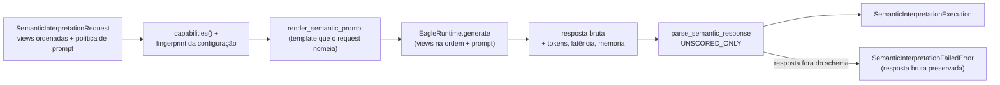

# Interpretador semântico Eagle 2.5

Este documento descreve `src/contextmap/visual_perception/backends/eagle2_5.py`, o adapter que
executa o VLM Eagle 2.5 (NVlabs) atrás do mesmo boundary `SemanticInterpreter` de Qwen, Gemini e
Florence-2 (issue #570). O objetivo é comparar a interpretação de cena e de região do Eagle 2.5
com os outros backends **sob o mesmo contrato de evidência**; o adapter não afirma que o Eagle
2.5 seja melhor, nem o torna o backend semântico canônico.

Não existe modelo de evidência específico do Eagle. O adapter recebe o
`SemanticInterpretationRequest` canônico e devolve `SemanticInterpretationExecution` com as
mesmas `SemanticClaim`/`SceneContext`, a mesma `SemanticInferenceProvenance` e os mesmos
`SemanticBackendDiagnostics` dos demais interpretadores
([Semantic Interpretation](semantic-interpretation.md)).

## Fluxo



1. `validate_semantic_request()` compara o request com `capabilities()` e o adapter confere
   `configuration_fingerprint`; qualquer divergência é `ValueError` **antes** de o runtime ser
   chamado.
2. A política de prompt é a do request: `semantic_prompt_template(request.prompt_template_id)`
   renderizado por `render_semantic_prompt()` com `SemanticConfidencePolicy.UNSCORED_ONLY`, byte a
   byte o mesmo texto que Qwen e Gemini renderizam para o mesmo request (#542). Não há prompt
   padrão do backend; identidade desconhecida, modo ou schema divergentes falham antes da
   inferência.
3. O runtime recebe `request.visual_views` inteiras e na ordem exata do request, mais o texto
   renderizado.
4. A resposta bruta passa pelo parser canônico. Se o parser a rejeitar,
   `SemanticInterpretationFailedError` carrega `FailedSemanticInterpretation` com a resposta
   verbatim, seu SHA-256, o prompt consumido, a proveniência e os diagnostics; o chamador a
   persiste com `PerceptionRunWriter.add_failed_semantic_interpretation()`. Nada do que o modelo
   disse se perde.

## Capacidades declaradas

| Campo | Valor | Motivo |
| --- | --- | --- |
| `supported_modes` | `SCENE`, `REGION` | os dois modos do contrato |
| `supported_view_kinds` | todos os `VisualViewKind` | toda view é uma imagem comum para o modelo; várias views viram várias imagens de uma mesma mensagem |
| `required_view_kinds` | nenhum | a política de views pertence a quem monta o request |
| `accepts_visual_features` | `False` | features DINO/CLIP não são entradas do modelo |
| `accepts_scene_context` | `False` | o condicionamento por contexto de cena ainda não foi mapeado para o Eagle |

Request com features visuais ou `scene_context_reference` é recusado antes da inferência, em vez
de o dado ser descartado em silêncio.

## Configuração (`EagleSemanticConfig`)

| Campo | Significado |
| --- | --- |
| `model` | checkpoint Hugging Face, por exemplo `nvidia/Eagle2.5-8B` |
| `revision` | SHA de commit completo; fixa pesos **e** o código remoto do checkpoint. O runtime transformers o exige |
| `device`, `precision` | device torch e dtype dos pesos (`float32`, `float16`, `bfloat16`); herda `resources.device` pelo runtime |
| `max_new_tokens`, `temperature` | limite de geração; `0` é decoding guloso, positivo amostra com essa temperatura |
| `max_dynamic_tiles` | **obrigatório**: máximo de tiles dinâmicas por view |
| `min_dynamic_tiles` | mínimo de tiles dinâmicas por view (padrão `1`) |
| `use_thumbnail` | acrescenta a tile de thumbnail da view inteira quando ela vira mais de uma tile (padrão `true`) |

Todos os campos entram em `to_dict()`, na configuração efetiva da execução e no fingerprint
(`sha256` do JSON com chaves ordenadas), que é determinístico: a mesma configuração sempre gera
o mesmo fingerprint, e mudar modelo, revisão, orçamento visual, precisão ou geração gera outro.

### Orçamento visual

O processor `eagle_2_5_vl` redimensiona cada imagem para uma grade de tiles de 448×448 cujo
número fica entre `min_dynamic_tiles` e `max_dynamic_tiles`, escolhendo a grade que melhor
preserva área e aspect ratio (Image Area Preservation), e acrescenta uma tile de thumbnail
quando `use_thumbnail` está ativo e a grade tem mais de uma tile. Cada tile custa 256 tokens de
contexto nos checkpoints publicados. Logo, por view:

```text
tiles  <= max_dynamic_tiles + (1 se use_thumbnail e max_dynamic_tiles > 1)   # max_tiles_per_view
tokens visuais <= 256 * tiles
```

`max_dynamic_tiles` é obrigatório porque é o orçamento que determina custo e resolução efetiva;
sem ele, valeria em silêncio o padrão do checkpoint (12 tiles, até 13 com thumbnail, ≈3,3k
tokens por view). O runtime sempre envia os três valores explicitamente ao processor
(`images_kwargs`), então o padrão do checkpoint nunca se aplica, e **confere o resultado**: se o
processor produzir menos tiles que views ou mais que `views × max_tiles_per_view`, a request falha
com `EagleInferenceError` antes da geração. Um código remoto que ignorasse o orçamento nunca
rodaria silenciosamente com uma entrada maior e mais cara.

O tamanho da tile (448 px) e os tokens por tile (256) são propriedades do checkpoint e do seu
vision tower, fixados pela revisão, não parâmetros ajustáveis.

## Runtime (`EagleRuntime` e `HuggingFaceEagleRuntime`)

`EagleRuntime` é o seam interno (não exportado) que isola torch/transformers e os objetos do
código remoto. CI usa um runtime fake determinístico; o runtime real nunca é executado nos
testes.

`HuggingFaceEagleRuntime` segue o caminho de inferência que a NVlabs documenta:

- **Carregamento.** `AutoProcessor.from_pretrained(..., use_fast=True)` e
  `AutoModel.from_pretrained(..., torch_dtype=<precision>)`, ambos com `trust_remote_code=True`,
  `revision=<SHA>` e, por padrão, `local_files_only=True`: nada é baixado implicitamente e o
  código Python do checkpoint só é executado na revisão imutável fixada. Depois o modelo vai para
  o device em modo `eval()`. O load é lazy e acontece uma única vez; `load()` permite carregá-lo
  antes de medir latência.
- **Entrada.** Cada view é lida por `read_view_payload()` (SHA-256 conferido contra
  `SemanticVisualView.sha256`) e decodificada em RGB a partir desses bytes. A mensagem de usuário
  tem uma parte `image` por view, na ordem do request, seguida do prompt renderizado. O chat
  template do checkpoint numera as imagens (`<image-1>`, `<image-2>`, ...) e o processor associa a
  k-ésima marca à k-ésima imagem da lista, montada no mesmo laço. O runtime não acrescenta
  instrução própria; o único texto além do prompt é o do chat template do checkpoint (papéis e o
  system prompt padrão dele).
- **Geração.** `model.generate(**inputs, ...)` sob `torch.inference_mode()`. `temperature=0` usa
  decoding guloso e anula `temperature`/`top_p`/`top_k`; positivo amostra com essa temperatura.
- **Saída.** O `generate` do Eagle entrega `inputs_embeds` ao LLM, então os ids devolvidos são só
  os tokens novos: são decodificados inteiros com `skip_special_tokens=True` e
  `clean_up_tokenization_spaces=False`, como nos exemplos oficiais.
- **Diagnostics.** `input_tokens` (tokens do prompt, incluindo os tokens visuais das tiles),
  `output_tokens`, `peak_memory_bytes` (pico de memória alocada na GPU pelo processo; `None` em
  CPU) e latência medida pelo adapter. Atingir `max_new_tokens` gera um warning, porque o JSON
  provavelmente foi truncado.

Falhas são explícitas e nunca acionam fallback para outro backend:

- `EagleDependencyError` — torch, transformers ou Pillow ausentes, ou um pacote que o processor
  ou o código remoto importa (por exemplo `flash_attn`, `torchvision`);
- `EagleDeviceError` — CUDA indisponível, precisão desconhecida ou `float16` em CPU;
- `EagleModelLoadError` — checkpoint/revisão não carregável (inclui repositório gated fora do
  cache local);
- `EagleInferenceError` — view ausente, fora da raiz ou com SHA-256 divergente, orçamento de
  tiles violado, ou falha de geração/decodificação.

## Seleção pelo runtime

O runtime compõe o Eagle 2.5 como backend `eagle2_5` do componente
`visual_perception.semantic_interpretation`, com os mesmos grupos obrigatórios `prompt_policy` e
`view_policy` de Qwen e Gemini ([composição do runtime](../../runtime/docs/composition.md#política-de-prompt-semântico-542)).
Como o Eagle declara `accepts_scene_context=False`, `prompt_policy.region_scene_context = true` é
recusado na composição.
O modelo é fornecido por um `RuntimeProvider` que devolve um `EagleRuntime` (por exemplo, um
`HuggingFaceEagleRuntime` construído com o `view_root` do run).

```toml
[components.visual_perception.semantic_interpretation]
backend = "eagle2_5"

[components.visual_perception.semantic_interpretation.eagle2_5]
model = "nvidia/Eagle2.5-8B"
revision = "<SHA Git completo de 40 caracteres>"
precision = "bfloat16"
max_new_tokens = 256
temperature = 0.0
max_dynamic_tiles = 6
prompt_policy = { scene = "scene/v1", region = "region/v1" }
view_policy = { region_views = ["tight_crop"] }
```

Sem `prompt_policy`, sem `view_policy` ou sem `max_dynamic_tiles`, `compose()` levanta `BackendConfigurationError`
antes de pedir o runtime. Na data desta implementação o commit de `main` do repositório
`nvidia/Eagle2.5-8B` era `61e45235a1e4a35222b86383479b3b004f4809d7`; ele não foi executado aqui e
serve só como ponto de partida para fixar a revisão de uma execução real.

## O que o upstream fornece, o que adaptamos e o que é nosso

- **Upstream (NVlabs, Eagle 2.5).** O modelo `nvidia/Eagle2.5-8B`: vision tower
  SigLIP2-So400m-Patch16-512 e LLM Qwen2.5-7B-Instruct numa arquitetura LLaVA com entrada em
  tiles; treino long-context (até 128K) com Information-First Sampling (Image Area Preservation
  no tiling, Automatic Degrade Sampling no treino) e pós-treino progressivo. Para inferência, o
  código remoto `eagle_2_5_vl` do checkpoint: `AutoModel`/`AutoProcessor` com
  `trust_remote_code`, chat template no formato Qwen, `process_vision_info`, tiling dinâmico
  controlado por `max_dynamic_tiles`/`min_dynamic_tiles`/`use_thumbnail` (o próprio demo da
  NVlabs passa `images_kwargs={"max_dynamic_tiles": ...}`), 256 tokens por tile, e os exemplos
  que decodificam a saída de `generate` sem corte.
- **Adaptado.** O mesmo caminho de carregamento e inferência, com as imagens entregues ao
  processor como lista já decodificada (em vez de URLs/arquivos via `process_vision_info`), o
  orçamento de tiles sempre explícito, e a mesma decodificação. Precisão, device e decoding vêm
  da configuração, não de valores fixos dos exemplos.
- **Original do ContextMap2.** O request canônico e a política de prompt selecionada por
  configuração, a verificação do SHA-256 de cada view antes de decodificá-la, a checagem pós-
  processor de que as tiles respeitam o orçamento, o parsing no schema `semantic-response/1` com
  `UNSCORED_ONLY`, a preservação da resposta bruta quando o parser falha, o fingerprint da
  configuração efetiva e os diagnostics comparáveis entre backends. Vídeo, multi-observação,
  features a partir de estados ocultos e quantização não são usados.

As afirmações sobre o comportamento do processor e do `generate` foram verificadas no código
`eagle_2_5_vl` publicado nos checkpoints abertos `nvidia/Eagle2-1B`/`nvidia/Eagle2-2B`, que usam o
mesmo código remoto; o repositório `nvidia/Eagle2.5-8B` é gated. Nele, `chat_template.json`,
`preprocessor_config.json` (tiles de 448 px, `max_dynamic_tiles=12`, `min_dynamic_tiles=1`,
`use_thumbnail=true`, `tokens_per_tile=256`), `processor_config.json` e
`configuration_eagle2_5_vl.py` são os mesmos blobs Git dos checkpoints abertos; os arquivos do
processor, do image processor e do modelo diferem ligeiramente em tamanho e não puderam ser lidos.
A checagem do orçamento de tiles protege exatamente contra uma divergência desse tipo. O código
remoto do Eagle 2 força `flash_attention_2` no vision tower, então uma execução em CPU
provavelmente falha no load; o adapter não o impede por configuração, porque isso não foi
verificado no checkpoint 8B.

## Licença do modelo

O código do repositório NVlabs/Eagle é Apache 2.0, mas os **pesos do Eagle 2.5 são distribuídos
sob a NVIDIA License (NSCLv1)**, cuja limitação de uso (seção 3.3) restringe o uso a fins
não comerciais, isto é, pesquisa acadêmica ou sem fins lucrativos. O checkpoint também herda os
termos de Qwen2.5-7B-Instruct e SigLIP2 (Apache 2.0) e é gated no Hugging Face (exige aceitar os
termos e autenticar para baixar). O ContextMap2 não redistribui pesos nem código do Eagle: o
adapter só carrega um checkpoint que o usuário já tem no cache local. Quem executa o backend é
responsável por cumprir essas licenças.

## Validação desta implementação

Fake/contract, na CI:

- `tests/visual_perception/backends/test_eagle_semantic.py`: declaração de capacidades, ordem
  exata das views até o runtime, política de prompt consumida (inclusive não canônica) e idêntica
  à de Qwen/Gemini, recusas antes da inferência (template, modo, schema, fingerprint, features,
  contexto de cena), claims com alternativas, abstenção, `SceneContext`, recusa de confidence
  auto-relatada, resposta bruta preservada na falha do parser e fingerprint determinístico;
- `tests/visual_perception/backends/test_eagle_runtime.py`: módulos de SDK falsos provam revisão
  fixada, `trust_remote_code`, cache local, load único, ordem das imagens no chat e no processor,
  orçamento explícito e sua verificação, decoding, contagem de tokens, memória, warning de
  truncamento, integridade das views e erros de dependência/device/load;
- `tests/runtime/test_runtime_eagle_composition.py`: seleção por configuração, `prompt_policy` e
  `max_dynamic_tiles` obrigatórios, e o provider exigido.

**Pendente de execução real** (GPU e pesos gated): qualidade de conceito, taxa de claims não
suportadas/alucinadas, preservação de alternativas/abstenção, consistência entre repetições,
latência p50/p95 de cena e região, tokens e pico de VRAM/RAM no reference set, pelas superfícies
existentes de [avaliação de Semantic Interpretation](../../evaluation/docs/semantic-interpretation.md).
Nenhum número de qualidade ou custo do Eagle 2.5 existe ainda neste repositório.
