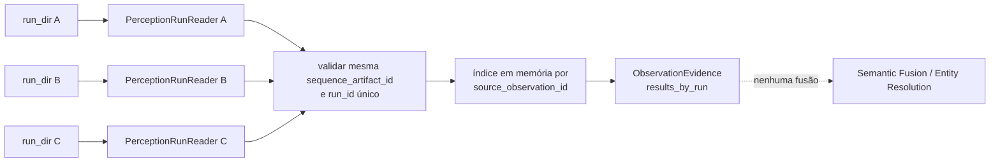
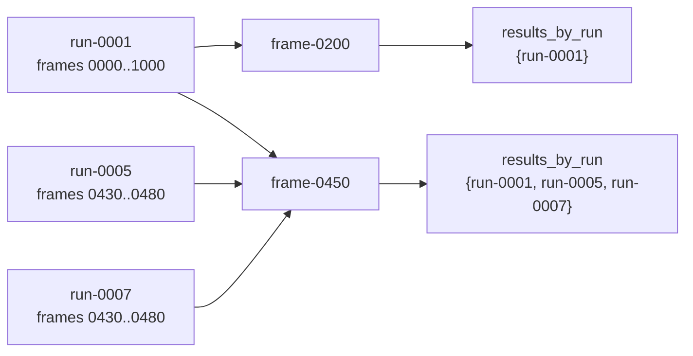

# Evidência multi-run

Este documento descreve `src/contextmap/visual_perception/evidence_set.py`: como várias execuções de percepção, já persistidas (issue #52), podem ser lidas juntas sem fundir sua evidência.

## Seleção sempre explícita

`PerceptionEvidenceSet.open(run_dirs)` nunca infere "use todos os runs encontrados" ou "prefira o run mais recente". Um run conhecido-defeituoso é simplesmente excluído por não estar na lista — seu artefato nunca é lido, modificado ou apagado.

## Agrupamento por observação física, nunca fusão

`evidence_for(source_observation_id)` retorna um `ObservationEvidence` com `results_by_run: Mapping[PerceptionRunId, PerceptionResult]` — um `PerceptionResult` por run selecionado que produziu resultado para aquela observação. Esta view **nunca**:

- escolhe um rótulo vencedor entre runs;
- combina confidences;
- decide que rótulos de runs diferentes são equivalentes;
- associa regiões entre runs como o mesmo objeto;
- cria entidades persistentes;
- trata inferência repetida como evidência física independente.

O agrupamento correlacionado e a acumulação já pertencem a Semantic Fusion;
identidade persistente continua planejada para Entity Resolution. Esta view não
executa nenhuma das duas responsabilidades.

## Seleções sobrepostas

Nenhum payload é copiado ou reescrito para construir essa view — `PerceptionEvidenceSet` apenas lê cada `PerceptionRunReader` já existente e monta um índice em memória por `source_observation_id`.

## Sequências incompatíveis

`open()`/`__init__` levantam `EvidenceSetError` se os runs selecionados referenciarem mais de um `sequence_artifact_id` — misturar evidência de sequências diferentes sob uma única observação não faz sentido semântico.

A seleção também é rejeitada quando dois diretórios declaram o mesmo `run_id`, pois a chave deixaria de identificar univocamente a origem da evidência. Para cada resultado lido, a view confirma ainda que `PerceptionResult.run_id` coincide com o `run_id` do manifest que o possui, evitando atribuição silenciosa a outro run.

## Sem `runs.json`

Cada run é aberto via `PerceptionRunReader` (issue #52), que nunca requer `runs.json` — a view multi-run funciona igual quando o registro de conveniência está ausente.
