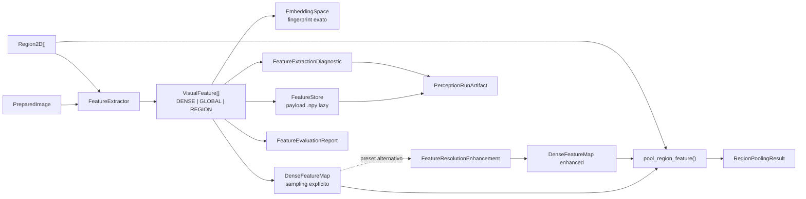

# Feature Extraction

Feature Extraction produz evidência visual numérica para uma execução de Visual Perception. A capability preserva identidade de espaço de embedding, geometria de amostragem, payload, provenance e custo, sem transformar vetores em labels finais, entidades 3D persistentes ou crenças multi-view.

## Visão geral



O port canônico continua sendo `FeatureExtractor.extract(PreparedImage, regions=()) -> Sequence[VisualFeature]`. O escopo declarado por `required_scope()` determina se o backend produz feature densa, global ou por região. O core não contém branches por DINO, CLIP ou AlphaCLIP.

## Estado implementado na `dev`

O core de Feature Extraction está materializado e exportado por `contextmap.visual_perception`:

- `VisualFeature` com scopes `DENSE`, `GLOBAL` e `REGION`;
- `EmbeddingSpace`, fingerprint determinístico e validação explícita de compatibilidade;
- `FeatureExtractor` como port backend-neutral;
- `DenseFeatureSampling` e `DenseFeatureMap` para registrar a geometria entre imagem preparada e grid de features;
- pooling dense para região com suporte de máscara, diagnostics e provenance;
- `FeatureStoreWriter` e `FeatureStoreReader` para persistência `.npy`, índice versionado e carregamento lazy;
- diagnostics obrigatórios separados de previews de debug;
- `FeatureResolutionEnhancement` como estágio opcional `DenseFeatureMap -> DenseFeatureMap`, fora do preset canônico;
- `DinoV2DenseFeatureBackend` e `DinoV3DenseFeatureBackend` para mapas densos em resolução nativa;
- `ClipVisualFeatureBackend` para features globais ou de região;
- `AlphaClipRegionFeatureBackend` para features de região condicionadas por máscara;
- protocolo de avaliação determinístico em `contextmap.evaluation`.

`CANONICAL_PRESET_V1` possui os estágios `dense_feature_extraction` e `region_feature_extraction`, ambos resolvidos pelo capability port `feature_extractor`. Isso define topologia e contrato, mas não implica que um modelo concreto esteja disponível.

Os quatro adapters concretos ficam em `visual_perception/backends/` e satisfazem o mesmo port sem expor PyTorch, Transformers, AlphaCLIP, Pillow ou arrays na API pública da capability. Carregamento é lazy, checkpoints locais são o default e falhas de dependência, device, checkpoint e inferência permanecem explícitas. Os testes usam runtimes determinísticos injetados e não baixam pesos. Os adapters DINOv2 e CLIP foram executados com pesos reais em 2026-09-20 (resultados em `dinov2.md` e `clip.md`) e o DINOv3 em 2026-09-21 (`dinov3.md` e [`dinov3-validation.md`](dinov3-validation.md)); AlphaCLIP (checkpoints ausentes) ainda não tem execução real e não deve ser tratado como validado. Os adapters de Hugging Face fazem o resize no Pillow e deixam ao processor só rescale e normalização, para que o vetor não dependa do backend do processor.

As execuções reais validam os adapters e a reprodutibilidade numérica nas configurações registradas; não constituem comparação científica da qualidade dos embeddings.

Os adapters não são registrados nem selecionados implicitamente por `CANONICAL_PRESET_V1`. A composition root deve importar o módulo interno correspondente, construir a configuração efetiva e fornecê-lo ao `StageBackendFactory`.

## Contrato `VisualFeature`

`VisualFeature` preserva metadata pequena e serializável:

```text
VisualFeature
├── feature_id
├── scope = DENSE | GLOBAL | REGION
├── embedding_space_id
├── shape
├── dtype
├── payload_reference
├── provenance
├── region_id?
└── normalization?
```

O tensor não fica inline no contrato. `payload_reference` aponta para o payload persistido quando ele existe no run. `FeatureId` é local a um `PerceptionResult`; por isso o feature store usa a chave `(source_observation_id, feature_id)`.

Uma feature `REGION` exige `region_id`. Features `DENSE` e `GLOBAL` não podem carregar `region_id`.

## Espaço de embedding e compatibilidade

`EmbeddingSpace` identifica família, modelo, versão, checkpoint, layer/projeção, dimensão e normalização. `embedding_space_fingerprint()` gera o `embedding_space_id` determinístico.

A regra é estrita:

```text
mesma dimensão != mesmo espaço de embedding
mesma família != mesmo checkpoint
comparação válida => fingerprint exato
```

`ensure_compatible_embedding_spaces()` valida contratos completos. `ensure_compatible_features()` valida diretamente os ids persistidos. Incompatibilidade levanta `EmbeddingSpaceMismatchError`.

Essa separação evita combinar silenciosamente vetores que possuem o mesmo tamanho, mas semântica diferente.

## Feature densa e geometria de amostragem

Uma feature `DENSE` vira consumível espacialmente por meio de `DenseFeatureMap`, que combina:

- o `VisualFeature` canônico;
- `DenseFeatureSampling`;
- identidade do artifact que possui a feature;
- provenance de enhancement opcional.

`DenseFeatureSampling` registra grid, tamanho da imagem preparada, origem, stride, support e `coordinate_transform_id`. Stride e support permanecem campos distintos para representar grids sem overlap, receptive fields sobrepostos ou mapas reamostrados.

Nenhum consumidor deve inferir coordenadas pelo shape do tensor ou por um patch size conhecido de um modelo específico.

## Associação dense para região

`pool_region_feature()` usa a política versionada `mask_weighted_mean_preserve_l2_v2`.

O fluxo é:

1. localizar células cujo suporte intersecta o bounding box congelado;
2. recortar suporte pelos limites da imagem;
3. calcular peso por pixels válidos da máscara, ou pelo box inteiro quando não há máscara;
4. fazer média ponderada dos vetores;
5. renormalizar o resultado quando `normalization="l2"`.

Suporte vazio, metadata incompatível, máscara inválida ou resultado L2 degenerado falham explicitamente. `RegionPoolingDiagnostics` preserva cobertura e contribuição de células. `RegionPoolingProvenance` registra feature, artifact, região, máscara, política e transformação usadas.

A operação deriva uma representação de região. Ela não altera a `Region2D` congelada e não cria identidade persistente de objeto.

## Persistência de payload

Payloads numéricos são persistidos em `.npy` com `allow_pickle=False`:

```text
outputs/
└── features/
    ├── feature-index.jsonl
    └── <observation-scope>/
        └── <payload>.npy
```

O índice possui schema próprio e permite consultar metadata sem carregar NumPy ou o array. `FeatureStoreReader.load()` valida presença, hash, formato, shape e dtype antes de devolver o payload.

`PerceptionRunWriter.add_feature_payload()` apenas enfileira conteúdo. `finalize()` cruza cada payload com o `VisualFeature` correspondente de `outputs/results.jsonl`, grava tudo no diretório temporário, inclui arquivos no inventory e só então publica o run de forma atômica.

## Diagnostics e debug

Feature Extraction separa três categorias:

```text
outputs/features/                  payload contratual
metrics/feature-extraction.jsonl   métricas obrigatórias
debug/30-feature-extraction/       inspeção humana opcional
```

`FeatureExtractionDiagnostic` registra status, backend, modelo/configuração, prepared input, feature, embedding space, preprocessing, timing, memória, warnings, failures ou abstentions.

Todo diagnostic `SUCCEEDED`/`WARNING` é conferido no `finalize()` contra exatamente uma `VisualFeature` do run (scope, shape, dtype, normalização, payload, proveniência, `EmbeddingSpace` e, para dense, grade e run dono); ver [`feature_diagnostics.md`](feature_diagnostics.md).

Os níveis `none | standard | full` controlam apenas debug. Nível `none` não remove outputs nem métricas. Previews são fornecidos pelo produtor e não podem substituir o payload contratual.

## Enhancement opcional

`FeatureResolutionEnhancement` é um port separado porque possui input, output, custo, falha e lineage próprios.

```text
DenseFeatureMap native
    -> FeatureResolutionEnhancement
    -> DenseFeatureMap enhanced
```

`pipeline.py` conhece a capability `feature_resolution_enhancement`, mas `CANONICAL_PRESET_V1` não contém esse estágio. Um preset alternativo precisa selecioná-lo explicitamente e fornecer sua factory.

A saída recebe nova identidade de feature, artifact e payload. Se o enhancement alterar a semântica vetorial, também deve declarar novo `embedding_space_id`. Não existe backend aprendido de enhancement integrado atualmente.

## Avaliação objetiva

A avaliação fica em `contextmap.evaluation`, separada da produção de evidência. `FeatureEvaluationReport` mantém três eixos independentes:

```text
numerical   valores, finitude, dimensão, normalização
spatial     sampling e transformação da feature densa
cost        runtime, memória, bytes e throughput
```

Não existe score único de qualidade. `assert_repeatable_feature_outputs()` valida repetibilidade sob contexto fixo. `compare_feature_map_resolutions()` compara native e enhanced somente quando contexto, imagem e espaço de embedding permanecem compatíveis.

Detalhes: [protocolo de avaliação](../../evaluation/docs/feature_extraction.md).

## Invariantes principais

- embeddings só são comparados quando o fingerprint do espaço é idêntico;
- `FeatureId` nunca é tratado como global;
- payload persistido precisa corresponder ao `VisualFeature` da mesma observação;
- dense sampling é explícito, nunca inferido por backend;
- pooling preserva a semântica de normalização declarada;
- enhancement não sobrescreve o artifact nativo;
- debug nunca é dependência downstream;
- Feature Extraction não produz `SemanticClaim`, entidade 3D ou fusão multi-view.

## Testes que sustentam o contrato

A cobertura determinística principal está em:

- `tests/visual_perception/test_embedding_space.py`;
- `tests/visual_perception/test_feature_store.py`;
- `tests/visual_perception/test_dense_region_association.py`;
- `tests/visual_perception/test_feature_diagnostics.py`;
- `tests/visual_perception/test_feature_resolution_enhancement.py`;
- `tests/visual_perception/test_run_artifact.py`;
- `tests/evaluation/test_feature_extraction.py`;
- `tests/visual_perception/test_pipeline.py`.

Esses testes não exigem GPU, download de pesos ou rede para validar os contratos do core.

## Como adicionar um backend concreto

Um backend de Feature Extraction deve:

1. implementar `FeatureExtractor` e declarar um único `required_scope()`;
2. expor `BackendProvenance` completo;
3. definir seu `EmbeddingSpace` e usar o fingerprint como `embedding_space_id`;
4. produzir `VisualFeature` com shape, dtype, normalização e `payload_reference` coerentes;
5. para dense features, produzir metadata `DenseFeatureSampling` verificável;
6. persistir payload e diagnostics pelos contratos existentes;
7. passar pelo protocolo de avaliação e por testes de integração próprios;
8. entrar em um preset somente por decisão explícita de composição.

Implementar um adapter não muda automaticamente `CANONICAL_PRESET_V1`.

## Documentos detalhados

- [`embedding_space.md`](embedding_space.md), identidade e compatibilidade;
- [`feature_store.md`](feature_store.md), persistência e lazy loading;
- [`dense_region_association.md`](dense_region_association.md), sampling e pooling;
- [`feature_diagnostics.md`](feature_diagnostics.md), métricas e debug;
- [`feature_resolution_enhancement.md`](feature_resolution_enhancement.md), estágio opcional e lineage;
- [`ports.md`](ports.md), contrato `FeatureExtractor`;
- [`pipeline.md`](pipeline.md), integração no DAG;
- [`run_artifact.md`](run_artifact.md), persistência no run;
- [avaliação de Feature Extraction](../../evaluation/docs/feature_extraction.md).

## Integração com a documentação global

- [`docs/PIPELINE.md`](../../../../docs/PIPELINE.md) posiciona Feature Extraction no branch de Visual Perception;
- [`docs/CONTRACTS.md`](../../../../docs/CONTRACTS.md) define o significado global de `VisualFeature`;
- [`docs/architecture.md`](../../../../docs/architecture.md) define ownership e variation points;
- [`docs/ARTIFACTS.md`](../../../../docs/ARTIFACTS.md) define outputs, métricas, debug e integridade;
- [Visual Perception README](README.md) é o índice do módulo.
