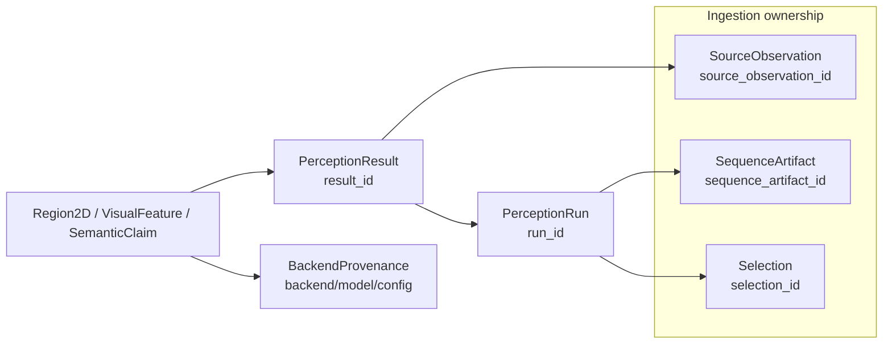
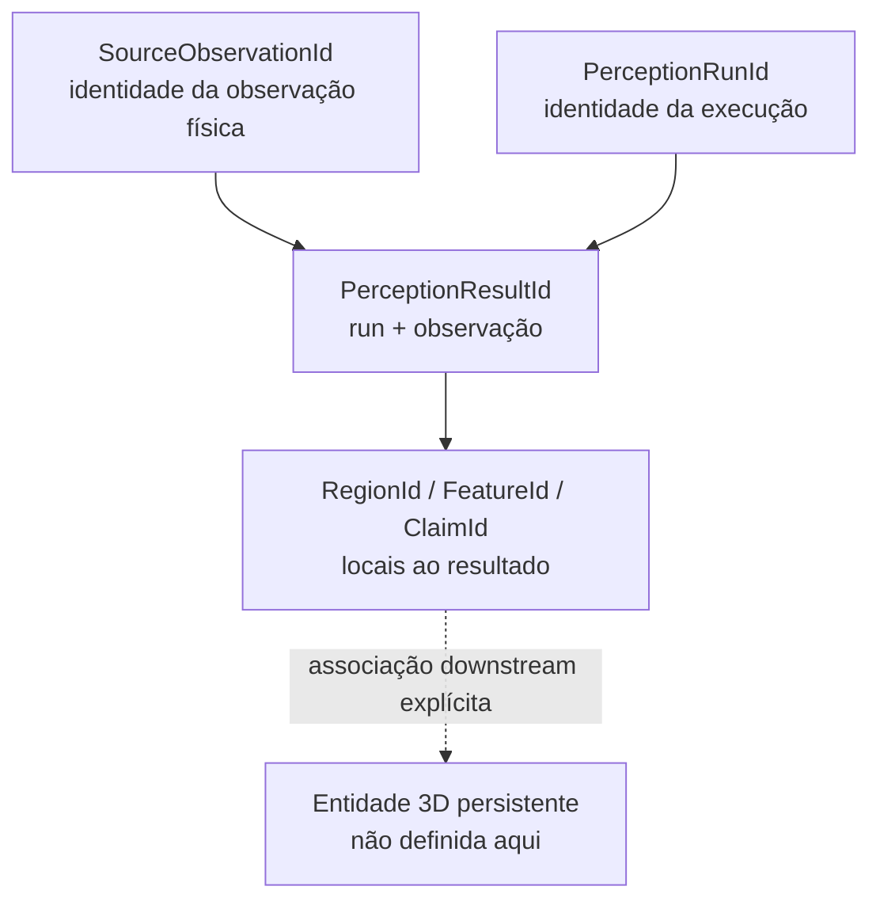

# Identidade e proveniência

Este documento descreve `src/contextmap/visual_perception/identity.py` e a cadeia completa de rastreabilidade de evidência visual.

## Cadeia de rastreabilidade

Dado qualquer `SemanticClaim`, `VisualFeature` ou `Region2D`, é possível rastrear até:



Nenhum desses IDs implica identidade de entidade 3D persistente — são todos identidades locais de evidência de inferência (ver `contracts.md`).

### Escopos de identidade



A seta tracejada não representa uma conversão automática. Ela marca apenas a fronteira onde uma capability posterior pode associar evidência local a uma entidade persistente.

## Por que identidades determinísticas

`perception_result_id_for()`, `region_id_for()`, `feature_id_for()`, `claim_id_for()` são funções puras: a mesma entrada sempre produz a mesma identidade, em vez de um valor aleatório (UUID). Isso significa:

- a identidade de um `PerceptionResult` é sempre `f"{run_id}--{source_observation_id}"` — não precisa de um registro externo para saber qual resultado pertence a qual run+frame;
- reconstruir os mesmos objetos a partir dos mesmos dados brutos produz os mesmos IDs — útil para testes e para comparar re-execuções determinísticas;
- a identidade sobrevive a um round-trip de serialização (é só uma string, não um estado externo).

## Runs repetidos permanecem distintos

Duas execuções (`run_id` diferente) sobre a **mesma** `SourceObservation` produzem `PerceptionResultId`s diferentes (o `run_id` faz parte da chave), mas ambas preservam o mesmo `source_observation_id` — exatamente a distinção central da issue #48/#50: reprocessamento nunca é uma nova observação física.

```text
perception_result_id_for(run_id="run-0001", source_observation_id="frame-0124")
    → "run-0001--frame-0124"
perception_result_id_for(run_id="run-0002", source_observation_id="frame-0124")
    → "run-0002--frame-0124"
```

## Seleções sobrepostas

Quando duas seleções de sequência se sobrepõem (ex.: `run-0001` processa frames 0-1000, `run-0005` processa frames 430-480), cada run continua produzindo seus próprios `PerceptionResult`s com identidade própria por frame — não há fusão implícita. Ver `tests/visual_perception/test_identity.py` para o teste com seleções sobrepostas.

## Escopo local, não global

Um `RegionId`/`FeatureId`/`ClaimId` é único **dentro de um `PerceptionResult`** (garantido por `region_id_for(result_id=..., index=...)` incluir o `result_id` na própria string) — nunca global, e nunca comparável entre dois `PerceptionResult`s sem associação explícita posterior por uma capability downstream.
