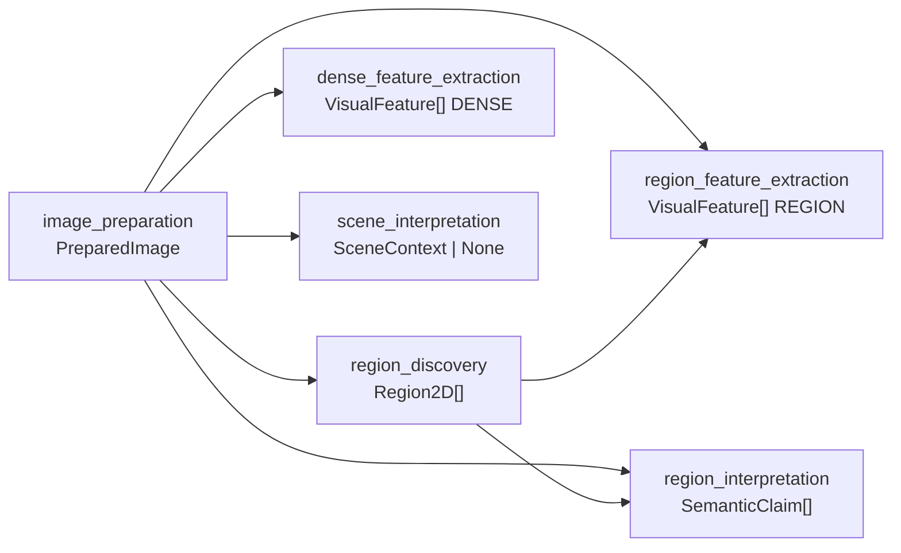
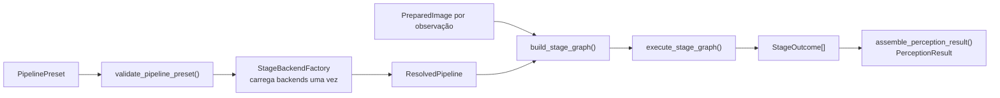

# Presets de pipeline e grafo de estágios declarativo

Este documento descreve `src/contextmap/visual_perception/pipeline.py`: como um grafo de estágios executável (`service.py`, issue #50) é produzido a partir de uma configuração pequena, versionada e serializável, em vez de ser montado à mão em código a cada vez.

## Três conceitos, não um motor de workflow genérico

- **`StageSpec`** — um estágio declarativo: `capability`, como seus `inputs` nomeados se ligam a `stage_id`s upstream, qual `backend_id` o preenche (ou `None` para um estágio "fonte", cuja saída é fornecida externamente — ex.: a imagem preparada), seus `parameters` resolvidos e, para `feature_extractor`, o `feature_scope` produzido.
- **Uma instância de backend concreta** — construída por uma `StageBackendFactory` fornecida pelo chamador. Este módulo nunca constrói uma sozinho e nunca importa um SDK de modelo.
- **`PipelinePreset`** — uma seleção nomeada e versionada de estágios/dependências/backends/parâmetros (ex.: `"canonical/1"`).

Deliberadamente **não** é um sistema de plugin/workflow genérico: o conjunto de capabilities executáveis é a tabela pequena e fixa `_CAPABILITY_ADAPTERS` (`region_discovery`, `feature_extractor`, `feature_resolution_enhancement`, `scene_interpretation`, `region_interpretation`). Ela adapta os ports necessários ao grafo atual, mas não equivale a todos os ports públicos de `ports.py`: `SemanticScorer` já existe como contrato público e ainda não está ligado ao pipeline canônico. Tornar uma nova capability executável exige um adapter explícito, contrato de inputs e decisão de preset — nunca um mecanismo de despacho genérico.

## Preset canônico versionado

`CANONICAL_PRESET_V1` (`preset_id="canonical/1"`) é a topologia padrão atualmente validada: descoberta de região sobre a imagem preparada, extração de features densa e por região, e interpretação semântica de cena e de região. Implementar uma capability/backend **nunca** a torna parte deste preset automaticamente — inclusão aqui é uma decisão explícita e separada da implementação existir.

Duas presets com topologias diferentes nunca compartilham `preset_id` — uma versão nunca é reaproveitada para uma topologia diferente.

### Topologia de `canonical/1`



`image_preparation` é um estágio fonte (`backend_id=None`): sua saída é injetada por `ResolvedPipeline.build_stage_graph()`. Os demais estágios resolvem backends uma única vez por pipeline resolvido. `region_feature_extraction` e `region_interpretation` dependem explicitamente das regiões; `dense_feature_extraction` e `scene_interpretation` permanecem branches independentes.

O estágio `region_discovery` pode ser satisfeito pelos adapters SAM2, SAM3 ou Florence-2 implementados na capability. Passes full-frame/tiles, scale, remapeamento, normalização e Geometry Freeze ficam encapsulados atrás do port `RegionDiscovery`; a topologia do pipeline continua vendo apenas `PreparedImage -> Region2D[]`. Ver [`region-discovery.md`](region-discovery.md).

## Validar antes de carregar modelos pesados

`validate_pipeline_preset()` verifica, apenas a partir da estrutura declarativa (nenhum backend é construído): `stage_id` duplicado, dependência (`inputs`) para um `stage_id` desconhecido, capability sem adaptador conhecido, ciclos, nomes obrigatórios/permitidos de inputs e compatibilidade da capability produtora. `image` deve vir de `image_preparation`; `regions`, de `region_discovery`; `dense_map`, de `dense_feature_map_source` ou de outro `feature_resolution_enhancement`. Um `feature_extractor` declara `feature_scope`: `REGION` exige `image` e `regions`, enquanto `DENSE`/`GLOBAL` aceitam somente `image`. `resolve_pipeline()` chama essa validação **antes** de qualquer `StageBackendFactory`, portanto uma configuração inválida não carrega modelos pesados.

### Ciclo de resolução e execução



A validação estrutural ocorre antes da construção de qualquer backend pesado. Depois da resolução, apenas o grafo por observação é reconstruído; as instâncias de backend são reutilizadas.

## Resolver uma vez, construir o grafo por observação

```python
# backends pesados carregam aqui, uma vez
resolved = resolve_pipeline(CANONICAL_PRESET_V1, backend_factories={...})

for observation in sequence:
    image = prepare(observation)
    # barato, por observação
    stages = resolved.build_stage_graph({"image_preparation": image})
    outcomes = execute_stage_graph(stages)
```

`resolve_pipeline()` constrói cada backend de estágio exatamente uma vez. `ResolvedPipeline.build_stage_graph()` é a operação chamada por observação — ela só injeta a(s) saída(s) de estágio "fonte" daquela observação (ex.: a imagem preparada) e reutiliza as mesmas instâncias de backend já resolvidas.

## Inserir/remover um estágio opcional sem tocar código de capability

Um estágio marcado `optional=True` documenta que um preset alternativo pode omiti-lo — a aplicação é estrutural, não uma flag em runtime: se um preset omite um estágio opcional, qualquer estágio downstream que referenciasse seu `stage_id` em `inputs` também precisa ser atualizado nesse mesmo preset, ou a validação rejeita o preset por depender de um `stage_id` desconhecido.

Exemplo (`tests/visual_perception/test_pipeline.py::test_optional_stage_can_be_inserted_without_touching_downstream_capability_code`): um preset experimental insere um estágio opcional `region_refinement` (capability `region_discovery`) entre `image_preparation` e `region_feature_extraction`, apenas mudando de qual `stage_id` o `inputs["regions"]` deste último aponta — nenhuma função em `pipeline.py` ou `ports.py` precisa mudar. `region_feature_extraction` nunca sabe, e nunca precisa saber, se o backend que produziu suas regiões foi o `region_discovery` canônico ou o `region_refinement` experimental — apenas que o contrato (`Sequence[Region2D]`) é o mesmo.

A mesma lógica é implementada para o estágio opcional de aumento de resolução: um preset experimental pode ligar um `DenseFeatureMap` nativo a `feature_resolution_enhancement`, enquanto o preset canônico continua omitindo esse nó. Ambos os caminhos expõem o mesmo contrato público `DenseFeatureMap`; nenhum consumidor downstream contém `if loftup` ou equivalente. Ver [`feature_resolution_enhancement.md`](feature_resolution_enhancement.md).

## Reprodutibilidade e proveniência

- `encode_pipeline_preset()`/`decode_pipeline_preset()` — round-trip JSON simétrico de um `PipelinePreset` inteiro (schema próprio, `PIPELINE_SCHEMA_VERSION`; versão `0.2.0` inclui `feature_scope`).
- `ResolvedPipeline.backend_provenance()` — um `BackendProvenance` por estágio de backend resolvido.
- `ResolvedPipeline.configuration_digest()` — hash determinístico sobre o preset codificado e a proveniência de cada backend resolvido; duas resoluções produzem o mesmo digest se e somente se compartilham o mesmo conteúdo de preset **e** a mesma identidade de backend resolvida (mesmo checkpoint/versão) para cada estágio.

Ambos — o preset resolvido e o `configuration_digest` — são persistidos no `manifest.json` de todo `PerceptionRunArtifact` (`run_artifact.py`, `schema_version` 0.4.0), então o grafo de estágios, o escopo de feature e as identidades de backend efetivamente usados por um run são inspecionáveis sem precisar reconstruir o pipeline.

## O que este módulo explicitamente não faz

- Não decide qual preset é o "certo" para uma execução — isso é uma decisão de composição root/configuração de runtime, fora do escopo deste módulo.
- Não interpreta `parameters` — apenas os repassa, primitivos e serializáveis, para a `StageBackendFactory` do estágio.
- Não introduz um registro de maturidade de backend nem um sistema de plugin genérico — a lista de capabilities executáveis é pequena e cresce apenas quando uma nova capability recebe adapter, contrato de inputs e inclusão explícita em um preset.
