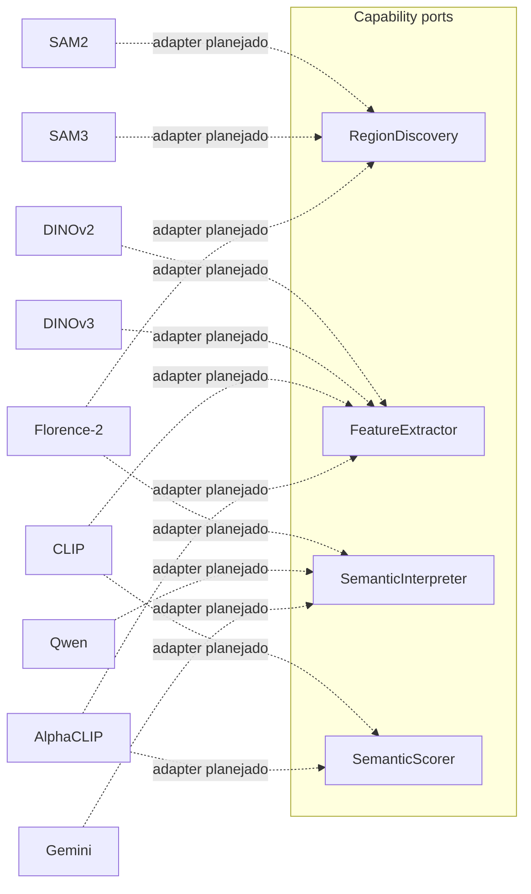

# Capability ports

Este documento descreve `src/contextmap/visual_perception/ports.py`: os quatro `Protocol`s que qualquer backend concreto de percepção visual implementa.

## Mapeamento planejado capability/backend



Um mesmo modelo pode satisfazer mais de uma capability através de adapters **distintos** — Florence-2 como `RegionDiscovery` e Florence-2 como `SemanticInterpreter` continuam sendo dois adapters de capability separados, mesmo compartilhando o runtime do modelo internamente. O mesmo vale para CLIP como `FeatureExtractor` vs. CLIP como `SemanticScorer`.

## Nenhuma sequência obrigatória

Os ports não codificam `RegionDiscovery -> FeatureExtractor -> SemanticInterpreter` como uma sequência fixa. Cada capability declara o que exige/produz; o grafo de execução resolvido (`docs/architecture.md`/issue #50/#55) decide a ordenação real. Exemplos:

```text
DINOv3 (dense)         requires: PreparedImage                    provides: VisualFeature[] (dense)
AlphaCLIP (region)     requires: PreparedImage + Region2D[]       provides: VisualFeature[] (region)
Gemini (region)        requires: PreparedImage + Region2D[]       provides: SemanticClaim[]
CLIP (scorer)          requires: SemanticClaim[] + PreparedImage  provides: SemanticSupport[]
```

## `PreparedImage`

Contrato canônico de "imagem pronta para os backends consumirem" (`contextmap.visual_perception.models.PreparedImage`) — qualquer implementação de preparação de imagem (resize, rectification, crop, máscara de área válida...) produz exatamente esse tipo. O contrato preserva `payload_reference`, metadata content-addressed opcional, `TransformationRecord[]` ordenado e constraints `ValidRegion`/`ExclusionRegion` opcionais. Não existe um segundo `PreparedImage` específico de Region Discovery.

## `RegionDiscovery`

O port público permanece `discover(PreparedImage) -> Sequence[Region2D]`. SAM2, SAM3 e Florence-2 implementam essa assinatura e devolvem o mesmo `Region2D` canônico consumido por Feature Extraction e pelo `PerceptionResult`. A execução por pass usa o boundary interno `RegionCandidateDiscovery.discover_candidates(DiscoveryInput)`; passes, diagnostics e `RegionCandidate` não vazam para o orchestrator do Core.

## `FeatureExtractor.required_scope()`

Em vez de multiplicar tipos de port por escopo (dense/global/region), um único `FeatureExtractor` declara seu escopo via `required_scope()`. Um extrator dense/global só recebe `image`; um extrator region-scoped também recebe `regions`. Isso evita forçar uma assinatura mandatória `PreparedImage + Region2D[]` em extratores que não precisam de regiões (ex.: DINOv3 dense).

## `SemanticScorer` nunca muta uma claim

`score()` retorna `SemanticSupport[]` — um julgamento de suporte separado, referenciando `claim_id` — nunca modifica a `SemanticClaim` original. Isso preserva a claim como evidência imutável.

## Metadata de backend

Todo port expõe `backend_provenance() -> BackendProvenance` (issue #48) — identidade do backend, capability satisfeita, provider/model/version, e um fingerprint de configuração opcional. Nenhum port expõe objetos nativos do SDK do modelo.

## Substituibilidade

Qualquer classe que implemente os métodos de um port satisfaz esse port (`Protocol` com `@runtime_checkable`) — código de orquestração nunca precisa de `isinstance(backend, Sam2RegionDiscovery)` ou qualquer branch por modelo. `tests/visual_perception/test_ports.py` demonstra isso com duas implementações fake de `RegionDiscovery` sendo usadas de forma intercambiável pelo mesmo código consumidor.

## Estado no pipeline canônico

Os quatro ports acima são contratos públicos implementados em `ports.py`, mas isso não significa que todos estejam ligados ao preset canônico. Hoje, `CANONICAL_PRESET_V1` executa `RegionDiscovery`, `FeatureExtractor` e as duas operações de `SemanticInterpreter` (`scene_interpretation` e `region_interpretation`). `SemanticScorer` existe como ponto de substituição público, porém ainda não possui um estágio em `_CAPABILITY_ADAPTERS` nem no preset canônico.

Essa separação é intencional: adicionar um port ou backend não altera automaticamente a topologia executada. Integrar uma nova capability ao pipeline exige uma decisão explícita de inputs, outputs, validação e preset.

## O que este contrato não define

Instanciação de backends concretos (pertence à composition root/`runtime`), configuração específica de modelo, e a ordem real de execução (issues #50/#55) ficam fora do escopo desta issue.
