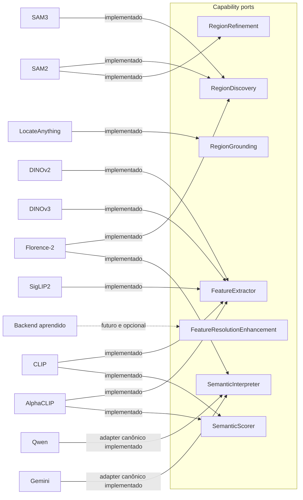

# Capability ports

Este documento descreve `src/contextmap/visual_perception/ports.py`: os sete `Protocol`s que backends concretos de percepção visual podem implementar.

## Mapeamento capability/backend



Um mesmo modelo pode satisfazer mais de uma capability através de adapters **distintos** — Florence-2 como `RegionDiscovery` e Florence-2 como `SemanticInterpreter` continuam sendo dois adapters de capability separados, mesmo compartilhando o runtime do modelo internamente. O mesmo vale para CLIP como `FeatureExtractor` vs. CLIP como `SemanticScorer`.

## Nenhuma sequência obrigatória

Os ports não codificam `RegionDiscovery -> FeatureExtractor -> SemanticInterpreter` como uma sequência fixa. Cada capability declara o que exige/produz; o grafo de execução resolvido (`docs/architecture.md`/issue #50/#55) decide a ordenação real. Exemplos:

```text
DINOv3 (dense)         requires: PreparedImage                    provides: VisualFeature[] (dense)
SigLIP2 (dense|global) requires: PreparedImage                    provides: VisualFeature[] (um escopo por instância)
resolution enhancement requires: DenseFeatureMap                  provides: DenseFeatureMap
AlphaCLIP (region)     requires: PreparedImage + Region2D[]       provides: VisualFeature[] (region)
Gemini (region)        requires: SemanticInterpretationRequest    provides: SemanticInterpretationExecution
CLIP (scorer)          requires: SemanticClaim[] + VisualFeature[] provides: SemanticScore[]
```

## `PreparedImage`

Contrato canônico de "imagem pronta para os backends consumirem" (`contextmap.visual_perception.models.PreparedImage`) — qualquer implementação de preparação de imagem (resize, rectification, crop, máscara de área válida...) produz exatamente esse tipo. O contrato preserva `payload_reference`, metadata content-addressed opcional, `TransformationRecord[]` ordenado e constraints `ValidRegion`/`ExclusionRegion` opcionais. Não existe um segundo `PreparedImage` específico de Region Discovery.

## `RegionDiscovery`

O port público permanece `discover(PreparedImage) -> Sequence[Region2D]`. SAM2, SAM3 e Florence-2 implementam essa assinatura e devolvem o mesmo `Region2D` canônico consumido por Feature Extraction e pelo `PerceptionResult`. A execução por pass usa o boundary interno `RegionCandidateDiscovery.discover_candidates(DiscoveryInput)`; passes, diagnostics e `RegionCandidate` não vazam para o orchestrator do Core.

Os tipos adapter-facing são exportados para configuração, diagnóstico e avaliação, mas não alteram a fronteira consumida pelas capabilities downstream. O fluxo completo está em [`region-discovery.md`](region-discovery.md).

## `RegionGrounding`

`capabilities() -> RegionGroundingCapabilities` e `ground(RegionGroundingRequest) -> RegionGroundingExecution`. É um port separado de `RegionDiscovery` porque a entrada é outra: além da imagem, uma query explícita (texto livre ou categorias ordenadas, política versionada e geometria pedida) que entra na identidade do request e é validada antes da inferência. Um adapter de grounding nunca recebe a query pela configuração. Só saídas box viram `Region2D`; pontos permanecem evidência nativa. Detalhes em [`region-grounding.md`](region-grounding.md). O LocateAnything implementa `RegionGrounding` com runtime injetável; ver [`locateanything.md`](locateanything.md).

## `RegionRefinement`

`capabilities() -> RegionRefinementCapabilities` e `refine(RegionRefinementRequest) -> RegionRefinementExecution`. Recebe propostas de grounding só como prompts de segmentação e devolve, por prompt, uma `Region2D` nova com máscara ou uma rejeição explícita; nunca altera a evidência de grounding. O SAM2 implementa este port com um adapter distinto do de Region Discovery (`Sam2PromptRefinement`), sobre o mesmo modelo carregado pelo provider. Detalhes em [`region-refinement.md`](region-refinement.md).

## `FeatureExtractor.required_scope()`

Em vez de multiplicar tipos de port por escopo (dense/global/region), um único `FeatureExtractor` declara seu escopo via `required_scope()`. Um extrator dense/global só recebe `image`; um extrator region-scoped também recebe `regions`. Isso evita forçar uma assinatura mandatória `PreparedImage + Region2D[]` em extratores que não precisam de regiões (ex.: DINOv3 dense).

## `FeatureResolutionEnhancement`

É um port separado porque possui input/output de artifact, custo, falha e ativação próprios. Recebe um `DenseFeatureMap` já produzido e devolve outro `DenseFeatureMap`, com lineage completa em `FeatureResolutionEnhancementProvenance`. Não é um modo interno do DINO e não aparece no caminho canônico quando ausente da configuração.

## `SemanticInterpreter`

O port recebe um único `SemanticInterpretationRequest`, declara antecipadamente
seus modes/views/evidências suportados e devolve
`SemanticInterpretationExecution`. A execução mantém separados request, prompt
renderizado, resposta bruta, parsing canônico, configuração efetiva e métricas.
Nenhum objeto do SDK de Qwen, Gemini ou Florence-2 atravessa essa fronteira.
`QwenSemanticInterpreter`, `GeminiSemanticInterpreter` e
`Florence2SemanticInterpreter` implementam esse boundary hoje usando seams
injetáveis (`QwenRuntime`, `GeminiClient` e `Florence2SemanticRuntime`). Esses
seams recebem as `SemanticVisualView` completas e cada implementação precisa
verificar o SHA-256 dos bytes da view antes de decodificá-los ou enviá-los a um
provider (`read_view_payload`; ver
[Integridade das views](semantic-interpretation.md#integridade-das-views-na-inferência)).
Isso valida contratos, mapping, parsing, retries/diagnostics e provenance sem
afirmar que execuções controladas com checkpoint/API real já foram concluídas.

## `SemanticScorer` nunca muta uma claim

`score()` recebe claims e features canônicas e retorna `SemanticScore[]` —
julgamentos separados que referenciam claim, feature, embedding space,
observação e resultado — sem modificar a `SemanticClaim` original. CLIP opera
sobre features globais; AlphaCLIP exige feature regional da mesma região.
Cosine similarity permanece em `[-1, 1]`, e
`calibrated_probability=None` enquanto não existir calibração demonstrada.

## Metadata de backend

Todo port expõe `backend_provenance() -> BackendProvenance` (issue #48) — identidade do backend, capability satisfeita, provider/model/version, e um fingerprint de configuração opcional. Nenhum port expõe objetos nativos do SDK do modelo.

## Substituibilidade

Qualquer classe que implemente os métodos de um port satisfaz esse port (`Protocol` com `@runtime_checkable`) — código de orquestração nunca precisa de `isinstance(backend, Sam2RegionDiscovery)` ou qualquer branch por modelo. `tests/visual_perception/test_ports.py` demonstra isso com duas implementações fake de `RegionDiscovery` sendo usadas de forma intercambiável pelo mesmo código consumidor.

## Estado no pipeline canônico

Os sete ports acima são contratos públicos implementados em `ports.py`, mas
isso não significa que todos pertençam ao preset canônico. Os adapters de
capability `semantic_interpreter` e `semantic_scorer` podem ser selecionados por
`StageSpec`; o scorer recebe os inputs nomeados `claims` e `features`.
`CANONICAL_PRESET_V1` ainda preserva temporariamente os dois estágios anteriores
de cena/região e não seleciona Qwen, CLIP ou AlphaCLIP silenciosamente.

Essa separação é intencional: adicionar um port ou backend não altera automaticamente a topologia executada. Integrar uma nova capability ao pipeline exige uma decisão explícita de inputs, outputs, validação e preset.

## O que este contrato não define

Instanciação de backends concretos (pertence à composition root/`runtime`), configuração específica de modelo, e a ordem real de execução (issues #50/#55) ficam fora do escopo desta issue.
