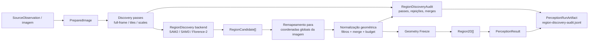
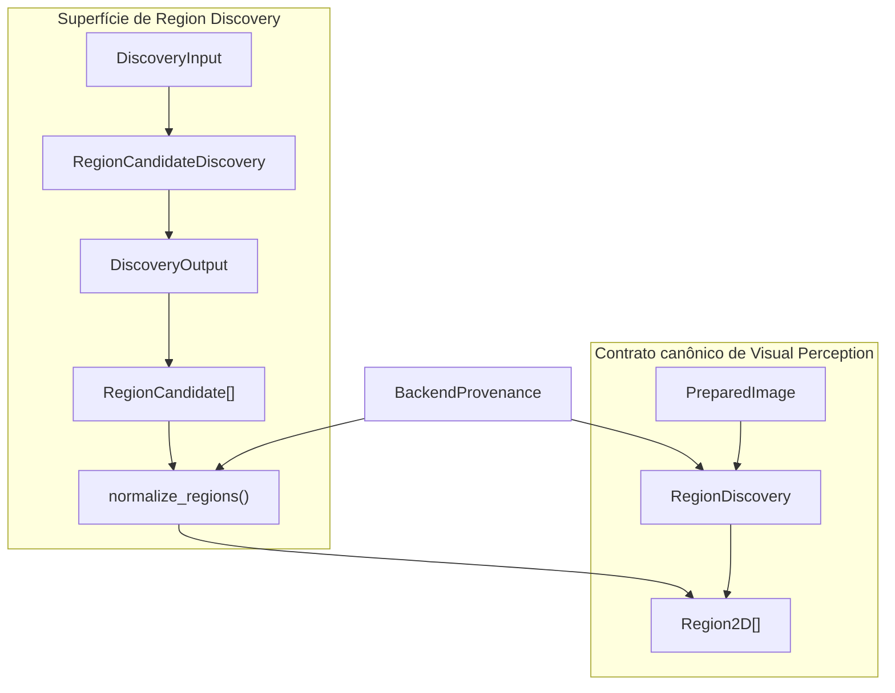
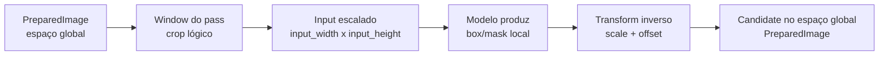
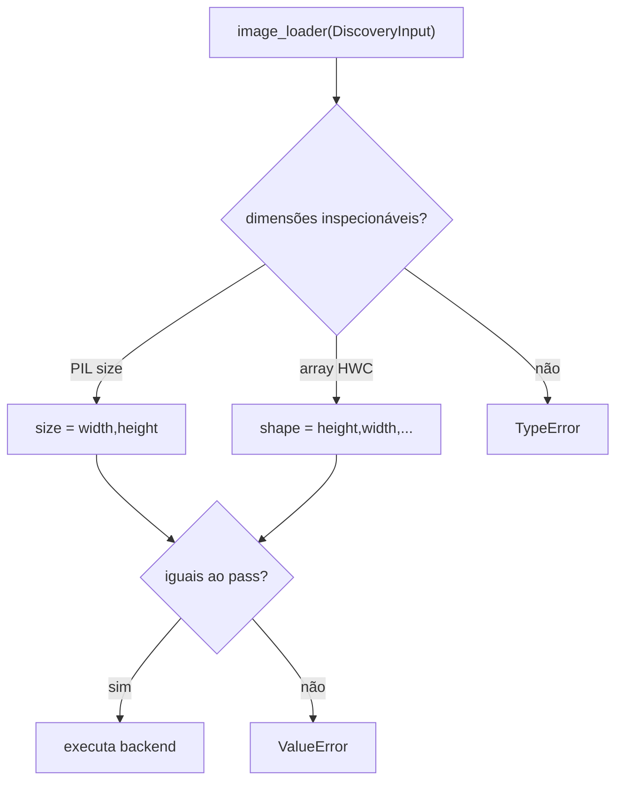
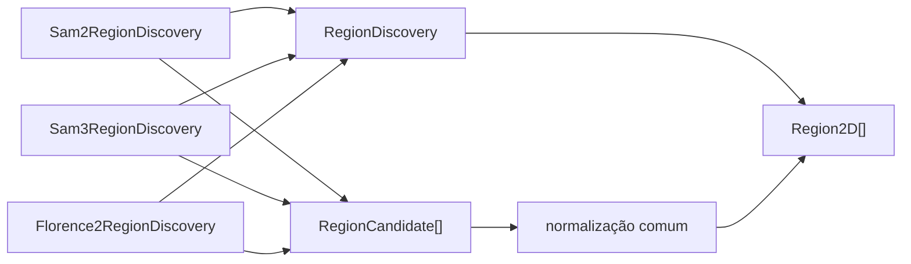
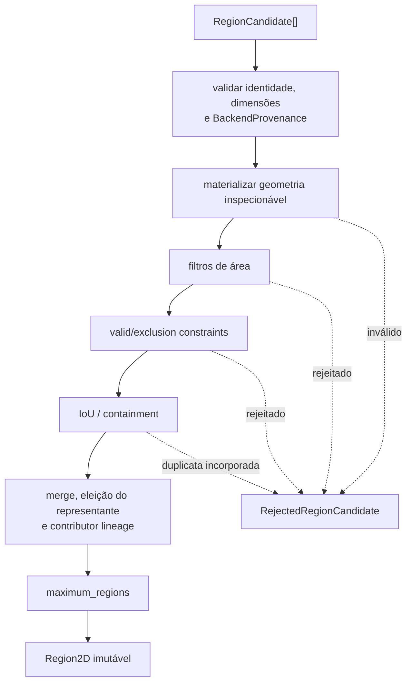
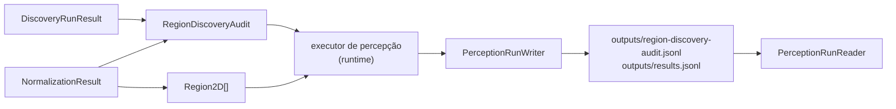
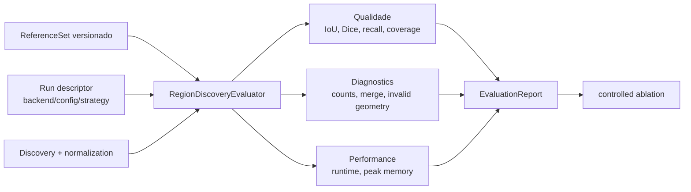

# Region Discovery

Region Discovery propõe geometria 2D para uma execução de Visual Perception. A capability
preserva evidência geométrica e provenance, sem decidir identidade persistente, label final ou
suporte 3D.

## Visão geral



O port consumido pelo Visual Perception Core é `RegionDiscovery.discover(PreparedImage) -> Sequence[Region2D]`. Passes, candidatos, rejeições, diagnostics e avaliação existem para tornar a produção dessas regiões verificável sem transformar uma proposta de frame em verdade persistente do mapa. O caminho canônico do runtime usa `AuditedRegionDiscovery.discover_audited(PreparedImage) -> AuditedRegions`, que devolve as mesmas regiões junto com a `RegionDiscoveryAudit` do frame; essa auditoria é gravada no `PerceptionRunArtifact` (ver [Evidência persistida](#evidência-persistida-a-auditoria-de-cada-frame)).

## Contratos canônicos

`RegionCandidate` representa uma proposta antes de validação, merge e normalização. A proposta
carrega identidade da observação física, run, resultado, pass e proposta nativa. Sua geometria pode
ser uma bounding box ou uma máscara `InlineMask` materializada. Uma `mask_reference` só é aceita
junto da máscara materializada que a normalização realmente inspeciona; uma referência opaca não é
publicada como geometria consumível.

`InlineMask` é uma máscara da imagem inteira, imutável, com um byte por pixel (#593). Os pixels são
copiados uma vez, na construção, para um buffer `bytes` da própria máscara, e `as_array()` devolve
uma view `(height, width)` somente leitura desse buffer, sem cópia: nem a view nem nada abaixo dela
pode voltar a ser gravável, então a máscara continua sendo um valor, com igualdade e hash por
dimensões e pixels. Não há acesso a uma tupla de pixels: quem consome a máscara usa `as_array()`,
`area` ou `value_at()`. `to_dict()`/`from_dict()` mantêm a forma serializada (lista plana de 0/1
em ordem de linha), então nenhum artifact muda.

Os backends produzem a máscara direto da saída nativa, sem uma lista Python por pixel: a
segmentação do SAM2 é lida como array; os logits do SAM3 saem do tensor para a CPU em float64 (exato
para float32, float16 e bfloat16) e são comparados com `mask_threshold` em float64, como sempre foram;
os polígonos do Florence-2 são rasterizados pela regra par-ímpar no centro do pixel, aresta por aresta,
com a mesma aritmética do teste ponto a ponto.

A normalização trabalha sobre o recorte da máscara na caixa justa dos seus pixels (uma view) e só
compara pixel a pixel duas propostas cujas caixas se encontram. Com os dois limiares de merge
positivos, propostas de caixas disjuntas têm IoU e contenção 0 e não podem se fundir; com um limiar
0, todo par é comparado, como antes.

`Region2D` é o contrato único definido pelo Visual Perception Core e representa geometria aceita e
congelada. O `region_id` é local ao `PerceptionResult`, que fornece os escopos de run e observação;
portanto, dois resultados podem usar o mesmo `region_id` sem sugerir que representam o mesmo objeto
físico. Contributor IDs e provenance de geometry freeze estendem esse contrato canônico. A
identidade não pode ser usada como entity ID do mapa.

`RejectedRegionCandidate` registra uma rejeição com motivo legível por máquina, detalhe e pass de
origem. Rejeições e propostas incorporadas por merge permanecem disponíveis para auditoria: a
`RegionDiscoveryAudit` de cada frame as leva até o `PerceptionRunArtifact`. Nenhum backend de
produção devolve uma `Region2D` com `is_accepted=False`; o campo continua no contrato, mas a
rejeição do caminho canônico é sempre uma `RejectedRegionCandidate` da auditoria.

## Fronteiras de contrato



`PreparedImage`, `Region2D` e `RegionDiscovery` possuem uma única definição canônica em Visual Perception Core. `DiscoveryInput`, `DiscoveryOutput`, `RegionCandidate`, `RejectedRegionCandidate`, `RegionDiscoveryAudit` e os tipos de passes são contratos adapter-facing e de auditoria exportados pelo módulo, mas não substituem `Region2D` como evidência consumida pelas capabilities downstream.

`AuditedRegionDiscovery` estende `RegionDiscovery` com `discover_audited()` e é o port que o executor de percepção do runtime exige. O port `RegionDiscovery` não muda: quem só precisa de regiões continua dependendo dele, e os três backends implementam os dois, com `discover()` devolvendo exatamente as regiões de `discover_audited()`.

Uma `RegionCandidate` é evidência de proposta antes da consolidação. Ela preserva run/result, observação física, dimensões da imagem, provenance do proposal, score nativo e geometria materializada. Uma `Region2D` é a geometria canônica após validação, merge e freeze; ainda é evidência local ao `PerceptionResult`, nunca uma entidade 3D persistente.

## Espaço de coordenadas

A convenção inicial é `pixel_xy_top_left`:

- origem no canto superior esquerdo;
- `x` cresce para a direita e `y` cresce para baixo;
- bounding boxes são intervalos semiabertos `[x_min, x_max)` e `[y_min, y_max)`;
- largura e altura descrevem o espaço da imagem preparada;
- máscaras inline usam ordem row-major e exatamente `width * height` valores.

Geometria fora dos limites da imagem é inválida: `RegionCandidate` e, quando conhece
`image_width`/`image_height`, `Region2D` recusam uma bounding box que passe da imagem (#619).
Remapeamentos de crop, resize ou tile devem ocorrer antes da criação da região canônica e
permanecer registrados em provenance.

## Scores

`BackendScore` exige nome, valor e semântica. Um `predicted_iou` do SAM não é tratado como
probabilidade nem comparado diretamente com scores de Florence-2. Ausência de score permanece
`None`; ela não é convertida em zero ou um.

## Normalização de backends

Adapters convertem apenas dados serializáveis para `RegionCandidate`:

```text
SAM2/SAM3 mask + box + native scores -> RegionCandidate
Florence-2 box ou mask + parser data  -> RegionCandidate
fake deterministic proposal          -> RegionCandidate
```

Tensors, objetos de SDK e handles de modelo ficam dentro do adapter. Prompt ou texto usado para
descobrir uma região pode aparecer na provenance, mas não cria automaticamente um
`SemanticClaim`.

## Organização da implementação

```text
visual_perception/
├── models.py                 # PreparedImage, Region2D, BackendProvenance
├── ports.py                  # RegionDiscovery, AuditedRegionDiscovery
├── image_preparation.py      # plano auditável de preparação
├── region_models.py          # RegionCandidate e geometria de proposal
├── discovery.py              # passes, tiling, remapeamento, adapter boundary e auditoria
├── normalization.py          # filtros, merge e geometry freeze
├── run_artifact.py           # persistência da auditoria no PerceptionRunArtifact
└── backends/
    ├── sam2.py
    ├── sam3.py
    └── florence2.py
```

A separação evita que SDKs de modelos definam os contratos do domínio. `models.py` e `ports.py` contêm a fronteira canônica; os adapters concretos isolam APIs de modelos; `discovery.py` e `normalization.py` permanecem backend-neutral.

## Preparação de imagem e constraints

`prepare_image` recebe uma `SourceImage` imutável e uma sequência explícita de operações. Sem
configuração, o resultado referencia o payload original e registra `transformations = []`. Resize,
crop, rectification e normalization recebem a referência do payload materializado pelo adapter de
imagem e produzem um `TransformationRecord` ordenado com dimensões de entrada/saída e parâmetros.
Cada operação também exige `provenance_source`, que identifica a configuração, calibração ou
política que solicitou a transformação e é serializada junto ao registro.

`ValidRegion` restringe os pixels elegíveis e `ExclusionRegion` remove áreas nomeadas. Ambos são
opcionais, precisam corresponder ao espaço de coordenadas final e registram motivo e origem da
configuração. A API não contém defaults para câmera fisheye, veículo, drone, rig ou dataset. Uma
necessidade desse tipo deve ser declarada pelo preset/source config que criou a constraint.

O contrato não pinta pixels excluídos de preto nem altera a observação física. Backends recebem a
imagem preparada e as constraints separadamente, evitando que uma alteração visual silenciosa seja
confundida com evidência do sensor.

## Transformações de coordenadas



A geometria produzida por backend pertence ao espaço efetivamente materializado para o pass. O remapeamento para `PreparedImage` ocorre antes da normalização, e a provenance mantém `discovery_pass_id`, configuração e identidade nativa da proposta.

## Passes e tiling

O baseline executa um único pass `full_frame`. `DiscoveryPassConfig` pode adicionar um ou mais
grids de tiles com tamanho, overlap, escala e budget por pass explícitos. As janelas são geradas em
ordem row-major e o último tile de cada eixo é alinhado ao limite da imagem para garantir cobertura
sem produzir coordenadas fora do espaço preparado.

O port público `RegionDiscovery` recebe `PreparedImage` e devolve `Sequence[Region2D]`, exatamente
como o Visual Perception Core exige. A execução por pass é um detalhe interno exposto somente a
adapters pelo `RegionCandidateDiscovery`: ele recebe `DiscoveryInput` e devolve `RegionCandidate`
mais diagnostics. A orquestração do Core não contém branches para SAM2, SAM3 ou Florence-2.
Propostas locais de tiles são remapeadas para a imagem preparada, recebem ID prefixado pelo pass e
preservam o ID nativo em provenance. Máscaras inline são redimensionadas e expandidas no espaço
global antes da normalização. O redimensionamento é por vizinho mais próximo amostrando o
**centro** de cada pixel de saída: o pixel `x` cobre `[x, x + 1)`, seu centro `x + 0.5` vai para
`(x + 0.5) * largura_entrada / largura_saída`, a mesma convenção contínua do remapeamento de
boxes, e o pixel de entrada que contém esse ponto é o amostrado (em aritmética inteira, sem erro de
ponto flutuante). Amostrar o canto `x` deslocava a máscara em até 1 px sempre que a escala não era
1 (#619).

`TilingConfig.scale` define as dimensões efetivamente apresentadas ao backend: cada
`DiscoveryPass` registra `input_dimensions` e o transform inverso para o espaço preparado. Boxes e
máscaras retornadas nesse espaço escalado são remapeadas para a janela global. Assim, alterar a
escala altera o input do modelo sem alterar a coordenada canônica da mesma geometria.
Os runtimes oficiais validam o objeto materializado pelo loader antes da inferência: imagens
compatíveis com PIL devem expor `size = (width, height)` e arrays HWC devem expor
`shape = (height, width, ...)`, sempre iguais a `input_dimensions`. Um loader que apenas propaga
metadados do pass sem produzir o crop/resize correspondente falha explicitamente.

`BorderPolicy.KEEP` mantém propostas que tocam bordas internas. A política
`REJECT_INTERNAL_BORDER` registra `tile_border_truncation` sem apagar a proposta dos diagnostics.
Cada pass de tile é pareado, no momento em que é criado, com o `TilingConfig` que o gerou; com
vários grids (`tiling` e `additional_tilings`), um tile é sempre julgado pela política de borda do
seu próprio grid, sem reconstruir essa atribuição pela contagem de janelas (#619).
Um candidato só-máscara (sem `bounding_box`) é testado pela caixa justa dos pixels verdadeiros da
máscara; uma máscara vazia não toca borda nenhuma (#596).
Deduplicação entre passes não ocorre aqui; ela pertence à normalização geométrica.

## Validação da imagem materializada

Os runtimes oficiais não confiam apenas nos metadados do pass. Depois que o `image_loader` materializa o crop/resize, `validate_materialized_discovery_image()` verifica as dimensões reais antes da inferência:



Isso torna `TilingConfig.scale` uma transformação verificável: alterar a escala muda o tamanho efetivamente apresentado ao modelo, e o remapeamento inverso retorna a geometria ao mesmo sistema de coordenadas global.

## Backend SAM2

`Sam2RegionDiscovery` implementa o mesmo port usado pelos demais backends. O adapter recebe
`Sam2Config` validada e um runtime injetado que isola carregamento de checkpoint, Torch e objetos
do SDK. Apenas boxes, máscaras booleanas e scores escalares atravessam essa fronteira interna.

A configuração efetiva inclui checkpoint, versão, device, precision, thresholds e parâmetros do
automatic mask generator. Seu digest determinístico acompanha cada proposta. `predicted_iou` e
`stability_score` mantêm seus nomes e significados SAM2; nenhum deles vira confidence universal.
O runtime recebe o `DiscoveryInput` completo, incluindo constraints explícitas, pass e tile. Erros
de shape ou runtime interrompem a execução, sem fallback silencioso para outro backend.

`Sam2AutomaticMaskRuntime` encapsula a API oficial `SAM2AutomaticMaskGenerator.generate`. Um
loader injetado materializa exatamente a janela do pass como imagem HWC `uint8`; o runtime converte
a box nativa XYWH para XYXY, destaca a máscara binária e preserva `predicted_iou`,
`stability_score` e área. `from_model` constrói o generator com os thresholds e settings que
participam do digest, sem tornar SAM2 dependência obrigatória do pacote principal.

`model_version` não tem default em `Sam2Config`, `Sam3Config` nem `Florence2Config`: a versão entra
na provenance e no digest, então uma execução nunca registra um placeholder no lugar da versão real
do checkpoint. O modelo chega carregado pela composition root, e device e precision da configuração
também vão para a provenance; por isso os runtimes oficiais conferem, antes da primeira inferência,
o primeiro parâmetro do modelo contra a configuração (sem índice no device, qualquer GPU do tipo
confere, como em `model.to("cuda")`). `from_model` do SAM2 falha com `ValueError` se o modelo estiver
em outro device ou em outro dtype que `precision`: esse runtime não aplica autocast, então o dtype
dos pesos é a precisão da inferência (#617).

O `bbox` do SDK oficial usa **índices de pixel inclusivos** (`[x0, y0, x1 - x0, y1 - y0]`), e a
`BoundingBox` canônica é semiaberta. A conversão soma um pixel às duas bordas máximas
(`x + w + 1`, `y + h + 1`), o que torna a caixa justa à máscara. Sem isso a normalização, que exige
que a caixa contenha a máscara, rejeitaria todo candidato real como `invalid_geometry`. O
comportamento foi confirmado com o SDK e o checkpoint SAM 2.1 tiny em frames reais (issue #336).

## Backend SAM3

`Sam3RegionDiscovery` é o adapter concreto de SAM3 para Region Discovery e continua substituível
pelo mesmo port. `Sam3Config` torna checkpoint, versão, device, precision, thresholds e estratégia
parte do digest da execução. Estratégias `automatic`, `text_prompt`, `point_grid`, `tracker` e `pcs`
são distintas; `text_prompt` exige prompt, enquanto `automatic` rejeita prompt oculto.

O runtime retorna propostas escalares, warnings e métricas próprias. O adapter preserva query ID,
prompt aplicável e nome/semântica do score em provenance. Texto usado para obter a máscara não é
publicado como `SemanticClaim`. Falha do runtime ou estratégia configurada é propagada; não existe
fallback silencioso para outra estratégia ou backend.

`Sam3ImageProcessorRuntime` integra o caminho oficial de imagem para `text_prompt`:
`set_image`, `set_confidence_threshold` e `set_text_prompt`. Boxes, scores e probabilidades de
máscara são destacados dos tensors antes de sair do runtime. As demais estratégias continuam
distinguíveis no contrato, mas esse runtime as rejeita explicitamente até existir uma integração
real específica; selecionar uma delas não aciona comportamento alternativo.

A `precision` de `Sam3Config` (`float32`, `float16` ou `bfloat16`; qualquer outro valor é rejeitado
na configuração) é a precisão com que a inferência realmente roda: o runtime executa as chamadas do
SDK dentro de `torch.autocast` para `float16`/`bfloat16` e sem autocast para `float32`. O modelo de
imagem oficial do SAM3 só executa sob autocast `bfloat16`; com `float32` o SDK falha com
`mat1 and mat2 must have the same dtype`. O contexto de precisão é injetável (`autocast=`), então os
testes registram a ordem das chamadas sem torch real (issue #338). Em qualquer precisão, as
chamadas do SDK rodam também dentro de `torch.inference_mode()`, sem depender de o SDK desligar o
autograd por conta própria; sem torch instalado, a inferência falha explicitamente (#617).

Antes de chamar o SDK, o runtime confere o device do modelo exposto pelo processor
(`processor.model`) contra `Sam3Config.device`. O dtype dos pesos ainda não é conferido: a precisão
do SAM3 é realizada por autocast, e o SDK oficial roda com pesos `float32` sob autocast `bfloat16`
(#338), então a regra de dtype sob autocast é uma decisão pendente da #617.

### Geometria das propostas SAM3

O SAM3 devolve `boxes` de um head independente do head de máscara. Na prática essa caixa pode
ultrapassar a imagem em alguns pixels e frequentemente não contém a máscara binarizada. Como a
normalização exige que a caixa contenha a máscara e que `RegionCandidate` fique dentro da imagem, o
adapter usa como geometria a **caixa justa e semiaberta da própria máscara** (mesma escolha do
Florence-2 para polígonos). A caixa nativa não é descartada: ela acompanha o candidato em
`native_metadata` (`native_box_x_min`, `native_box_y_min`, `native_box_x_max`, `native_box_y_max`) e
`native_box_contains_mask` registra se ela continha a máscara.

Uma proposta sem pixel de máscara mantém a caixa nativa recortada à janela do pass, quando existe
interseção, e é rejeitada de forma explícita pela normalização (`invalid_geometry`). Nenhum caso
levanta exceção que interrompa o pass por causa de uma única proposta (issue #337).

## Backend Florence-2

`Florence2RegionDiscovery` atende somente ao port de descoberta de regiões. Sua configuração
registra checkpoint, versão, device, precision, task, prompt opcional, threshold e generation
settings. O task é obrigatório porque diferentes modos de Florence-2 têm semânticas de proposta
distintas.

O parser interno pode produzir box, máscara opcional, score opcional, texto parseado e diagnostics.
O adapter transforma apenas a geometria em `RegionCandidate`. Task, prompt e texto parseado ficam
como provenance/metadata de descoberta; não geram `SemanticClaim`.
`Florence2SemanticInterpreter` já implementa interpretação semântica por outro
port e outro adapter, mesmo que a composition root possa compartilhar o
lifecycle do modelo carregado.

`TransformersFlorence2Runtime` implementa o fluxo oficial do Transformers: prepara o task prompt,
confere que o modelo está no device e no dtype configurados (sem autocast, o dtype dos pesos é a
precisão da inferência), move os inputs para esse device e converte os de ponto flutuante para esse
dtype, executa `generate` dentro de `torch.inference_mode()` (#617), mantém os tokens especiais no
decode e chama `post_process_generation` com o tamanho do pass. Tasks aceitas precisam produzir regiões;
um frame sem detecções devolve zero regiões (`box_count=0`, `polygon_count=0`), como SAM2 e SAM3,
e não falha o estágio.
Boxes são destacadas diretamente e polígonos são rasterizados por centro de pixel; labels do parser
permanecem metadata de descoberta.

## Relação entre backends



Os três adapters compartilham a mesma política geométrica depois da conversão para `RegionCandidate`. Scores permanecem backend-native e não são comparados como uma confiança universal. Texto de prompt ou labels do parser podem permanecer como metadata/provenance de descoberta, mas não são promovidos automaticamente a `SemanticClaim`.

## Normalização, merge e geometry freeze

`normalize_regions` aplica a mesma política a propostas de SAM2, SAM3, Florence-2 e fakes. A ordem
é: validar geometria, aplicar limites de área, verificar valid/exclusion masks declaradas, detectar
duplicatas por IoU ou containment, aplicar budget e criar `Region2D` imutável. Nenhuma regra usa
label semântico ou compara scores de backends diferentes.



Rejeições permanecem evidência auditável, e não só durante a execução: a `RegionDiscoveryAudit` de cada frame é gravada no `PerceptionRunArtifact` (ver [Evidência persistida](#evidência-persistida-a-auditoria-de-cada-frame)). Um merge não apaga a proposta incorporada: a região final mantém contributor IDs e `discovery_provenance`, enquanto a decisão de merge e a rejeição correspondente explicam o que ocorreu.

A chamada recebe o `BackendProvenance` exato reportado pelo adapter e valida sua consistência com
as propostas. O mesmo value object acompanha cada `Region2D`; provider, model, versão e fingerprint
não são reconstruídos a partir da provenance reduzida da proposta.

A ordem canônica de processamento é pelo `candidate_id`, tornando IDs `region-0001`,
`region-0002` e decisões de budget reproduzíveis: cada grupo ocupa a posição do seu primeiro
membro. Quem representa o grupo, e portanto a única geometria congelada na `Region2D`, não depende
do nome dos candidatos: é decidido pela política versionada
`NormalizationConfig.merge_representative_policy`. A política atual, `largest_area_v1`, elege o
membro de maior `area_pixels`, com empate resolvido pelo menor `candidate_id`. Scores não são
critério, porque não são comparáveis entre backends (o SAM2 reporta `predicted_iou`; o Florence-2
pode não reportar score algum).

A eleição acontece a cada merge. Quando a proposta que chega vence o representante atual, ela
assume a representação e o representante anterior passa a ser o incorporado. `MergeDecision` e a
rejeição `merged_duplicate` registram o par comparado já resolvido pela eleição, então as decisões
de um grupo formam uma cadeia que termina no representante final; IoU e containment são simétricos
e continuam descrevendo o par registrado. Todas as propostas contribuintes e respectivas
provenances permanecem em `contributor_candidate_ids` e `discovery_provenance`, na ordem de
processamento, e nenhuma proposta incorporada desaparece dos diagnostics.

Há um efeito colateral aceito: depois que um representante maior é eleito, os candidatos seguintes
são comparados com a geometria dele, então o agrupamento pode mudar transitivamente, e uma proposta
que antes formaria região própria pode ser incorporada ao grupo. Grupos já formados não são
fundidos entre si. O resultado continua determinístico, porque a ordem de processamento e o
desempate são fixos. A união das geometrias do grupo foi avaliada como alternativa e não foi
implementada: exigiria recompor máscara e bounding box, e não é necessária para remover a
arbitrariedade da ordem lexicográfica.

Os thresholds, os budgets e a política de representante vivem em `NormalizationConfig`; seu digest
acompanha o resultado e muda quando a política muda. Máscaras inline são avaliadas pixel a pixel.
`RegionCandidate` não aceita uma máscara persistida opaca como substituta da geometria
materializada, mesmo quando existe bounding box, evitando ignorar silenciosamente a máscara.
Constraints só são aplicadas quando a `PreparedImage` as declara explicitamente.

## Evidência persistida: a auditoria de cada frame

`discover_canonical_regions()` devolve `AuditedRegions`: as regiões canônicas e a
`RegionDiscoveryAudit` do frame, montada a partir do `DiscoveryRunResult` e do
`NormalizationResult` reais da execução, sem reconstrução. A auditoria é a evidência por trás das
regiões, não as regiões: as aceitas continuam no `PerceptionResult` e nomeiam seus contribuintes em
`contributor_candidate_ids`, com os mesmos IDs de candidato que as rejeições e as decisões de merge
usam, então resultado e auditoria se reconciliam.

O executor de percepção do runtime entrega a auditoria de cada frame ao `PerceptionRunWriter`, que a
grava na tabela contratual `outputs/region-discovery-audit.jsonl` do próprio `PerceptionRunArtifact`
(schema `0.6.0`), inventariada no manifest com tamanho e SHA-256. Não existe mais um artifact de
estágio paralelo: a auditoria herda a identidade, a escrita atômica e a integridade do run. Um
registro por frame:

```json
{
  "source_observation_id": "frame-0000",
  "backend": {"backend_id": "sam2", "capability": "region_discovery", "provider": "facebook",
              "model": "facebook/sam2-hiera-large", "version": "2.1",
              "configuration_fingerprint": "sha256:..."},
  "passes": [
    {"pass_id": "full-frame", "kind": "full_frame",
     "window": {"x_min": 0, "y_min": 0, "x_max": 640, "y_max": 480}, "scale": 1.0,
     "input_dimensions": [640, 480], "input_to_prepared_scale": [1.0, 1.0],
     "diagnostics": {"duration_ms": 812.4, "proposal_count": 37, "warnings": [],
                     "metadata": [{"name": "raw_proposal_count", "value": 41}]}}
  ],
  "pass_rejections": [],
  "normalization_config_digest": "sha256:...",
  "normalization_rejections": [
    {"candidate_id": "full-frame/p-2", "reason": "merged_duplicate",
     "detail": "merged into full-frame/p-1", "discovery_pass_id": "full-frame"}
  ],
  "merge_decisions": [
    {"representative_candidate_id": "full-frame/p-1", "merged_candidate_id": "full-frame/p-2",
     "kind": "iou_duplicate", "iou": 0.93, "containment_fraction": 0.97}
  ]
}
```

- `passes` traz cada pass apresentado ao backend, na ordem de execução, com os diagnostics do
  backend naquele pass (duração, contagem, warnings e metadata nativa, como `raw_proposal_count`).
- `pass_rejections` são as rejeições das políticas de pass (budget por pass, borda interna de tile),
  antes da normalização; `normalization_rejections` são as da normalização, incluindo cada
  `merged_duplicate`, na ordem em que foram decididas. As duas listas ficam separadas porque o mesmo
  motivo `region_budget_exceeded` existe nos dois níveis (budget por pass e `maximum_regions`).
- `merge_decisions` encadeia cada grupo até o representante final, como descrito acima.
- `normalization_config_digest` identifica a `NormalizationConfig` efetiva do frame. Ele fica
  auditável por frame, mas hoje não entra no `configuration_digest` do manifest nem na identidade do
  run.
- `backend` é a `BackendProvenance` exata do backend; sem ela, um frame sem nenhuma região não
  diria qual backend e configuração o analisaram.

Um frame com zero candidatos tem registro (passes e diagnostics, listas vazias). Um frame cuja
descoberta falhou tem resultado, mas não tem registro: a falha fica em `metrics/stage-timings.jsonl`.
Ficam fora da tabela a geometria e as máscaras dos candidatos rejeitados (a rejeição guarda
identidade, motivo, detalhe e pass) e a geometria das regiões aceitas, que já está em
`outputs/results.jsonl` e `outputs/masks/`.

A leitura usa só o diretório do run: `PerceptionRunReader.records_region_discovery_audit()`,
`iter_region_discovery_audits()` (em fluxo, um registro por vez) e
`region_discovery_audit(source_observation_id)`. Um run `0.5.0`, o schema da v0.1.0, continua
abrindo, mas não tem a tabela: `records_region_discovery_audit()` devolve `False` e as leituras
falham com `RunArtifactError` dizendo que a auditoria não foi registrada, em vez de devolver uma
lista vazia que se confundiria com "nada rejeitado". Um run `0.6.0` sem a tabela está corrompido e
também falha, nunca é tratado como `0.5.0`.



Diagnósticos humanos (overlays SVG de candidatos e rejeições, máscara PBM por região) não são
gravados hoje. O antigo `RegionDiscoveryEvidenceWriter`, que os escrevia num diretório de estágio
avulso com manifest próprio, não tinha chamador de produção e foi removido (#611): a parte
contratual do que ele gravava agora está na tabela acima, e as métricas agregadas (contagens, razão
de merge, durações) derivam dela e de `outputs/results.jsonl`, como a avaliação de Region Discovery
já as calcula. Se esses diagnósticos voltarem, vão para o `debug/` do run, pelo
`PerceptionRunWriter`, somente quando um nível de debug os pedir, e nunca como dependência de outra
capability.

## Avaliação objetiva

A avaliação específica de Region Discovery está em [`contextmap/evaluation/docs/region-discovery.md`](../../evaluation/docs/region-discovery.md). O mesmo reference set e schema medem SAM2, SAM3, Florence-2 ou fakes sem usar labels semânticos downstream.



Comparações de ablação exigem o mesmo reference set e exatamente uma variável declarada diferente. Backend, checkpoint, versão, strategy, thresholds, pipeline graph, `config_digest` e `execution_kind` são verificados para impedir atribuição de delta a uma variável errada. O baseline versionado atual é `ci_contract`, não evidência de qualidade do modelo SAM3 real.

## Falhas explícitas e invariantes

Region Discovery falha cedo quando um contrato que afeta a interpretação geométrica é violado. Entre os invariantes cobertos pelo código e testes estão:

- dimensões da imagem preparada e dos candidates positivas e consistentes;
- IDs de candidate únicos antes da normalização;
- candidate e `BackendProvenance` pertencem ao mesmo backend/configuração;
- `mask_reference` não substitui uma máscara materializada quando a geometria precisa ser inspecionada;
- materialização do pass possui as dimensões realmente declaradas;
- geometria não sai dos bounds da imagem;
- estratégias de runtime não implementadas falham sem fallback silencioso;
- cada auditoria persistida resolve para um resultado do mesmo run, no máximo uma por observação, e
  um registro que não seja a codificação canônica da auditoria é recusado na leitura;
- Geometry Freeze produz `Region2D` imutável.

## Como adicionar outro backend de Region Discovery

Um novo backend deve resolver um variation point real sem alterar o contrato downstream:

1. definir configuração efetiva e fingerprint reproduzível;
2. isolar o SDK/runtime dentro de `backends/`;
3. implementar `backend_provenance()`, `discover(PreparedImage)` e `discover_audited(PreparedImage)` (`AuditedRegionDiscovery`, que o runtime exige), delegando a `discover_canonical_regions()`;
4. converter output nativo para `RegionCandidate` no boundary adapter-facing;
5. preservar scores com nome e semântica próprios;
6. reutilizar passes, remapeamento e `normalize_regions()` em vez de criar política geométrica paralela;
7. adicionar testes determinísticos sem download/GPU e testes do runtime oficial quando aplicável;
8. avaliar no mesmo reference set e schema antes de qualquer decisão de baseline.

Adicionar um backend não o torna automaticamente parte de um `PipelinePreset`; seleção e composição continuam sendo responsabilidade explícita do pipeline/runtime.

## Testes que sustentam o contrato

A cobertura principal está em:

- `tests/visual_perception/test_region_contracts.py`;
- `tests/visual_perception/test_image_preparation.py`;
- `tests/visual_perception/test_discovery_passes.py`;
- `tests/visual_perception/test_region_normalization.py`;
- `tests/visual_perception/test_discovery_audit.py`;
- `tests/visual_perception/test_run_artifact.py` (tabela de auditoria e runs `0.5.0`);
- `tests/visual_perception/backends/test_sam2.py`;
- `tests/visual_perception/backends/test_sam3.py`;
- `tests/visual_perception/backends/test_florence2.py`;
- `tests/evaluation/test_region_discovery_evaluation.py`.

Esses testes verificam contratos, coordenadas, scale, materialização, adapters, provenance, normalização, persistência e comparação objetiva. O gate do repositório continua sendo `make check`, `make build` e os checks automatizados da PR.

## Integração com a documentação global

- [`docs/PIPELINE.md`](../../../../docs/PIPELINE.md) posiciona Region Discovery dentro do branch de Visual Perception;
- [`docs/CONTRACTS.md`](../../../../docs/CONTRACTS.md) define o significado global de `Region2D`;
- [`docs/architecture.md`](../../../../docs/architecture.md) define ownership, ports/adapters e direção de dependências;
- [`docs/ARTIFACTS.md`](../../../../docs/ARTIFACTS.md) define a relação entre outputs de estágio, debug e artifacts imutáveis;
- [`Visual Perception README`](README.md) é o índice do módulo.

## Geometry freeze

Depois da normalização, `Region2D` é um value object imutável. Feature extraction, semantic
interpretation, scoring e audit podem referenciar a região, mas não podem alterar seu ID, máscara
ou bounding box. Uma geometria diferente exige outro resultado de percepção ou outra evidência
derivada com identidade própria.
