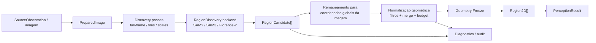
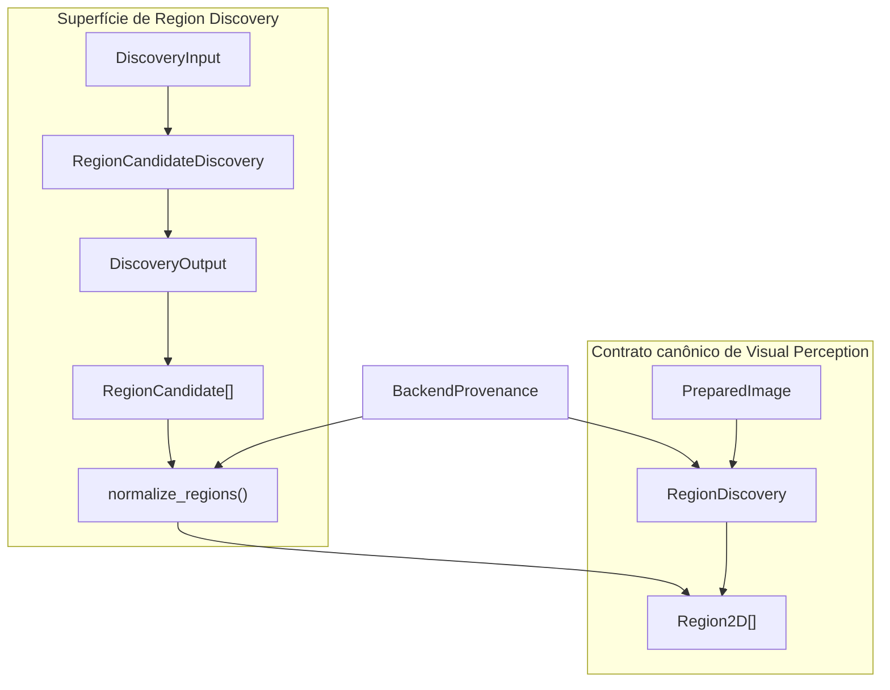
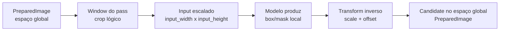
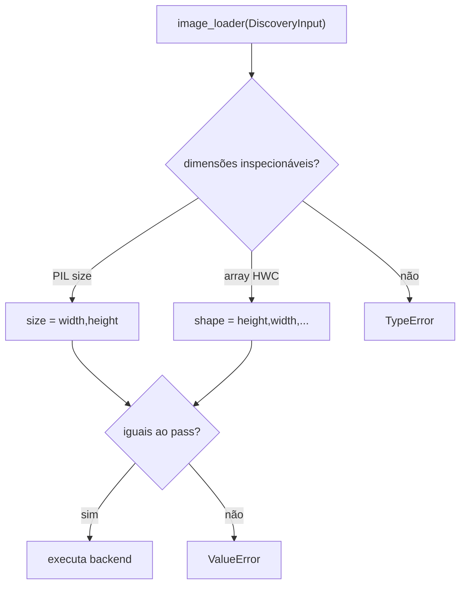
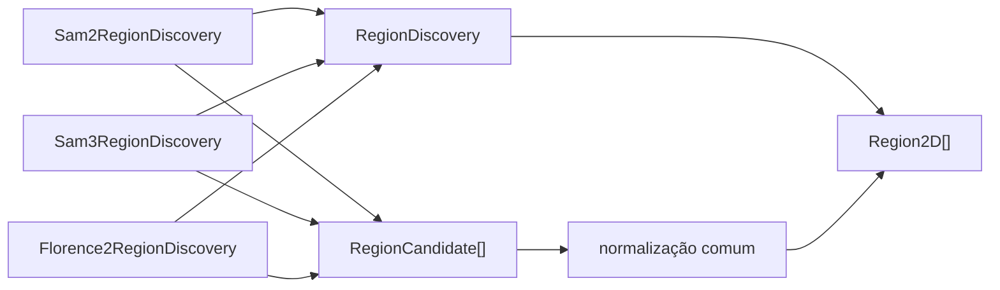
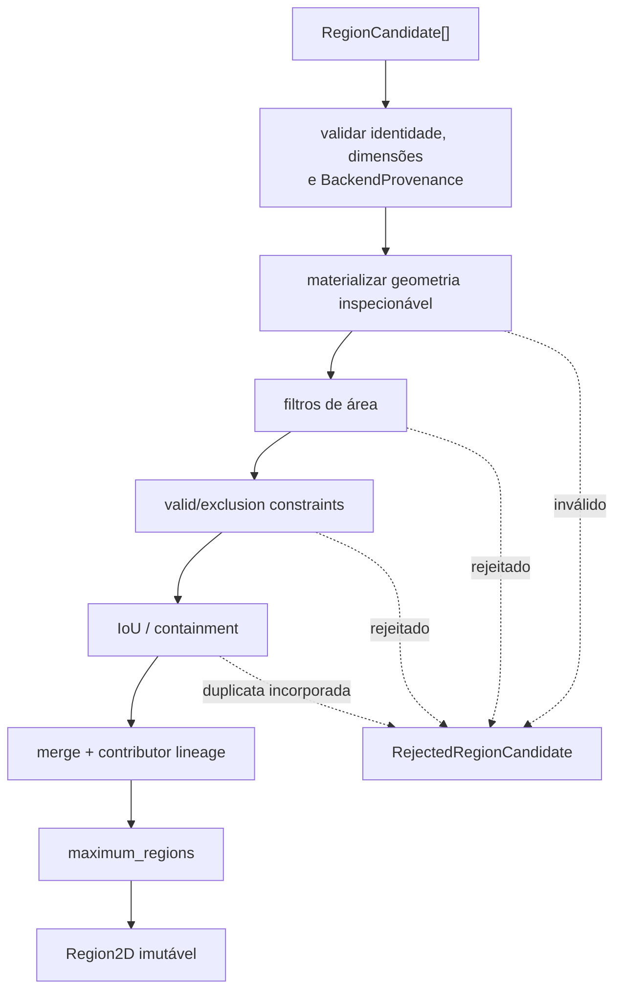
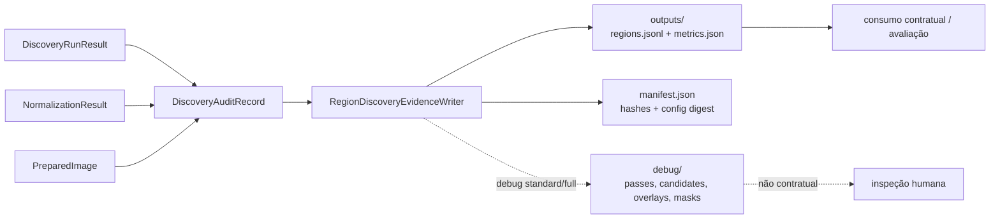
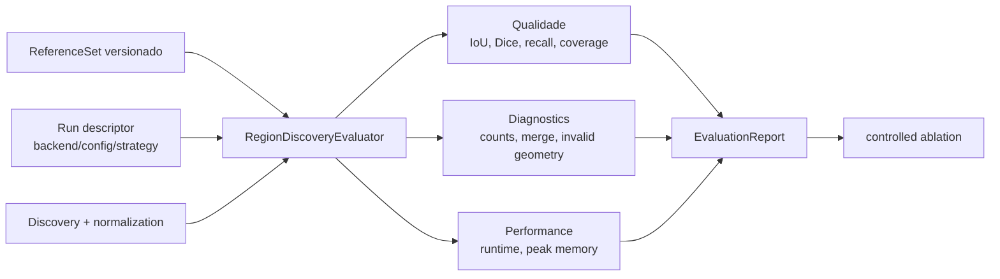

# Region Discovery

Region Discovery propõe geometria 2D para uma execução de Visual Perception. A capability
preserva evidência geométrica e provenance, sem decidir identidade persistente, label final ou
suporte 3D.

## Visão geral



O port consumido pelo Visual Perception Core é `RegionDiscovery.discover(PreparedImage) -> Sequence[Region2D]`. Passes, candidatos, rejeições, diagnostics e avaliação existem para tornar a produção dessas regiões verificável sem transformar uma proposta de frame em verdade persistente do mapa.

## Contratos canônicos

`RegionCandidate` representa uma proposta antes de validação, merge e normalização. A proposta
carrega identidade da observação física, run, resultado, pass e proposta nativa. Sua geometria pode
ser uma bounding box ou uma máscara `InlineMask` materializada. Uma `mask_reference` só é aceita
junto da máscara materializada que a normalização realmente inspeciona; uma referência opaca não é
publicada como geometria consumível.

`Region2D` é o contrato único definido pelo Visual Perception Core e representa geometria aceita e
congelada. O `region_id` é local ao `PerceptionResult`, que fornece os escopos de run e observação;
portanto, dois resultados podem usar o mesmo `region_id` sem sugerir que representam o mesmo objeto
físico. Contributor IDs e provenance de geometry freeze estendem esse contrato canônico. A
identidade não pode ser usada como entity ID do mapa.

`RejectedRegionCandidate` registra uma rejeição com motivo legível por máquina, detalhe e pass de
origem. Rejeições e propostas incorporadas por merge permanecem disponíveis para auditoria.

## Fronteiras de contrato



`PreparedImage`, `Region2D` e `RegionDiscovery` possuem uma única definição canônica em Visual Perception Core. `DiscoveryInput`, `DiscoveryOutput`, `RegionCandidate`, `RejectedRegionCandidate` e os tipos de passes são contratos adapter-facing e de auditoria exportados pelo módulo, mas não substituem `Region2D` como evidência consumida pelas capabilities downstream.

Uma `RegionCandidate` é evidência de proposta antes da consolidação. Ela preserva run/result, observação física, dimensões da imagem, provenance do proposal, score nativo e geometria materializada. Uma `Region2D` é a geometria canônica após validação, merge e freeze; ainda é evidência local ao `PerceptionResult`, nunca uma entidade 3D persistente.

## Espaço de coordenadas

A convenção inicial é `pixel_xy_top_left`:

- origem no canto superior esquerdo;
- `x` cresce para a direita e `y` cresce para baixo;
- bounding boxes são intervalos semiabertos `[x_min, x_max)` e `[y_min, y_max)`;
- largura e altura descrevem o espaço da imagem preparada;
- máscaras inline usam ordem row-major e exatamente `width * height` valores.

Geometria fora dos limites da imagem é inválida. Remapeamentos de crop, resize ou tile devem
ocorrer antes da criação da região canônica e permanecer registrados em provenance.

## Scores

`BackendScore` exige nome, valor e semântica. Um `predicted_iou` do SAM não é tratado como
probabilidade nem comparado diretamente com scores de Florence-2. Ausência de score permanece
`None`; ela não é convertida em zero ou um.

## Normalização de backends

Adapters convertem apenas dados serializáveis para `RegionCandidate`:

```text
SAM2/SAM3 mask + box + native scores -> RegionCandidate
Florence-2 box ou mask + parser data  -> RegionCandidate
fake deterministic proposal          -> RegionCandidate
```

Tensors, objetos de SDK e handles de modelo ficam dentro do adapter. Prompt ou texto usado para
descobrir uma região pode aparecer na provenance, mas não cria automaticamente um
`SemanticClaim`.

## Organização da implementação

```text
visual_perception/
├── models.py                 # PreparedImage, Region2D, BackendProvenance
├── ports.py                  # RegionDiscovery
├── image_preparation.py      # plano auditável de preparação
├── region_models.py          # RegionCandidate e geometria de proposal
├── discovery.py              # passes, tiling, remapeamento e adapter boundary
├── normalization.py          # filtros, merge e geometry freeze
├── diagnostics.py            # outputs e debug do estágio
└── backends/
    ├── sam2.py
    ├── sam3.py
    └── florence2.py
```

A separação evita que SDKs de modelos definam os contratos do domínio. `models.py` e `ports.py` contêm a fronteira canônica; os adapters concretos isolam APIs de modelos; `discovery.py` e `normalization.py` permanecem backend-neutral.

## Preparação de imagem e constraints

`prepare_image` recebe uma `SourceImage` imutável e uma sequência explícita de operações. Sem
configuração, o resultado referencia o payload original e registra `transformations = []`. Resize,
crop, rectification e normalization recebem a referência do payload materializado pelo adapter de
imagem e produzem um `TransformationRecord` ordenado com dimensões de entrada/saída e parâmetros.
Cada operação também exige `provenance_source`, que identifica a configuração, calibração ou
política que solicitou a transformação e é serializada junto ao registro.

`ValidRegion` restringe os pixels elegíveis e `ExclusionRegion` remove áreas nomeadas. Ambos são
opcionais, precisam corresponder ao espaço de coordenadas final e registram motivo e origem da
configuração. A API não contém defaults para câmera fisheye, veículo, drone, rig ou dataset. Uma
necessidade desse tipo deve ser declarada pelo preset/source config que criou a constraint.

O contrato não pinta pixels excluídos de preto nem altera a observação física. Backends recebem a
imagem preparada e as constraints separadamente, evitando que uma alteração visual silenciosa seja
confundida com evidência do sensor.

## Transformações de coordenadas



A geometria produzida por backend pertence ao espaço efetivamente materializado para o pass. O remapeamento para `PreparedImage` ocorre antes da normalização, e a provenance mantém `discovery_pass_id`, configuração e identidade nativa da proposta.

## Passes e tiling

O baseline executa um único pass `full_frame`. `DiscoveryPassConfig` pode adicionar um ou mais
grids de tiles com tamanho, overlap, escala e budget por pass explícitos. As janelas são geradas em
ordem row-major e o último tile de cada eixo é alinhado ao limite da imagem para garantir cobertura
sem produzir coordenadas fora do espaço preparado.

O port público `RegionDiscovery` recebe `PreparedImage` e devolve `Sequence[Region2D]`, exatamente
como o Visual Perception Core exige. A execução por pass é um detalhe interno exposto somente a
adapters pelo `RegionCandidateDiscovery`: ele recebe `DiscoveryInput` e devolve `RegionCandidate`
mais diagnostics. A orquestração do Core não contém branches para SAM2, SAM3 ou Florence-2.
Propostas locais de tiles são remapeadas para a imagem preparada, recebem ID prefixado pelo pass e
preservam o ID nativo em provenance. Máscaras inline são redimensionadas e expandidas no espaço
global antes da normalização.

`TilingConfig.scale` define as dimensões efetivamente apresentadas ao backend: cada
`DiscoveryPass` registra `input_dimensions` e o transform inverso para o espaço preparado. Boxes e
máscaras retornadas nesse espaço escalado são remapeadas para a janela global. Assim, alterar a
escala altera o input do modelo sem alterar a coordenada canônica da mesma geometria.
Os runtimes oficiais validam o objeto materializado pelo loader antes da inferência: imagens
compatíveis com PIL devem expor `size = (width, height)` e arrays HWC devem expor
`shape = (height, width, ...)`, sempre iguais a `input_dimensions`. Um loader que apenas propaga
metadados do pass sem produzir o crop/resize correspondente falha explicitamente.

`BorderPolicy.KEEP` mantém propostas que tocam bordas internas. A política
`REJECT_INTERNAL_BORDER` registra `tile_border_truncation` sem apagar a proposta dos diagnostics.
Deduplicação entre passes não ocorre aqui; ela pertence à normalização geométrica.

## Validação da imagem materializada

Os runtimes oficiais não confiam apenas nos metadados do pass. Depois que o `image_loader` materializa o crop/resize, `validate_materialized_discovery_image()` verifica as dimensões reais antes da inferência:



Isso torna `TilingConfig.scale` uma transformação verificável: alterar a escala muda o tamanho efetivamente apresentado ao modelo, e o remapeamento inverso retorna a geometria ao mesmo sistema de coordenadas global.

## Backend SAM2

`Sam2RegionDiscovery` implementa o mesmo port usado pelos demais backends. O adapter recebe
`Sam2Config` validada e um runtime injetado que isola carregamento de checkpoint, Torch e objetos
do SDK. Apenas boxes, máscaras booleanas e scores escalares atravessam essa fronteira interna.

A configuração efetiva inclui checkpoint, versão, device, precision, thresholds e parâmetros do
automatic mask generator. Seu digest determinístico acompanha cada proposta. `predicted_iou` e
`stability_score` mantêm seus nomes e significados SAM2; nenhum deles vira confidence universal.
O runtime recebe o `DiscoveryInput` completo, incluindo constraints explícitas, pass e tile. Erros
de shape ou runtime interrompem a execução, sem fallback silencioso para outro backend.

`Sam2AutomaticMaskRuntime` encapsula a API oficial `SAM2AutomaticMaskGenerator.generate`. Um
loader injetado materializa exatamente a janela do pass como imagem HWC `uint8`; o runtime converte
a box nativa XYWH para XYXY, destaca a máscara binária e preserva `predicted_iou`,
`stability_score` e área. `from_model` constrói o generator com os thresholds e settings que
participam do digest, sem tornar SAM2 dependência obrigatória do pacote principal.

## Backend SAM3

`Sam3RegionDiscovery` é o adapter planejado para o baseline da Solution 1 e continua substituível
pelo mesmo port. `Sam3Config` torna checkpoint, versão, device, precision, thresholds e estratégia
parte do digest da execução. Estratégias `automatic`, `text_prompt`, `point_grid`, `tracker` e `pcs`
são distintas; `text_prompt` exige prompt, enquanto `automatic` rejeita prompt oculto.

O runtime retorna propostas escalares, warnings e métricas próprias. O adapter preserva query ID,
prompt aplicável e nome/semântica do score em provenance. Texto usado para obter a máscara não é
publicado como `SemanticClaim`. Falha do runtime ou estratégia configurada é propagada; não existe
fallback silencioso para outra estratégia ou backend.

`Sam3ImageProcessorRuntime` integra o caminho oficial de imagem para `text_prompt`:
`set_image`, `set_confidence_threshold` e `set_text_prompt`. Boxes, scores e probabilidades de
máscara são destacados dos tensors antes de sair do runtime. As demais estratégias continuam
distinguíveis no contrato, mas esse runtime as rejeita explicitamente até existir uma integração
real específica; selecionar uma delas não aciona comportamento alternativo.

## Backend Florence-2

`Florence2RegionDiscovery` atende somente ao port de descoberta de regiões. Sua configuração
registra checkpoint, versão, device, precision, task, prompt opcional, threshold e generation
settings. O task é obrigatório porque diferentes modos de Florence-2 têm semânticas de proposta
distintas.

O parser interno pode produzir box, máscara opcional, score opcional, texto parseado e diagnostics.
O adapter transforma apenas a geometria em `RegionCandidate`. Task, prompt e texto parseado ficam
como provenance/metadata de descoberta; não geram `SemanticClaim`. Um futuro adapter Florence-2
para interpretação semântica deve implementar outro port, mesmo que compartilhe o runtime carregado.

`TransformersFlorence2Runtime` implementa o fluxo oficial do Transformers: prepara o task prompt,
move inputs para o device configurado, executa `generate`, mantém os tokens especiais no decode e
chama `post_process_generation` com o tamanho do pass. Tasks aceitas precisam produzir regiões.
Boxes são destacadas diretamente e polígonos são rasterizados por centro de pixel; labels do parser
permanecem metadata de descoberta.

## Relação entre backends



Os três adapters compartilham a mesma política geométrica depois da conversão para `RegionCandidate`. Scores permanecem backend-native e não são comparados como uma confiança universal. Texto de prompt ou labels do parser podem permanecer como metadata/provenance de descoberta, mas não são promovidos automaticamente a `SemanticClaim`.

## Normalização, merge e geometry freeze

`normalize_regions` aplica a mesma política a propostas de SAM2, SAM3, Florence-2 e fakes. A ordem
é: validar geometria, aplicar limites de área, verificar valid/exclusion masks declaradas, detectar
duplicatas por IoU ou containment, aplicar budget e criar `Region2D` imutável. Nenhuma regra usa
label semântico ou compara scores de backends diferentes.



Rejeições permanecem evidência auditável. Um merge não apaga a proposta incorporada: a região final mantém contributor IDs e `discovery_provenance`, enquanto a decisão de merge e a rejeição correspondente explicam o que ocorreu.

A chamada recebe o `BackendProvenance` exato reportado pelo adapter e valida sua consistência com
as propostas. O mesmo value object acompanha cada `Region2D`; provider, model, versão e fingerprint
não são reconstruídos a partir da provenance reduzida da proposta.

A ordem canônica é pelo `candidate_id`, tornando IDs `region-0001`, `region-0002` e decisões de
budget reproduzíveis. No merge, a primeira geometria canônica permanece como representante e todas
as propostas contribuintes e respectivas provenances são preservadas. A proposta incorporada gera
tanto `MergeDecision` quanto uma rejeição `merged_duplicate`, portanto não desaparece dos
diagnostics.

Os thresholds e budgets vivem em `NormalizationConfig`; seu digest acompanha o resultado. Máscaras
inline são avaliadas pixel a pixel. `RegionCandidate` não aceita uma máscara persistida opaca como
substituta da geometria materializada, mesmo quando existe bounding box, evitando ignorar
silenciosamente a máscara. Constraints só são aplicadas quando a `PreparedImage` as declara
explicitamente.

## Evidência persistida e diagnostics

`RegionDiscoveryEvidenceWriter` finaliza atomicamente `20-region-discovery/` e recusa sobrescrever
um estágio existente. `outputs/regions.jsonl`, `outputs/metrics.json` e `manifest.json` são
contratuais. O manifest registra schema, backend, digest da política, nível de debug e hash de cada
payload. Consumidores downstream não leem `debug/`.

Os níveis são:

- `none`: somente regiões, métricas e manifest;
- `standard`: prepared-image reference, configuração efetiva, passes/timings, candidates,
  accepted/rejected, merge decisions e overlays SVG;
- `full`: conteúdo standard mais `region.json` e máscara PBM por região inline.

Os overlays usam IDs canônicos e coordenadas da imagem preparada. O formato vetorial mantém a
inspeção disponível sem introduzir uma biblioteca de imagem no domínio. Métricas preservam counts,
motivos de rejeição, distribuição de área, merge ratio, duração por pass, warnings e memória quando
o runtime a reporta.

## Persistência e diagnostics



O writer finaliza atomicamente o diretório solicitado e recusa sobrescrita. `outputs/` e `manifest.json` são contratuais para esse artifact de estágio; `debug/` é auxiliar e nunca deve ser requisito de uma capability downstream. A documentação global de artifacts explica como esse output se relaciona ao `PerceptionRunArtifact`.

## Avaliação objetiva

A avaliação específica de Region Discovery está em [`contextmap/evaluation/docs/region-discovery.md`](../../evaluation/docs/region-discovery.md). O mesmo reference set e schema medem SAM2, SAM3, Florence-2 ou fakes sem usar labels semânticos downstream.



Comparações de ablação exigem o mesmo reference set e exatamente uma variável declarada diferente. Backend, checkpoint, versão, strategy, thresholds, pipeline graph, `config_digest` e `execution_kind` são verificados para impedir atribuição de delta a uma variável errada. O baseline versionado atual é `ci_contract`, não evidência de qualidade do modelo SAM3 real.

## Falhas explícitas e invariantes

Region Discovery falha cedo quando um contrato que afeta a interpretação geométrica é violado. Entre os invariantes cobertos pelo código e testes estão:

- dimensões da imagem preparada e dos candidates positivas e consistentes;
- IDs de candidate únicos antes da normalização;
- candidate e `BackendProvenance` pertencem ao mesmo backend/configuração;
- `mask_reference` não substitui uma máscara materializada quando a geometria precisa ser inspecionada;
- materialização do pass possui as dimensões realmente declaradas;
- geometria não sai dos bounds da imagem;
- estratégias de runtime não implementadas falham sem fallback silencioso;
- escrita de evidence artifact é atômica e não sobrescreve resultado finalizado;
- Geometry Freeze produz `Region2D` imutável.

## Como adicionar outro backend de Region Discovery

Um novo backend deve resolver um variation point real sem alterar o contrato downstream:

1. definir configuração efetiva e fingerprint reproduzível;
2. isolar o SDK/runtime dentro de `backends/`;
3. implementar `backend_provenance()` e `discover(PreparedImage)` do port canônico;
4. converter output nativo para `RegionCandidate` no boundary adapter-facing;
5. preservar scores com nome e semântica próprios;
6. reutilizar passes, remapeamento e `normalize_regions()` em vez de criar política geométrica paralela;
7. adicionar testes determinísticos sem download/GPU e testes do runtime oficial quando aplicável;
8. avaliar no mesmo reference set e schema antes de qualquer decisão de baseline.

Adicionar um backend não o torna automaticamente parte de um `PipelinePreset`; seleção e composição continuam sendo responsabilidade explícita do pipeline/runtime.

## Testes que sustentam o contrato

A cobertura principal está em:

- `tests/visual_perception/test_region_contracts.py`;
- `tests/visual_perception/test_image_preparation.py`;
- `tests/visual_perception/test_discovery_passes.py`;
- `tests/visual_perception/test_region_normalization.py`;
- `tests/visual_perception/test_discovery_diagnostics.py`;
- `tests/visual_perception/backends/test_sam2.py`;
- `tests/visual_perception/backends/test_sam3.py`;
- `tests/visual_perception/backends/test_florence2.py`;
- `tests/evaluation/test_region_discovery_evaluation.py`.

Esses testes verificam contratos, coordenadas, scale, materialização, adapters, provenance, normalização, persistência e comparação objetiva. O gate do repositório continua sendo `make check`, `make build` e os checks automatizados da PR.

## Integração com a documentação global

- [`docs/PIPELINE.md`](../../../../docs/PIPELINE.md) posiciona Region Discovery dentro do branch de Visual Perception;
- [`docs/CONTRACTS.md`](../../../../docs/CONTRACTS.md) define o significado global de `Region2D`;
- [`docs/architecture.md`](../../../../docs/architecture.md) define ownership, ports/adapters e direção de dependências;
- [`docs/ARTIFACTS.md`](../../../../docs/ARTIFACTS.md) define a relação entre outputs de estágio, debug e artifacts imutáveis;
- [`Visual Perception README`](README.md) é o índice do módulo.

## Geometry freeze

Depois da normalização, `Region2D` é um value object imutável. Feature extraction, semantic
interpretation, scoring e audit podem referenciar a região, mas não podem alterar seu ID, máscara
ou bounding box. Uma geometria diferente exige outro resultado de percepção ou outra evidência
derivada com identidade própria.
