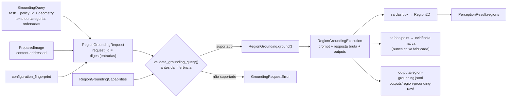

# Region Grounding (grounding condicionado por prompt)

Este documento descreve `src/contextmap/visual_perception/grounding.py`, o port
`RegionGrounding` em `ports.py` e a persistência do grounding no
`PerceptionRunArtifact` (issue #566).

## Responsabilidade

Region Discovery (`RegionDiscovery.discover(image)`) propõe regiões **só a partir da
imagem**. Grounding responde a uma **pergunta explícita em linguagem** sobre uma imagem
preparada: "onde estão as cadeiras e as mesas?", "onde está a cadeira vermelha?",
"aponte a maçaneta". A pergunta é uma entrada científica da inferência, não estado do
adapter:

- ela viaja dentro de cada `RegionGroundingRequest`;
- ela faz parte da identidade do request e, portanto, da evidência que ele produz;
- ela é validada contra as capacidades declaradas do backend **antes** de qualquer modelo
  ser carregado ou executado;
- ela é persistida, verbatim, junto com cada execução.

Colocar a pergunta na configuração do backend (como hoje fazem o `prompt` do
`Sam3Config` com `strategy=text_prompt` e o `prompt`/`task` do `Florence2Config`) esconderia
uma entrada cientificamente relevante dentro do adapter: o mesmo backend com duas perguntas
diferentes seria "outra configuração", e cache, provenance e ablação controlada ficariam
ambíguos. Esses adapters de discovery **não mudam** nesta issue; o contrato abaixo é capaz de
representar a semântica deles (texto livre → `PHRASE_GROUNDING`; conjunto de categorias →
`CATEGORY_DETECTION`; caixas ou máscaras → geometria), então migrá-los para
`RegionGrounding` depois é uma mudança de adapter, não de contrato.



## Contratos

### `GroundingQuery`

| Campo | Significado |
|---|---|
| `task` | `CATEGORY_DETECTION` (todas as instâncias de cada categoria de um conjunto ordenado) ou `PHRASE_GROUNDING` (aquilo a que uma frase livre se refere) |
| `policy_id` | identidade **versionada** da regra pela qual o backend transforma a query em entrada do modelo (ex.: `locateanything.category-detection/1`); mudar o template exige outra identidade |
| `geometry` | família de geometria pedida: `BOX` ou `POINT` |
| `text` | frase livre, obrigatória só em `PHRASE_GROUNDING`; preservada exatamente (espaços, unicode) |
| `categories` | conjunto ordenado, obrigatório só em `CATEGORY_DETECTION`; a ordem faz parte da query |

Categorias vazias ou repetidas, texto em branco e combinações que não correspondem à task
são rejeitados na construção.

### `GroundingQueryPolicy` e `RegionGroundingCapabilities`

Um backend declara as políticas que implementa, cada uma com sua task e sua geometria.
`validate_grounding_query(query, capabilities)` exige a política exata, a mesma task e a
mesma geometria; caso contrário levanta `GroundingRequestError` — antes de qualquer
inferência, sem trocar de política nem de geometria. Um backend que não produz pontos
recusa um pedido de ponto; nada é convertido.

### `RegionGroundingRequest`

`perception_result_id` (dono da evidência), `image: PreparedImage`, `query` e
`configuration_fingerprint` do backend ao qual o request é emitido. A imagem precisa ter
`payload_artifact` (o SHA-256 dos pixels entra na identidade) e não pode carregar
`valid_region`/`exclusion_regions`: grounding ainda não aplica essas restrições, e ignorá-las
em silêncio seria pior do que recusar.

### `RegionGroundingExecution`

Mantém separados: o request atendido, a `BackendProvenance` (capability
`region_grounding`, fingerprint igual ao do request), o `rendered_prompt` exato enviado ao
modelo, a `raw_response` verbatim, os `outputs` aceitos em ordem de resposta, os
`rejected_outputs` (trechos explicitamente recusados, com `GroundingRejectionReason`), os
`no_match_labels` (termos para os quais o backend declarou explicitamente "nenhuma
instância"), os `GroundingDiagnostics`, a configuração efetiva e a `runtime_identity`
(versões de bibliotecas/dispositivo reportadas pelo backend).

- `GroundingOutput` carrega **exatamente uma** geometria em pixels da imagem preparada
  (`PIXEL_XY_TOP_LEFT`): `box` (`BoundingBox2D`) ou `point` (`GroundingPoint`). O `label` é o
  termo da query que o backend associou à saída — evidência do que o backend respondeu, não
  uma `SemanticClaim`. `native_diagnostics` guarda diagnósticos nativos por saída.
- `regions` materializa **somente** as saídas box como `Region2D` canônico. Uma saída point
  nunca vira caixa: ela aparece em `unsupported_outputs` e fica apenas no stream de
  grounding até existir um contrato canônico de ponto (ou um refinador que a consuma, #568).
- `no_match` é verdadeiro quando o backend não devolveu geometria alguma, nem válida nem
  rejeitada. Uma resposta cujas saídas foram todas rejeitadas **não** é no-match.
- Não existe campo `confidence`: nenhum score de decoder ou token é promovido a confiança.
  Diagnósticos nativos (`GroundingDiagnostics.native`, `GroundingOutput.native_diagnostics`)
  mantêm nome e valor nativos, sobrevivem à serialização sem alteração e um valor ausente
  continua ausente — nunca vira 0 ou 1. Calibração, se um dia for aceita, é outro contrato
  com proveniência própria (#573).

## Identidade

```text
request_id = "grounding-" + sha256(observação, sha256 da imagem, largura, altura,
                                   query completa, configuration_fingerprint)
region_id  = grounding_region_id_for(result_id, request_id, output_index)
           = "<result_id>--<request_id>-region-<NNNN>"
```

- **Mesma imagem + mesma query + mesma configuração ⇒ mesmo `request_id`**, em qualquer
  run: é uma chave de conteúdo das entradas da inferência. `perception_result_id` fica de
  fora de propósito.
- **Evidência continua local ao resultado**: o `region_id` inclui o `result_id`, então a
  mesma observação reprocessada em outro run recebe regiões distintas.
- **Mudar só a query muda só o que depende dela**: o `request_id` e as regiões daquele
  request mudam; as regiões de discovery (`region_id_for`) e as features não dependem da
  query. Ordem de categorias, política, geometria, conteúdo da imagem e fingerprint também
  entram na identidade.

## Persistência no `PerceptionRunArtifact`

Grounding é evidência do mesmo run de percepção, então é persistido **no mesmo artifact**,
sem novo estágio e sem mudar os consumidores downstream:

```text
outputs/
├── results.jsonl                  # Region2D das saídas box, ao lado das regiões de discovery
├── region-grounding.jsonl         # uma execução por linha: request (com a query), provenance,
│                                  # prompt renderizado, outputs, rejeições, diagnostics,
│                                  # configuração efetiva, runtime_identity, sha256 da resposta
└── region-grounding-raw/
    └── <request_id>.txt           # resposta bruta verbatim, separada do parsing
```

- `with_grounded_regions(result, executions)` acrescenta as regiões box ao resultado dono
  (recusando execução de outro resultado/observação), sem mutar o original.
- `PerceptionRunWriter.add_region_grounding(execution)` recusa um `request_id` repetido no
  run; `finalize()` exige que cada execução resolva para exatamente um resultado e que todas
  as suas regiões estejam materializadas nele.
- `PerceptionRunReader.iter_region_groundings()`/`list_region_groundings()` relêem a resposta
  bruta e verificam o SHA-256; qualquer divergência vira `RunArtifactError`. Um run sem
  grounding não tem o stream, e a leitura devolve vazio.
- O stream é aditivo: `schema_version` continua `0.5.0`, e artifacts anteriores continuam
  legíveis.

## Hooks de medição

| Métrica (issue #566) | Onde medir |
|---|---|
| falhas de validação de request | `GroundingRequestError` (levantada antes da inferência) |
| número de saídas | `len(execution.outputs)` |
| latência do backend | `execution.diagnostics.latency_ms` |
| saídas não suportadas | `len(execution.unsupported_outputs)` (pontos, não representáveis como `Region2D`) |
| falhas de parsing nativo | `len(execution.rejected_outputs)` e seus `reason` |
| identidade por query | `execution.request_id` e `grounding_region_id_for()` |

## O que este contrato não faz

- não cria entidades persistentes nem claims semânticas a partir do `label`;
- não refina caixas em máscaras (#568);
- não calibra scores (#573);
- não escolhe o backend default de Region Discovery; grounding e discovery são capacidades
  distintas e continuam distinguíveis pela `BackendProvenance.capability` e pelo namespace
  do `region_id`.

O primeiro adapter é o LocateAnything, descrito em [`locateanything.md`](locateanything.md).
