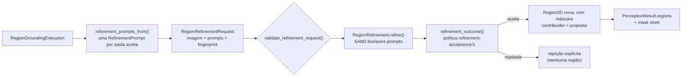

# Region Refinement (grounding → máscara)

Este documento descreve `src/contextmap/visual_perception/refinement.py`, o port
`RegionRefinement` em `ports.py`, o refinador SAM2 em `backends/sam2.py` e a persistência
do refinamento no `PerceptionRunArtifact` (issue #568). O contrato de grounding está em
[`region-grounding.md`](region-grounding.md).

## Por que um estágio separado

O LocateAnything devolve caixas ou pontos. Projetar em 3D toda amostra de profundidade
dentro de uma caixa incluiria o fundo e enfraqueceria a associação 2D→3D. Refinar é uma
cadeia de evidência de dois passos:

```text
proposta de grounding -> prompt de segmentação -> Region2D refinada com máscara
```

Juntar os dois num único adapter esconderia a proveniência e impediria avaliar grounding e
refinamento de forma independente. Aqui, cada passo tem seu port, seu backend, sua
configuração, sua identidade e seu stream no artifact.



## Contratos

- `RefinementPrompt`: a proposta usada **só** como prompt. Guarda `proposal_id` (o
  `RegionId` da caixa de grounding, ou `grounding_point_id_for()` de um ponto), o
  `grounding_request_id`, o `output_index`, a `BackendProvenance` do grounding e exatamente
  uma geometria (caixa ou ponto, em pixels da imagem preparada).
- `refinement_prompts_from(execution)`: uma prompt por saída aceita do grounding, na ordem
  da resposta; spans rejeitados não têm geometria e não viram prompt.
- `RegionRefinementCapabilities` / `validate_refinement_request()`: geometria de prompt não
  aceita pelo refinador é `RefinementRequestError` antes da inferência.
- `RegionRefinementRequest`: resultado dono, imagem preparada content-addressed e sem
  restrições (mesma regra do grounding, `validate_grounding_image`), prompts únicos dentro
  da imagem e o fingerprint do refinador. `request_id = "refinement-" + sha256(...)`.
- `RefinementOutcome`: **ou** uma região refinada **ou** uma rejeição com motivo e detalhe,
  mais `native_scores` (scores nativos do refinador, com semântica própria) e diagnósticos
  de aceitação.
- `RegionRefinementExecution`: uma outcome por prompt, na ordem das prompts; `regions` e
  `rejected` são derivados. `with_refined_regions(result, executions)` acrescenta as regiões
  aceitas ao resultado dono sem substituir nada.

## Política de aceitação (`refinement-acceptance/1`)

É da capability, não do backend, então vale para qualquer refinador:

| Situação | Resultado |
|---|---|
| máscara sem pixel de primeiro plano | rejeição `EMPTY_MASK` |
| caixa: nenhum centro de pixel da máscara dentro da caixa | rejeição `PROMPT_NOT_COVERED` |
| ponto: o pixel que contém o ponto não é primeiro plano | rejeição `PROMPT_NOT_COVERED` |
| máscara em outro espaço de pixels | erro (`ValueError`): quebra de contrato do refinador, não resposta rejeitável |
| caso contrário | `Region2D` nova, com a máscara |

Pixels seguem `PIXEL_XY_TOP_LEFT`: o pixel `(x, y)` cobre `[x, x + 1) × [y, y + 1)`. Um ponto
na borda direita/inferior (coordenada normalizada 1000 → `x = largura`) pertence ao último
pixel, de forma determinística. A máscara **não** é recortada pela caixa: pixels fora dela
são mantidos e contados (`mask_px_outside_prompt_box`), porque recortar seria outra política
científica.

Diagnósticos de aceitação: `mask_area_px`; para caixa, `mask_px_inside_prompt_box` e
`mask_px_outside_prompt_box`; para ponto, `prompt_point_covered`.

## Região refinada

- `region_id = refined_region_id_for(result_id, proposal_id, fingerprint)` =
  `"<result_id>--refinement-<sha256(proposal, fingerprint)>"`: nunca colide com a proposta,
  e a mesma proposta refinada com outra configuração tem outra identidade.
- `contributor_candidate_ids = (proposal_id,)`; `provenance` = refinador
  (`capability="region_refinement"`); `bounding_box` = caixa justa da máscara;
  `area_pixels` = área da máscara; `mask` inline até ser persistida.
- A caixa de grounding original continua no resultado, intacta e sem máscara. A Sensor
  Association só associa regiões com máscara (`SkipReason.NO_INLINE_MASK` para as outras),
  então a caixa não contribui pixels de fundo, e a região refinada é consumida pelo caminho
  existente de mask membership, via `PerceptionRunReader.mask_store()`
  (`tests/sensor_association/test_refined_region_membership.py`).
- Uma rejeição não produz região: a proposta nunca é substituída em silêncio, e também não
  existe fallback para a caixa.

## SAM2 como refinador

`Sam2PromptRefinement` (`backends/sam2.py`) implementa o port com prompts de caixa e ponto.

- `Sam2RefinementConfig`: `checkpoint`, `model_version`, `device`, `precision`
  (`float16`/`bfloat16` via `torch.autocast`), e os parâmetros do `SAM2ImagePredictor`
  oficial `mask_threshold`, `max_hole_area`, `max_sprinkle_area`. O `digest` inclui a tarefa
  (`prompt_refinement`), então nunca coincide com o digest de discovery.
- Seam `Sam2PromptRuntime.predict_prompts(image=bytes, width, height, prompts, config)`: o
  adapter lê a imagem preparada, confere o SHA-256 e entrega os bytes; um runtime fornecido
  por provider não precisa conhecer o diretório das imagens do run.
- `Sam2ImagePredictorRuntime.from_model(model=..., config=...)` constrói o
  `SAM2ImagePredictor` oficial a partir do **mesmo** modelo SAM2 que o provider já carregou
  (não existe um segundo loader). Codifica a imagem uma vez (`set_image`) e chama
  `predict(box=[x0, y0, x1, y1])` ou `predict(point_coords=[[x, y]], point_labels=[1])`, sempre
  com `multimask_output=False`: escolher entre várias máscaras seria outra política.
- `predicted_iou` fica em `native_scores` com a semântica "auto-estimativa do SAM2, não
  probabilidade calibrada"; nunca vira confiança.

## Persistência

```text
outputs/
├── results.jsonl              # caixas de grounding intactas + regiões refinadas (mask_reference)
├── masks/                     # pixels das máscaras refinadas (mask store compacto, #378)
└── region-refinement.jsonl    # uma execução por linha: request (prompts com linhagem de
                               # grounding), provenance, política de aceitação, outcomes
                               # (região referenciada ou rejeição), scores nativos, diagnostics
```

- `PerceptionRunWriter.add_region_refinement()` recusa request repetido e descarta a máscara
  inline da cópia enfileirada (os pixels chegam ao disco pelo resultado). No `finalize()`,
  cada prompt precisa ser exatamente a saída de grounding que nomeia, de uma execução de
  grounding deste run, e cada região refinada precisa estar no resultado com a máscara
  persistida.
- O stream nunca inlina pixels: a região vai como no `results.jsonl`, com `mask_reference`.
- `PerceptionRunReader.iter_region_refinements()`/`list_region_refinements()` devolvem as
  regiões iguais às de `iter_results()`. Sem refinamento, não há stream. O stream é aditivo;
  `schema_version` continua `0.5.0`.

## Runtime e ablação

`visual_perception.region_refinement` é um ponto de variação **opcional** do estágio
`visual_perception`, com o backend `sam2` (runtime `Sam2PromptRuntime` fornecido por
provider, pedido uma vez na composição). Selecioná-lo sem `region_grounding` é erro de
configuração explícito. Grounding e refinamento variam de forma independente: mudar a
configuração do SAM2 não muda o fingerprint nem as identidades do grounding, e desligar o
refinamento mantém o grounding como estava. O executor faz **um** request de refinamento por
imagem com todas as propostas dela (a imagem é codificada uma vez); uma imagem sem proposta
não gera request.

## Limites

- Nenhuma execução real: IoU de máscara contra anotação, precisão/recall do suporte 3D,
  contaminação de fundo versus caixa, fragmentação, taxa de máscara vazia, latência e pico
  de memória exigem SAM2 real e o slice anotado (#528/#576).
- O refinamento não produz rótulo semântico e não cria identidade persistente.
- Propostas de Region Discovery não são refinadas; só propostas de grounding.
