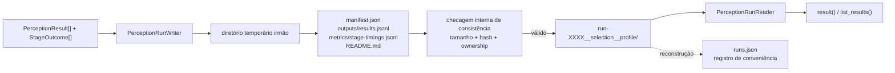

# Artefato de run de percepção

Este documento descreve `src/contextmap/visual_perception/run_artifact.py` e `serialization.py`. Para as convenções globais de artifact/lineage/immutability, ver [`docs/ARTIFACTS.md`](../../../../docs/ARTIFACTS.md).

## Layout no workspace local

```text
workspace/
└── runs/
    └── visual-perception/
        └── <sequence-name>/
            ├── runs.json                                              # registro reconstruível, não fonte de verdade
            ├── run-0001__frames-0120-0260__sam3-dinov2-gemini/
            │   ├── README.md                                          # gerado, legível por humano
            │   ├── manifest.json                                      # ponto autoritativo
            │   ├── outputs/
            │   │   └── results.jsonl                                   # um PerceptionResult por linha
            │   └── metrics/
            │       └── stage-timings.jsonl                             # um StageOutcome por linha
            └── run-0002__frames-0120-0260__sam3-dinov2-qwen/
                └── ...
```

## Fluxo de persistência e leitura



`manifest.json` e os arquivos inventariados no próprio run formam a fonte de verdade. `runs.json` serve apenas para descoberta e pode ser reconstruído; ele não participa da leitura de um run isolado.

Nomeação por índice monotônico (`run-0001`, `run-0002`, ...), nunca timestamp — o maior índice é o run mais recente nesse escopo sequência+capability. `allocate_run_index()` calcula o próximo índice escaneando os diretórios de run **íntegros** (nunca `runs.json`): além de carregar o manifest, confere presença, tamanho e hash dos arquivos inventariados. Um diretório interrompido ou adulterado não participa da alocação nem de `rebuild_run_registry()`.

## Decisões desta issue (v0)

- **`outputs/results.jsonl`, não `outputs/results.parquet`.** Mesma decisão e mesmo motivo da issue #39 de Ingestion: nenhuma dependência de runtime nova (`pyarrow`/`pandas`) se justifica ainda; JSON Lines é inspecionável com ferramentas de texto padrão. Revisitar se o volume de resultados tornar leitura linha-a-linha um gargalo real.
- **Um único `outputs/results.jsonl`, não arquivos separados `regions.jsonl`/`semantic-claims.jsonl`/`feature-index.jsonl`.** Cada `PerceptionResult` já carrega suas próprias `regions`/`features`/`claims` aninhadas (issue #48) — duplicar essa informação em índices paralelos seria redundância sem um caso de uso real ainda (YAGNI). `PerceptionRunReader.result(source_observation_id)` já permite lookup direto por observação sem escanear o diretório inteiro, satisfazendo o requisito real da issue.
- **`debug/` por frame não é criado por este writer.** A estrutura ordenada `debug/frames/<frame>/00-input/ ... 90-output/` sugerida pela issue depende de conteúdo que ainda não existe neste milestone (overlays de região, crops, respostas de modelo — dependem de Region Discovery/Feature Extraction/Semantic Interpretation reais). Criar as pastas vazias antecipando esse conteúdo violaria YAGNI (`docs/development.md`). O writer já registra `StageOutcome` com timing/erro por estágio (`metrics/stage-timings.jsonl`), que é o auditável mínimo desta issue; backends futuros podem estender o writer para popular `debug/` quando tiverem conteúdo real.
- **`config.yaml`, `lineage.json`, `environment.json`, `events.jsonl` não são escritos no v0.** Nenhum destes tem produtor real ainda (configuração efetiva de backend, lineage de artefatos upstream, ambiente de execução, eventos granulares) — `manifest.json` já cobre a metadata mínima autoritativa (run_id, índice, sequência, seleção, capabilities, contagens). Adicionar esses arquivos vazios/parciais agora seria estrutura sem conteúdo real.

## Escrita atômica

Mesmo padrão de `contextmap.ingestion.sequence_artifact`: `PerceptionRunWriter.finalize()` escreve em um diretório temporário irmão, roda uma checagem de consistência interna, e só então renomeia para o path final — um run interrompido nunca aparenta ser válido. Depois de renomear, `runs.json` é reconstruído a partir de todos os diretórios de run válidos (incluindo o recém-criado).

`add_result()` rejeita evidência pertencente a outro `run_id`, a outro `sequence_artifact_id` ou uma segunda evidência para o mesmo `source_observation_id`. Assim, o arquivo final preserva exatamente um resultado por observação e nunca mistura ownership de runs ou sequências.

## Leitura isolada, sem `runs.json`

`PerceptionRunReader(run_dir)` abre um run **apenas com seu próprio diretório** — `manifest.json` + `outputs/results.jsonl` bastam. `runs.json` nunca é necessário para abrir ou entender um run individual; `rebuild_run_registry()` pode reconstruí-lo do zero a qualquer momento a partir dos manifests.

## `serialization.py`

Funções `encode_x`/`decode_x` simétricas para cada tipo de `models.py` (`BackendProvenance`, `BoundingBox2D`, `Region2D`, `VisualFeature`, `SemanticClaim`, `SceneContext`, `PerceptionResult`). Reaproveitadas por `run_artifact.py` para persistir `outputs/results.jsonl`, mas não dependem do layout do artefato — qualquer chamador que precise de uma view JSON de um desses contratos pode usá-las diretamente.

## Reprodutibilidade do pipeline resolvido (issue #55, `schema_version` 0.3.0)

`manifest.json` também persiste `pipeline_preset` (o `PipelinePreset` resolvido — ver [`pipeline.md`](pipeline.md) — codificado por `encode_pipeline_preset()`) e `configuration_digest` (o fingerprint determinístico de `ResolvedPipeline.configuration_digest()`). Isso torna o grafo de estágios e as identidades de backend efetivamente usados por um run inspecionáveis a partir do próprio manifest, sem precisar reabrir `outputs/results.jsonl` e agregar a proveniência de cada evidência individualmente.

O schema `0.3.0` registra também o `feature_scope` de cada estágio de extração no preset embutido. Esta é uma quebra pré-1.0; nenhum leitor para manifests históricos é mantido, seguindo a postura do milestone de não preservar compatibilidade sem consumidor real.
