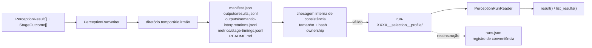

# Artefato de run de percepção

Este documento descreve `src/contextmap/visual_perception/run_artifact.py` e `serialization.py`. Para as convenções globais de artifact/lineage/immutability, ver [`docs/ARTIFACTS.md`](../../../../docs/ARTIFACTS.md).

## Layout no workspace local

```text
workspace/
└── runs/
    └── visual-perception/
        └── <sequence-name>/
            ├── runs.json                                              # registro reconstruível, não fonte de verdade
            ├── run-0001__frames-0120-0260__sam3-dinov2-gemini/
            │   ├── README.md                                          # gerado, legível por humano
            │   ├── manifest.json                                      # ponto autoritativo
            │   ├── outputs/
            │   │   ├── results.jsonl                                   # um PerceptionResult por linha
            │   │   ├── semantic-interpretations.jsonl                   # execução semântica auditável
            │   │   ├── semantic-views/                                  # pixels exatos enviados ao backend
            │   │   │   └── <view-payloads>
            │   │   └── features/                                       # quando payloads são persistidos
            │   │       ├── feature-index.jsonl
            │   │       └── <observation-scope>/*.npy
            │   ├── metrics/
            │   │   ├── stage-timings.jsonl                             # um StageOutcome por linha
            │   │   └── feature-extraction.jsonl                        # quando há diagnóstico de feature
            │   └── debug/
            │       ├── 30-feature-extraction/                           # somente standard/full
            │       └── 40-semantic-interpretation/<request-id>/
            │           ├── request.json / prompt.txt / parsed-response.json
            │           ├── diagnostics.json / semantic-claims.json
            │           └── raw-response.txt                             # somente full
            └── run-0002__frames-0120-0260__sam3-dinov2-qwen/
                └── ...
```

## Fluxo de persistência e leitura



`manifest.json` e os arquivos inventariados no próprio run formam a fonte de verdade. `runs.json` serve apenas para descoberta e pode ser reconstruído; ele não participa da leitura de um run isolado.

Nomeação por índice monotônico (`run-0001`, `run-0002`, ...), nunca timestamp — o maior índice é o run mais recente nesse escopo sequência+capability. `allocate_run_index()` calcula o próximo índice escaneando os diretórios de run **íntegros** (nunca `runs.json`): além de carregar o manifest, confere presença, tamanho e hash dos arquivos inventariados. Um diretório interrompido ou adulterado não participa da alocação nem de `rebuild_run_registry()`.

## Decisões desta issue (v0)

- **`outputs/results.jsonl`, não `outputs/results.parquet`.** Mesma decisão e mesmo motivo da issue #39 de Ingestion: nenhuma dependência de runtime nova (`pyarrow`/`pandas`) se justifica ainda; JSON Lines é inspecionável com ferramentas de texto padrão. Revisitar se o volume de resultados tornar leitura linha-a-linha um gargalo real.
- **`outputs/results.jsonl` continua canônico para metadata; `outputs/features/feature-index.jsonl` indexa apenas payloads numéricos opt-in.** Cada `PerceptionResult` carrega suas `regions`/`features`/`claims`; o feature index não duplica esse contrato, apenas liga a chave `(source_observation_id, feature_id)` ao arquivo `.npy`, hash e metadata necessária para leitura lazy. `finalize()` valida essa referência cruzada antes de publicar o artifact.
- **Views semânticas são outputs contratuais.** Cada `SemanticVisualView` possui SHA-256 obrigatório e referencia um arquivo abaixo de `outputs/semantic-views/`. `add_semantic_view_payload()` valida o hash antes de enfileirar os bytes; `finalize()` exige que toda view de toda execução possua payload inventariado e rejeita payloads sem request correspondente.
- **`debug/` só existe quando há conteúdo real.** Feature Extraction
  materializa previews conforme seu nível. `SemanticDebugLevel.NONE` não grava
  diagnostics humanos, `STANDARD` grava request/prompt/parsing/final outputs e
  `FULL` acrescenta a resposta bruta. `outputs/semantic-interpretations.jsonl`,
  hashes e outputs canônicos permanecem suficientes para leitura quando debug
  está desabilitado. Campos de credencial conhecidos são redigidos antes de
  qualquer serialização.
- **`config.yaml`, `lineage.json`, `environment.json`, `events.jsonl` não são escritos no v0.** Nenhum destes tem produtor real ainda (configuração efetiva de backend, lineage de artefatos upstream, ambiente de execução, eventos granulares) — `manifest.json` já cobre a metadata mínima autoritativa (run_id, índice, sequência, seleção, capabilities, contagens). Adicionar esses arquivos vazios/parciais agora seria estrutura sem conteúdo real.

## Escrita atômica

Mesmo padrão de `contextmap.ingestion.sequence_artifact`: `PerceptionRunWriter.finalize()` escreve em um diretório temporário irmão, roda uma checagem de consistência interna, e só então renomeia para o path final — um run interrompido nunca aparenta ser válido. Depois de renomear, `runs.json` é reconstruído a partir de todos os diretórios de run válidos (incluindo o recém-criado).

`add_result()` rejeita evidência pertencente a outro `run_id`, a outro `sequence_artifact_id` ou uma segunda evidência para o mesmo `source_observation_id`. Assim, o arquivo final preserva exatamente um resultado por observação e nunca mistura ownership de runs ou sequências.

Antes de publicar, o writer também exige que cada `SemanticInterpretationExecution` resolva para exatamente um `PerceptionResult` por `perception_result_id` e observação. Todas as `parsed.claims` precisam estar materializadas nesse resultado e o `parsed.scene_context`, quando presente, precisa coincidir integralmente com o contexto persistido.

Essa reconciliação inclui inputs mesmo quando a execução abstém: `region_id`
deve resolver em `regions`; cada `visual_feature` deve coincidir com uma feature
do resultado e possuir payload no feature store; e `scene_context_reference`
deve resolver pelo `PerceptionResultId` para um contexto da mesma observação.
`claim_count` soma tanto `PerceptionResult.claims` quanto as claims aninhadas em
`SceneContext`.

## Leitura isolada, sem `runs.json`

`PerceptionRunReader(run_dir)` abre um run **apenas com seu próprio diretório**. `manifest.json` e o inventário de `outputs/` fornecem os resultados e registros de execução contratuais; `debug/` não é dependência de leitura. `runs.json` nunca é necessário para abrir ou entender um run individual e pode ser reconstruído do zero a qualquer momento a partir dos manifests.

## `serialization.py`

Funções `encode_x`/`decode_x` simétricas para cada tipo de `models.py` (`BackendProvenance`, `BoundingBox2D`, `Region2D`, `VisualFeature`, `SemanticClaim`, `SceneContext`, `PerceptionResult`). Reaproveitadas por `run_artifact.py` para persistir `outputs/results.jsonl`, mas não dependem do layout do artefato — qualquer chamador que precise de uma view JSON de um desses contratos pode usá-las diretamente.

## Reprodutibilidade do pipeline resolvido (`schema_version` 0.4.0)

`manifest.json` também persiste `pipeline_preset` (o `PipelinePreset` resolvido — ver [`pipeline.md`](pipeline.md) — codificado por `encode_pipeline_preset()`) e `configuration_digest` (o fingerprint determinístico de `ResolvedPipeline.configuration_digest()`). Isso torna o grafo de estágios e as identidades de backend efetivamente usados por um run inspecionáveis a partir do próprio manifest, sem precisar reabrir `outputs/results.jsonl` e agregar a proveniência de cada evidência individualmente.

O schema `0.4.0` incorpora a nova forma de `SemanticClaim` e os registros
completos de execução semântica. Cada registro preserva request, prompt
renderizado, resposta/hash, parsing, diagnósticos e configuração efetiva
redigida. A cópia humana da resposta bruta só é inventariada em debug `FULL`.
Esta é uma quebra pré-1.0: artifacts `0.3.0` são rejeitados na abertura.
