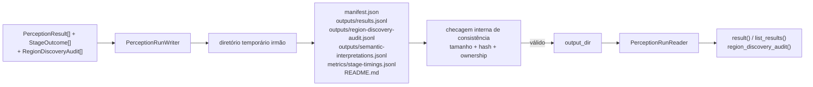

# Artefato de run de percepção

Este documento descreve `src/contextmap/visual_perception/run_artifact.py` e `serialization.py`. Para as convenções globais de artifact/lineage/immutability, ver [`docs/ARTIFACTS.md`](../../../../docs/ARTIFACTS.md).

## Layout do artefato

O writer grava o run **exatamente** no `output_dir` que o chamador entrega; ele não calcula caminho, não aloca índice e não mantém registro. No runtime, `output_dir` é `<workspace>/<dataset>/<run>/visual_perception/` ([`docs/ARTIFACTS.md`](../../../../docs/ARTIFACTS.md)).

```text
<output_dir>/
├── README.md                                          # gerado, legível por humano
├── manifest.json                                      # ponto autoritativo
├── outputs/
│   ├── results.jsonl                                   # um PerceptionResult por linha
│   ├── region-discovery-audit.jsonl                    # passes, rejeições e merges por frame
│   ├── semantic-interpretations.jsonl                   # execução semântica auditável
│   ├── semantic-interpretation-failures.jsonl           # resposta observada que não parseou
│   ├── semantic-views/                                  # pixels exatos enviados ao backend
│   │   └── <view-payloads>
│   ├── features/                                       # quando payloads são persistidos
│   │   ├── feature-index.jsonl
│   │   └── <observation-scope>/*.npy
│   └── masks/                                          # quando alguma região carrega máscara
│       ├── mask-index.jsonl
│       └── <source_observation_id>/<region_id>.npy    # bit-packed, ver mask_store.md
├── metrics/
│   ├── stage-timings.jsonl                             # um StageOutcome por linha
│   └── feature-extraction.jsonl                        # quando há diagnóstico de feature
└── debug/
    ├── 30-feature-extraction/                           # somente standard/full
    └── 40-semantic-interpretation/<request-id>/
        ├── request.json / prompt.txt / parsed-response.json
        ├── diagnostics.json / semantic-claims.json
        └── raw-response.txt                             # somente full
```

## Fluxo de persistência e leitura



`manifest.json` e os arquivos inventariados no próprio run formam a fonte de verdade; não existe registro nem índice ao lado do run.

`run_id` e `run_index` são entregues pelo chamador e gravados como recebidos; o writer nunca os aloca. O `run_index` é um ordinal legível do chamador (a runtime usa o número de `run-NNNN`), nunca timestamp, e não substitui identidade nem hash.

## Decisões desta issue (v0)

- **`outputs/results.jsonl`, não `outputs/results.parquet`.** Mesma decisão e mesmo motivo da issue #39 de Ingestion: nenhuma dependência de runtime nova (`pyarrow`/`pandas`) se justifica ainda; JSON Lines é inspecionável com ferramentas de texto padrão. Revisitar se o volume de resultados tornar leitura linha-a-linha um gargalo real.
- **`outputs/results.jsonl` continua canônico para metadata; `outputs/features/feature-index.jsonl` indexa apenas payloads numéricos opt-in.** Cada `PerceptionResult` carrega suas `regions`/`features`/`claims`; o feature index não duplica esse contrato, apenas liga a chave `(source_observation_id, feature_id)` ao arquivo `.npy`, hash e metadata necessária para leitura lazy. `finalize()` valida essa referência cruzada antes de publicar o artifact.
- **Máscara de região nunca inlina pixels em `outputs/results.jsonl` (#378).** Ao contrário de payloads de feature, persistir a máscara não é opt-in: toda região com `mask` materializado é persistida automaticamente em `outputs/masks/` (bit-packed, ver [`mask_store.md`](mask_store.md)), e a região grava apenas `mask_reference`. `PerceptionRunReader.list_results()` nunca materializa pixels; `PerceptionRunReader.mask_store()` carrega e verifica o hash sob demanda.
- **Uma resposta que não parseia continua sendo evidência.** Uma chamada real ao backend que
  produziu resposta observável mas falhou antes da materialização semântica é persistida em
  `outputs/semantic-interpretation-failures.jsonl`, com request, prompt renderizado,
  `raw_response`, `raw_response_sha256`, proveniência (backend/model/version), diagnostics do
  backend, `parse_failure.kind`/`parse_failure.message` e a configuração efetiva redigida.
  Antes disso o `raw_response` era reduzido a `error=str(error)` em `metrics/stage-timings.jsonl`
  e se perdia — justamente nos casos que mais precisam ser auditados (truncamento, drift de
  schema, prompt mal especificado).

  `raw_response_sha256` é calculado exatamente como no fluxo de sucesso, então a identidade da
  evidência não depende de o parser ter funcionado. A identidade da tentativa (`request_id`) é
  compartilhada entre os dois streams e nunca aparece nos dois ao mesmo tempo, então
  `attempted = parsed + parse_failed` é reconciliável em vez de inferido. Métricas de campanha
  devem reportar os três números separadamente, nunca só "parsed/attempted".

  Os dois streams são separados de propósito: `SemanticInterpretationExecution` hoje significa
  *uma execução parseada e materializável*, não *uma chamada executada*. Tornar `parsed` opcional
  mudaria o significado do tipo e quebraria `schema_version` 0.5.0, tornando ilegível a evidência
  já congelada. Unificar os dois numa union explícita (`parse: ParsedSemanticResponse |
  ParseFailure`) é a correção estrutural desejável, mas fica para a próxima quebra deliberada de
  schema, junto com uma política para artifacts anteriores. `occurred_at` é auditoria, não
  identidade de conteúdo: comparação entre runs precisa excluí-lo.

- **As rejeições e os merges de Region Discovery são evidência contratual do run (#611).**
  `add_region_discovery_audit()` recebe a `RegionDiscoveryAudit` de um frame, e o writer grava
  `outputs/region-discovery-audit.jsonl`, uma linha por frame: `source_observation_id`,
  `backend` (a `BackendProvenance` exata), `passes` (cada pass com os diagnostics do backend
  naquele pass), `pass_rejections`, `normalization_config_digest`, `normalization_rejections` e
  `merge_decisions`. O formato e a semântica de cada campo estão em
  [Region Discovery](region-discovery.md#evidência-persistida-a-auditoria-de-cada-frame). A
  tabela é escrita **sempre**, mesmo vazia, como o stream de falhas semânticas: num run `0.6.0`
  "nenhum frame auditado" nunca se confunde com "auditoria não registrada". `add_region_discovery_audit()`
  recusa uma segunda auditoria para a mesma observação, e `finalize()` recusa uma auditoria cuja
  observação não tenha resultado no run. A auditoria é metadata leve (IDs, motivos, números), então
  fica em memória até `finalize()`, como as falhas semânticas; nenhum pixel entra nela.
  `PerceptionRunReader.records_region_discovery_audit()` responde pela versão de schema se o run
  registrou a auditoria; `iter_region_discovery_audits()` a lê em fluxo e
  `region_discovery_audit(source_observation_id)` busca a de um frame.
- **Views semânticas são outputs contratuais.** Cada `SemanticVisualView` possui SHA-256 obrigatório e referencia um arquivo abaixo de `outputs/semantic-views/`. `add_semantic_view_payload()` valida o hash antes de enfileirar os bytes (na persistência; a inferência já verifica o mesmo hash em cada runtime, ver [Integridade das views](semantic-interpretation.md#integridade-das-views-na-inferência)); `finalize()` exige que toda view de toda execução possua payload inventariado e rejeita payloads sem request correspondente.
- **`debug/` só existe quando há conteúdo real.** Feature Extraction
  materializa previews conforme seu nível. `SemanticDebugLevel.NONE` não grava
  diagnostics humanos, `STANDARD` grava request/prompt/parsing/final outputs e
  `FULL` acrescenta a resposta bruta. `outputs/semantic-interpretations.jsonl`,
  hashes e outputs canônicos permanecem suficientes para leitura quando debug
  está desabilitado. Campos de credencial conhecidos são redigidos antes de
  qualquer serialização.
- **`config.yaml`, `lineage.json`, `environment.json`, `events.jsonl` não são escritos no v0.** Nenhum destes tem produtor real ainda (configuração efetiva de backend, lineage de artefatos upstream, ambiente de execução, eventos granulares) — `manifest.json` já cobre a metadata mínima autoritativa (run_id, índice, sequência, seleção, capabilities, contagens). Adicionar esses arquivos vazios/parciais agora seria estrutura sem conteúdo real.

## Escrita atômica e incremental

Mesmo padrão de `contextmap.ingestion.sequence_artifact`, agora nas duas metades: **atômica e streaming**. O writer monta o run em um diretório temporário irmão de `output_dir` (`.tmp-<nome-de-output_dir>-<random>/`), criado na primeira escrita, roda uma checagem de consistência interna em `finalize()`, e só então renomeia para `output_dir` — um run interrompido nunca aparenta ser válido. Um `output_dir` que já exista é recusado com `RunArtifactError`, sem alterar o run que está lá, e qualquer falha remove o temporário e não deixa nada. O writer não escreve registro nem `runs.json` e não toca em nenhum outro diretório.

Cada payload pesado é gravado **no momento em que é adicionado**, não em `finalize()`:

| Chamada | O que vai para o disco na hora | O que fica em memória |
| --- | --- | --- |
| `add_result()` | máscaras de cada região, em `outputs/masks/` | o resultado já com `mask_reference` e sem pixels |
| `add_feature_payload()` | o `.npy` em `outputs/features/` | só a metadata da feature |
| `add_semantic_view_payload()` | os bytes em `outputs/semantic-views/` | só `(sha256, size_bytes)` |
| `add_stage_outcomes()` | — | só `stage_id`/`status`/`duration_ms`/`error` |
| `add_region_discovery_audit()` | — | a auditoria do frame: IDs, motivos e números, nenhum pixel |

Isso vale porque o `output` de um `StageOutcome` de `region_discovery` é a **mesma** tupla de `Region2D` com máscaras que `add_result()` recebe, e as métricas de estágio nunca serializam esse `output`: retê-lo guardaria os pixels uma segunda vez.

O motivo é medido, não hipotético: uma `InlineMask` de 640x480 era então uma tuple de 307200 ponteiros (~2,36 MB; desde o #593 é um array de um byte por pixel, ~0,31 MB, e as mesmas regiões ainda somariam ~2,4 GB), então as 7828 regiões de um run real de 360 frames custavam ~18 GB só de máscaras — e outro tanto pelos `StageOutcome` retidos — antes de `finalize()` sequer começar. Depois da mudança, o crescimento de RSS do writer não escala com o número de frames; o que permanece é O(N) apenas em metadata leve (ids, hashes, contagens), medido em ~0,04 MB por frame.

`finalize()` passa a fazer só o que é inerentemente global: validar os invariantes entre frames, escrever `mask-index.jsonl`/`feature-index.jsonl`, o `manifest.json`, o `README.md`, conferir o inventário e publicar por rename.

`add_result()` rejeita evidência pertencente a outro `run_id`, a outro `sequence_artifact_id` ou uma segunda evidência para o mesmo `source_observation_id`. Assim, o arquivo final preserva exatamente um resultado por observação e nunca mistura ownership de runs ou sequências.

O writer também exige, antes de publicar, que cada diagnostic de feature `SUCCEEDED`/`WARNING` descreva exatamente uma feature do resultado da mesma observação (`feature_id`), com scope, shape, dtype, normalização, `payload_reference`, proveniência do backend e fingerprint do `EmbeddingSpace` iguais. Para features densas, `(grid_height, grid_width)` precisa ser `feature.shape[:2]` e `source_artifact_id` precisa ser o `run_id` do próprio run; um segundo diagnostic para a mesma feature é rejeitado. `metrics/feature-extraction.jsonl` carrega a geometria densa contratual, então ela não pode descrever outro payload. Detalhes em [`feature_diagnostics.md`](feature_diagnostics.md).

Antes de publicar, o writer também exige que cada `SemanticInterpretationExecution` resolva para exatamente um `PerceptionResult` por `perception_result_id` e observação. Todas as `parsed.claims` precisam estar materializadas nesse resultado e o `parsed.scene_context`, quando presente, precisa coincidir integralmente com o contexto persistido.

Essa reconciliação inclui inputs mesmo quando a execução abstém: `region_id`
deve resolver em `regions`; cada `visual_feature` deve coincidir com uma feature
do resultado e possuir payload no feature store; e `scene_context_reference`
deve resolver pelo `PerceptionResultId` para um contexto da mesma observação.
`claim_count` soma tanto `PerceptionResult.claims` quanto as claims aninhadas em
`SceneContext`.

## Leitura isolada

`PerceptionRunReader(run_dir)` abre um run **apenas com seu próprio diretório**. `manifest.json` e o inventário de `outputs/` fornecem os resultados, a auditoria de Region Discovery e os registros de execução contratuais; `debug/` não é dependência de leitura.

Um registro malformado de `outputs/semantic-interpretations.jsonl` (linha que não é JSON, campo ausente, `raw_response_reference` incluído, ou hash da resposta que não confere) vira `RunArtifactError` com o arquivo e a linha, nunca um `KeyError` ou `JSONDecodeError` cru (#619).

## `serialization.py`

Funções `encode_x`/`decode_x` simétricas para cada tipo de `models.py` (`BackendProvenance`, `BoundingBox2D`, `Region2D`, `VisualFeature`, `SemanticClaim`, `SceneContext`, `PerceptionResult`). Reaproveitadas por `run_artifact.py` para persistir `outputs/results.jsonl`, mas não dependem do layout do artefato — qualquer chamador que precise de uma view JSON de um desses contratos pode usá-las diretamente.

## Reprodutibilidade do pipeline resolvido (`schema_version` 0.6.0)

O schema `0.6.0` acrescenta `outputs/region-discovery-audit.jsonl` (#611) e não muda nenhum outro
arquivo: resultados, máscaras, features, execuções e falhas semânticas, métricas e README mantêm os
mesmos bytes, e o manifest só muda na versão e na entrada nova do inventário (há um teste de
caracterização para isso). Por isso o leitor continua abrindo runs `0.5.0`, o schema da v0.1.0,
sem outro ramo de compatibilidade além de informar que a auditoria de Region Discovery deles não
foi registrada (`records_region_discovery_audit()` devolve `False`). Versões anteriores continuam
recusadas na abertura.

`manifest.json` também persiste `pipeline_preset` (o `PipelinePreset` resolvido — ver [`pipeline.md`](pipeline.md) — codificado por `encode_pipeline_preset()`) e `configuration_digest` (o fingerprint determinístico de `ResolvedPipeline.configuration_digest()`). Isso torna o grafo de estágios e as identidades de backend efetivamente usados por um run inspecionáveis a partir do próprio manifest, sem precisar reabrir `outputs/results.jsonl` e agregar a proveniência de cada evidência individualmente.

O schema `0.5.0` move a máscara de região para fora de `outputs/results.jsonl`
(#378): `encode_region()` nunca mais inlina pixels, só `mask_reference`;
`decode_region()` sempre devolve `mask=None`. Uma máscara de imagem inteira
custava cerca de 0,92 MB de JSON por região, independente do tamanho real da
região; ver [`mask_store.md`](mask_store.md) para o formato compacto e o
carregamento lazy. Esta é uma quebra pré-1.0: artifacts `0.4.0` e anteriores
são rejeitados na abertura.

O schema `0.4.0` incorpora a nova forma de `SemanticClaim` e os registros
completos de execução semântica. Cada registro preserva request, prompt
renderizado, resposta/hash, parsing, diagnósticos e configuração efetiva
redigida. A cópia humana da resposta bruta só é inventariada em debug `FULL`.
Esta foi uma quebra pré-1.0: artifacts `0.3.0` foram rejeitados na abertura.
