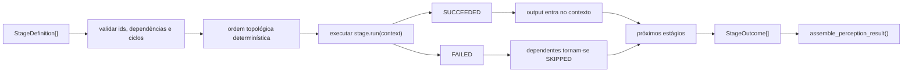
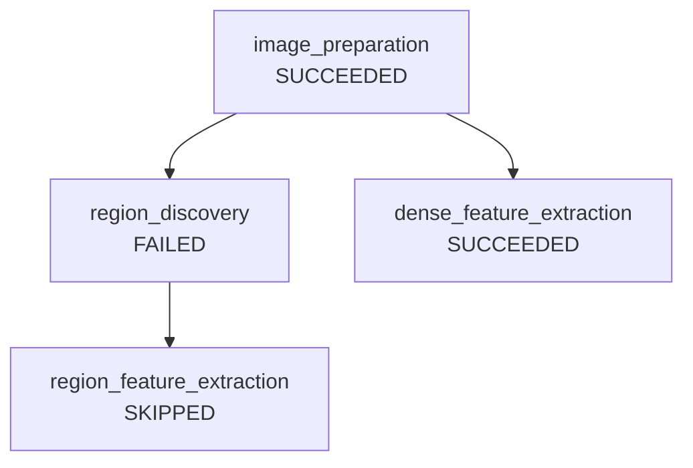

# Serviço de orquestração

Este documento descreve `src/contextmap/visual_perception/service.py`: como um grafo de estágios resolvido é executado e como um `PerceptionResult` é montado a partir dele.

## Grafo resolvido, não sequência fixa

`execute_stage_graph()` recebe uma lista de `StageDefinition` (cada uma com `stage_id`, `capability`, `depends_on`, e `run`) e calcula sua própria ordem topológica determinística (ordenação alfabética por `stage_id` entre estágios independentes, para reprodutibilidade). Nenhuma sequência `RegionDiscovery -> FeatureExtractor -> SemanticInterpreter` está hardcoded — quem monta o grafo (issue #55, o compilador de preset declarativo) decide as dependências reais.

### Semântica de execução

Somente outputs de estágios `SUCCEEDED` entram no contexto de execução e podem contribuir para o `PerceptionResult`. Falha e skip permanecem auditáveis como `StageOutcome` e não são convertidos em payloads sentinela.

## `StageRunner`: tipagem opaca por necessidade

`StageRunner = Callable[[Mapping[str, object]], object]` — cada estágio recebe um mapa `stage_id -> saída` dos estágios upstream já concluídos, e devolve sua própria saída. O executor tratada essas saídas como opacas (`object`) propositalmente: um executor de DAG genérico não pode conhecer estaticamente o tipo de cada nó sem se tornar um framework de workflow completo (fora do escopo desta issue — "Do not turn this into Airflow"). Cada `run` concreto (fechando sobre uma implementação de port real ou fake) conhece o tipo verdadeiro pelas suas próprias assinaturas tipadas (`RegionDiscovery.discover()`, etc.).

## Isolamento de falhas por branch independente

Um estágio que levanta uma exceção nunca derruba o run inteiro — vira `StageOutcome(status=FAILED, error=...)`. Qualquer estágio que dependa (direta ou transitivamente) de um estágio que não teve sucesso é marcado `SKIPPED`, não executado. Estágios em branches independentes (ex.: extração de features densas, que não depende de region discovery) continuam executando normalmente e contribuem sua evidência ao resultado final — isso é o que preserva evidência parcial quando um estágio recuperável falha, sem precisar de uma política de falha separada e configurável.

## `assemble_perception_result()`

Monta um `PerceptionResult` a partir de `StageOutcome`s já executados, recebendo explicitamente quais `stage_id`s produzem regiões/features/claims/scene context. Um estágio que falhou ou foi pulado simplesmente não contribui nada ao resultado — não existe placeholder ou valor sentinela.

## O que este módulo não define

- A definição do preset declarativo/versionado que produz um `StageDefinition[]` válido; isso pertence a [`pipeline.md`](pipeline.md).
- Persistência do `PerceptionResult`/outcomes em um `PerceptionRunArtifact`; isso pertence a [`run_artifact.md`](run_artifact.md).
- Backends concretos ou composição/injeção de dependência real (`runtime`, composition root).
